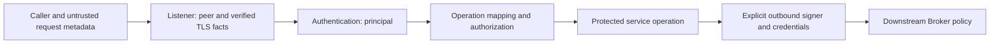

Security is composed at service boundaries. Shared contracts describe principals, resources, decisions, and secrets; authentication implementations verify identity; the network listener establishes trustworthy peer/TLS facts; operation adapters map requests to permissions. None of these steps is implied merely by compiling a security crate.

## Responsibility map

| Layer | Responsibility |
| --- | --- |
| `rocketmq-security-api` | Runtime-neutral principals/resources, request views, inbound policy, outbound signing, layered decisions, secret and maintenance contracts |
| `rocketmq-auth` | Access-key signature authentication, ACL evaluation, local metadata, imports/reloads, service-owned auth lifecycle |
| Transport / gRPC listener | Connection peer information, actual TLS handshake and verified certificate facts |
| Broker / Proxy integration | Map supported operations to authorization contexts and run checks before dispatch |
| Application / deployment owner | Select profile, provide credentials and policies, configure listeners, retain lifecycle owners |

The downstream hop is a separate trust boundary. Proxy accepting a client identity does not mean a Broker accepts the Proxy's outbound identity. Likewise, a request header that claims a peer identity is not equivalent to a certificate verified by the listener.

## Authentication and authorization

`AuthRuntime` loads providers and can check remoting requests. Both ordinary authentication and authorization default to disabled and are independently configured. Building the runtime does not install a network interceptor; an integration must call it with a trusted `RemotingAuthContext` before protected dispatch.

Authentication performs access-key lookup, enabled-user checks, and HMAC signature verification. Optional timestamp skew checks accept a missing timestamp; they do not include a nonce/replay cache. Consequently, enabling that window alone is not complete replay protection.

Authorization maps requests to resource/action contexts and requires each generated context to allow access. ACL evaluation chooses matching custom policies before fallback defaults, then applies resource specificity; equal-specificity ties prefer denial. “Deny always wins across every policy” would misdescribe the selection algorithm.

Unmapped ordinary remoting operations can produce no contexts and therefore no ACL decision. The generic auth gRPC adapter parses metadata but does not provide a complete method authorization interceptor; its default authorization context builder returns no contexts. Proxy has its own operation mapping and service integration. Adding a new public operation requires an explicit permission mapping rather than assuming generic auth covers it.

Global or account IP whitelist matches in the ordinary remoting path bypass both authentication and authorization. Request-code whitelists bypass their respective check separately. A super user bypasses ACL lookup during authorization but still needs authentication unless another configured bypass applies. These are concrete policy semantics and must be considered when exposing listeners.

## TLS and deployment bootstrap

`ROCKETMQ_SECURITY_PROFILE` selects `development-insecure-loopback` or `secure-enforced`. Development bootstrap validates that supplied listeners are loopback. Secure bootstrap checks required trust-anchor, certificate/key, mounted secret-provider, administrator identity, and request-policy material.

With neither profile nor bootstrap material, bootstrap returns disabled. Material without an explicit profile is rejected. Bootstrap validates configuration and material; it does not perform the TLS handshake or automatically attach request checks to every listener.

The owner must separately configure the actual transport or gRPC TLS listener and its client-auth policy. Proxy gRPC obtains verified TLS identity through server connection extensions, not arbitrary user metadata. Outbound TLS and signing need their own configuration. Consult [transport](protocol-transport.md) for feature selection and encrypted file-transfer behavior.

## Metadata, reloads, and secrets

Local auth providers optionally persist `users.json` and `acls.json`. User snapshots contain the secret needed for HMAC verification in plaintext; Debug redaction does not encrypt these files or ACL YAML. Protect storage permissions and secret distribution accordingly.

The ACL watcher reloads changed inputs. Read/parse/validation failures occur before import and preserve previous imported metadata. Actual user/ACL updates are sequential and are not a transaction across the entire import: a metadata or persistence failure during import can leave partial effects. File reload success also does not prove that every independently composed stateful cache has refreshed.

`Secret<T>` redacts formatting but does not promise zeroization for arbitrary `T`. `SecretMaterial` owns a zeroized byte buffer; explicit accessors still expose material to their caller. Keep credentials, tokens, complete request/config objects, and message bodies out of logs.

## Privileged adapters and lifecycle

One-time bootstrap, secret-provider registries, encrypted-file development secrets, credential rotation, and maintenance policy are separately composed adapters. Building `AuthRuntime` does not enable them. One-time bootstrap persists its claim before provisioning and a failed provisioning attempt does not reopen that claim.

Persistent one-time bootstrap and the encrypted-file secret adapter currently fail closed on Windows because equivalent filesystem ACL verification is not implemented. This restriction is separate from ordinary remoting authentication and JSON metadata support.

Maintenance authorization combines authenticated identity with explicit capability, target, and budget policy. Its runtime policy material and audit requirements remain product behavior; simplifying the documentation workflow does not remove those boundaries. An allow/deny/abstain decision is also distinct from a provider or contract error; required layers must not interpret a failed provider as permission.

Shutdown closes auth request admission, drains admitted work, stops ACL watching, and flushes/closes owned providers. Caller-injected metadata actors remain with their owner. Close auth after protected request work has stopped and before its runtime disappears.

## Source map

- [Security API](https://github.com/mxsm/rocketmq-rust/blob/main/rocketmq-security-api/README.md), [deployment validation](https://github.com/mxsm/rocketmq-rust/blob/main/rocketmq-security-api/src/secure_deployment.rs).
- [Auth semantics and adapters](https://github.com/mxsm/rocketmq-rust/blob/main/rocketmq-auth/README.md).
- [Proxy auth integration](https://github.com/mxsm/rocketmq-rust/blob/main/rocketmq-proxy/src/auth.rs), [gRPC trusted TLS context](https://github.com/mxsm/rocketmq-rust/blob/main/rocketmq-proxy/src/grpc/middleware.rs).
- [Errors and observability](errors-observability.md), [Broker pipeline](broker.md).
