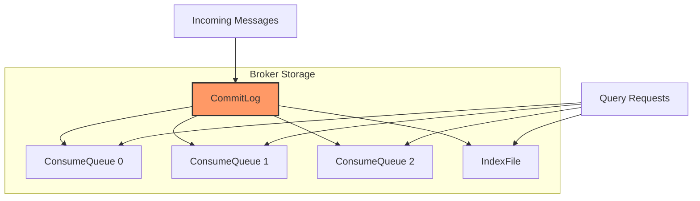
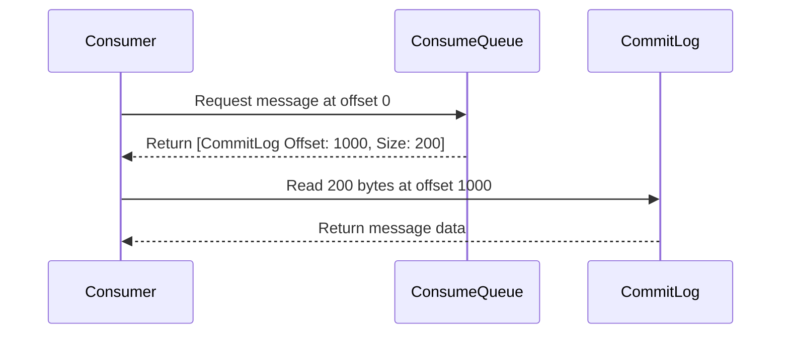

# Storage

RocketMQ-Rust employs a high-performance storage mechanism designed for reliable message persistence and fast retrieval.

## Storage Architecture



## CommitLog

The CommitLog is the core storage file that stores all messages sequentially.

### Characteristics

- **Sequential writes**: All messages are written in append-only mode
- **Fixed size**: Each CommitLog file has a fixed size (default 1GB)
- **Rolling**: When full, a new CommitLog file is created
- **No deletes**: Messages are deleted only after expiration

### Structure

```
CommitLog File (1GB each)

┌────────────────────────────────────────────────────┐
│ [Message 1][Message 2][Message 3]...[Message N]   │
│  ↑                                                   │
│  Sequential append writes                            │
└────────────────────────────────────────────────────┘

File naming: 00000000000000000000, 00000000000000001000, ...
```

### Message Format in CommitLog

```rust
pub struct CommitLogMessage {
    // Total message size (4 bytes)
    total_size: u32,

    // Magic code (4 bytes) - for file integrity check
    magic_code: u32,

    // Message body CRC32 (4 bytes)
    body_crc: u32,

    // Queue ID (4 bytes)
    queue_id: u32,

    // Message flag (4 bytes)
    flag: u32,

    // Message properties
    properties: ByteBuffer,

    // Message body
    body: ByteBuffer,
}
```

### Sequential Write Performance

Sequential writes to CommitLog provide excellent performance:

```
Traditional random I/O:  ~10,000 ops/sec
Sequential I/O (SSD):    ~100,000+ ops/sec
Sequential I/O (HDD):    ~50,000+ ops/sec
```

## ConsumeQueue

ConsumeQueue is an index structure for fast message consumption.

### Structure

Each topic queue has its own ConsumeQueue:

```
ConsumeQueue for Topic:OrderEvents, Queue:0

┌─────────────────────────────────────────────┐
│ Entry Size: 20 bytes                         │
├─────────────────────────────────────────────┤
│ [CommitLog Offset][Size][Tags Hash]         │
│ [8 bytes       ][4B  ][8 bytes      ]       │
│                                             │
│ Example:                                    │
│ [0x00000000][0x0064][0x12345678]           │
│ [0x00000064][0x0080][0x87654321]           │
│ [0x000000E4][0x0050][0xABCDEF12]           │
└─────────────────────────────────────────────┘
```

### Purpose

1. **Fast lookup**: Quickly locate messages by offset
2. **Memory mapped**: Can be memory-mapped for fast access
3. **Small size**: Each entry is only 20 bytes
4. **Filtering**: Supports tag-based filtering

### Reading Messages



## IndexFile

IndexFile provides fast message lookup by key.

### Structure

```
IndexFile

┌─────────────────────────────────────────────┐
│ Hash Slot (500万个 slots)                   │
│ ↓                                           │
│ [Slot 0] → [Head Index] → ...              │
│ [Slot 1] → [Head Index] → ...              │
│ [Slot 2] → [Head Index] → ...              │
│ ...                                         │
│                                             │
│ Each Index Entry (20 bytes):                │
│ - Key Hash (4 bytes)                        │
│ - CommitLog Offset (8 bytes)                │
│ - Time Diff (4 bytes)                       │
│ - Next Index Offset (4 bytes)               │
└─────────────────────────────────────────────┘
```

### Usage

```rust
// Query messages by key
let messages = broker.query_message_by_key("OrderEvents", "order_12345")?;

// Returns all messages with key "order_12345"
```

## Flush Strategies

RocketMQ supports different flush strategies to balance performance and reliability.

### ASYNC_FLUSH (Default)

- Messages are written to OS page cache
- Returns immediately
- Background thread flushes to disk
- **Performance**: Highest
- **Reliability**: May lose messages on system failure

### SYNC_FLUSH

- Messages are written to OS page cache
- Forces flush to disk before returning
- **Performance**: Lower
- **Reliability**: No message loss

```rust
// Configure flush mode
let mut broker_config = BrokerConfig::default();
broker_config.set_flush_disk_type(FlushDiskType::SYNC_FLUSH);
```

## File Deletion

RocketMQ automatically deletes expired files to free disk space.

### Deletion Policy

Files are deleted when any of these conditions are met:

1. **Disk space low**: Disk usage exceeds threshold (default 85%)
2. **Time-based**: Files older than default (72 hours)
3. **Manual**: Triggered by admin command

```rust
// Configure retention policy
let mut broker_config = BrokerConfig::default();
broker_config.set_delete_when(DeleteWhen::DiskFull);
broker_config.set_file_reserved_time(72); // hours
```

## Memory Mapping

ConsumeQueue and IndexFile use memory-mapped files for fast access:

```rust
// Memory-mapped file I/O
let mmap = unsafe { MmapOptions::new().map(&file)? };

// Access memory directly
let offset = mmap.read_u64(offset_position)?;
let size = mmap.read_u32(size_position)?;
```

### Benefits

- Zero-copy I/O
- Fast access to frequently read data
- OS manages paging

## Storage Performance

### Write Performance

```
Type                | Throughput    | Latency
--------------------|---------------|--------------
Single Thread       | 100K+ msg/s   | < 1ms
Multi Thread        | 500K+ msg/s   | < 5ms
Batch Send          | 1M+ msg/s     | < 10ms
```

### Read Performance

```
Operation           | Latency
--------------------|--------------
Sequential Read     | < 1ms
Random Read (mmap)  | < 1ms
Index Lookup        | < 1ms
```

## Storage Configuration

```toml
[broker]
# CommitLog file size (1GB default)
commit_log_file_size = 1073741824

# ConsumeQueue file size (30MB default)
consume_queue_file_size = 31457280

# Flush disk type: ASYNC_FLUSH or SYNC_FLUSH
flush_disk_type = "ASYNC_FLUSH"

# Delete policy
delete_when = "DiskFull"
file_reserved_time = 72  # hours

# Maximum disk usage ratio
disk_max_used_space_ratio = 85

# Minimum free disk space (GB)
disk_space_warning_level_ratio = 90
```

## Best Practices

1. **Use SSDs**: Significantly improves random read performance
2. **Monitor disk usage**: Set up alerts for disk space
3. **Choose appropriate flush mode**: Balance performance vs reliability
4. **Separate CommitLog and ConsumeQueue**: Use different disks if possible
5. **Regular backups**: Implement backup strategy for critical data
6. **Configure retention**: Set appropriate file retention time

## Next Steps

- [Producer](../category/producer) - Learn about sending messages
- [Consumer](../category/consumer) - Learn about consuming messages
- [Configuration](../category/configuration) - Configure storage settings
