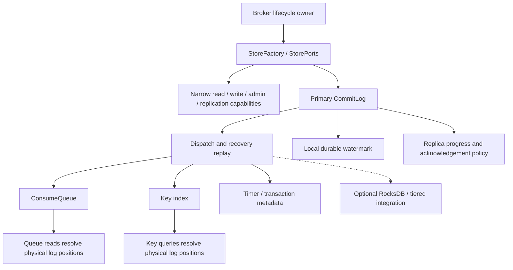
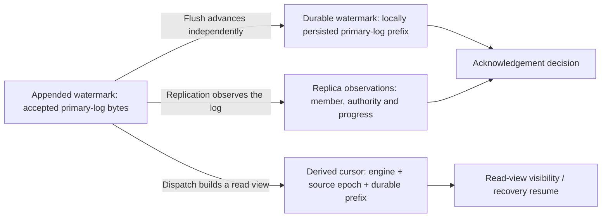

The Store turns Broker write/read requests into primary-log operations and the derived structures needed to serve them. Its central design distinction is between accepting bytes, satisfying a durability policy, and making those bytes visible through a particular read view.

## Composition and ownership

`rocketmq-store-api` defines executor-neutral capabilities and values. `rocketmq-store-local` provides local CommitLog, mapped-file, recovery, derived-view, timer and HA primitives. `rocketmq-store` composes a Broker-facing implementation through `StoreFactory` and `StorePorts`. Optional RocksDB and tiered components participate in that composition.

```mermaid
flowchart TB
    Broker["Broker lifecycle owner"] --> Factory["StoreFactory / StorePorts"]
    Factory --> Ports["Narrow read / write / admin / replication capabilities"]
    Factory --> Log["Primary CommitLog"]
    Log --> Dispatch["Dispatch and recovery replay"]
    Dispatch --> CQ["ConsumeQueue"]
    Dispatch --> Index["Key index"]
    Dispatch --> Timer["Timer / transaction metadata"]
    Dispatch -.-> Secondary["Optional RocksDB / tiered integration"]
    CQ --> Reads["Queue reads resolve physical log positions"]
    Index --> Queries["Key queries resolve physical log positions"]
    Log --> Flush["Local durable watermark"]
    Log --> Replication["Replica progress and acknowledgement policy"]
```

The composition root owns lifecycle. Request processors receive the narrow capability they need instead of a mutable handle to the whole backend. The Store is a Broker component, not a separate server that users must start.

The normal integration sequence is validated configuration, `StoreFactory::open`, initialization, load/recovery, startup, then graceful shutdown. Opening the composition alone is not evidence that recovery succeeded or background services started.

## Primary log and derived structures

CommitLog contains encoded message records at physical byte ranges. ConsumeQueue maps a Topic/queue's logical offsets to those physical records. A key index supports lookup by message key. Timer, transaction and optional secondary components maintain state needed by their own operations.

This organization avoids placing a complete independent message body in every read index. It also creates progress differences: an append can be accepted while one derived view lags. Queue reads and key queries need not observe identical progress at every instant.

RocksDB mode currently keeps the local file CommitLog and moves consume-queue, index and selected timer/transaction metadata into RocksDB-backed services. It is not a claim that all primary message bytes move into RocksDB. Tiered integration is optional secondary dispatch and does not strengthen the primary acknowledgement.

## Read an append receipt as a contract

`AppendReceipt` combines the append status, optional appended range, appended watermark, durable watermark and reached `Durability`. It validates that these fields do not contradict one another.

For an accepted half-open byte range `[start, end)`:

- The appended watermark covers `end`.
- The durable watermark cannot exceed the appended watermark.
- Local durability requires the durable watermark to cover the entire range.
- Replicated durability requires a validated replication decision covering the range; it cannot be asserted by constructing a plain receipt with a stronger enum value.

| Durability | Contract |
| --- | --- |
| `Memory` | The primary log accepted bytes without a durable-write guarantee for the full range |
| `Local` | The local durable watermark covers the complete appended range |
| `Replicated` | The configured replica acknowledgement condition was also satisfied |

`AppendStatus::is_accepted` includes `PutOk`, `FlushDiskTimeout`, `FlushReplicaTimeout` and `ReplicaUnavailable`. Those accepted outcomes still differ in the guarantee they reached. Invalid input, unavailable storage or other rejected outcomes must not be represented as a successful appended range.

The Broker maps store outcomes into send responses. A producer timeout or a non-success flush/replica status can therefore leave an uncertain write outcome. Retrying requires duplicate-tolerant business processing.

## Watermarks are not interchangeable

```mermaid
flowchart LR
    A["Appended watermark: accepted primary-log bytes"]
    D["Durable watermark: locally persisted primary-log prefix"]
    R["Replica observations: member, authority and progress"]
    C["Derived cursor: engine + source epoch + durable prefix"]
    A -->|"Flush advances independently"| D
    A -->|"Replication observes the log"| R
    A -->|"Dispatch builds a read view"| C
    D --> Decision["Acknowledgement decision"]
    R --> Decision
    C --> Visibility["Read-view visibility / recovery resume"]
```

Only compare positions in the same coordinate system and source generation. A Consumer Group's logical queue offset is not a CommitLog byte offset. A derived cursor's `next_offset` is the exclusive durable primary-log position completed by one engine, qualified by a source epoch.

Derived replay classifies a record as already committed or a contiguous advance. A source-epoch mismatch, physical gap or partial overlap violates the cursor contract. The typed cursor/checkpoint prevents an arbitrary number from silently becoming valid progress for a different log generation.

Derived progress does not upgrade `Memory` to `Local` or `Replicated`. There is also no universal rule that every derived structure must be equally caught up before all read operations can work; inspect the view used by the operation.

## Replication and write authority

`AckPolicy` distinguishes local durability, a configured replica count, and all members of the current in-sync set. Replica counts include the local leader and use unique eligible members. Controller-aware contracts also carry master/sync-set epochs and write authority.

The decision must match the current authority and acknowledgement condition. A connected replica, stale observation or outdated role is not sufficient evidence for a stronger receipt. Controller-issued lease durations become process-local monotonic deadlines in the Broker; they are not interchangeable with remote wall-clock timestamps.

These contracts make HA reasoning explicit, but the deployed topology and failure scenario determine the result users can rely on. A one-Broker LocalFile tutorial does not exercise replica acknowledgement or failover.

## File leases and asynchronous transfer

Read results can expose leased message buffers or file regions. A lease keeps the underlying file available while a transport writer still references it. Cleanup must respect outstanding leases; a request timeout does not automatically mean that every reference has been released.

Transport's portable file path uses bounded blocking I/O. Optional Linux sendfile requires eligible plaintext regions and capability checks; TLS uses portable reads through its record layer. These implementation choices change transfer cost, not the Store's acknowledgement policy.

## Recovery, shutdown and failure limits

Load/recovery determines usable primary-log records, handles the selected normal/abnormal recovery path, and reconciles compatible derived state and checkpoints. A dirty tail or interrupted derived update must be interpreted according to its format and engine contract.

Graceful shutdown stops admission and background activity in order, flushes according to the component path, and reports final progress, outstanding leases and pending file-retirement replay. Inspect `MessageStoreShutdownReport` alongside the runtime report. A generic task report cannot infer that all storage obligations completed.

| Failure window | What to investigate |
| --- | --- |
| Accepted before required local flush | The acknowledged policy and recovered durable prefix |
| Local durability before required replica progress | Replica policy, authority and remote observations |
| Primary record available while derived view lags | That engine's cursor, replay and visibility |
| Writer still retains a file region | Lease ownership and retirement progress |
| Business effect completed before consumer progress persists | Application replay/idempotency, separate from Store append recovery |

Do not use store-directory deletion as routine recovery. Backend/layout changes, restore operations and retention changes require their own procedures and data consequences. Existing data is evidence when investigating a failure.

## Features and tradeoffs

Default Store features select LocalFile and fast loading. Enabling `safe-load` only selects sequential loading when `fast-load` is absent; when neither is enabled, the local primitive's policy still permits parallel loading. `ROCKETMQ_SAFE_LOAD=true` can force the safe path.

`rocksdb_store`, tiered storage, extended timer timeline, observability and Linux `io_uring` add separate conditions. Compiling a platform feature does not prove that the host supports it. Throughput comparisons must keep backend, durability, message size, hardware and workload fixed; there is no universal performance number for this composition.

Continue with [message lifecycle](message-lifecycle.md), [delivery and retry](../guides/delivery-and-retry.md), or [deployment overview](../deployment/overview.md).

Sources: [Store composition](https://github.com/mxsm/rocketmq-rust/blob/main/rocketmq-store/README.md), [append contracts](https://github.com/mxsm/rocketmq-rust/blob/main/rocketmq-store-api/src/lib.rs), [derived progress](https://github.com/mxsm/rocketmq-rust/blob/main/rocketmq-store-api/src/progress.rs), [HA contracts](https://github.com/mxsm/rocketmq-rust/blob/main/rocketmq-store-api/src/ha_contract.rs), [local primitives](https://github.com/mxsm/rocketmq-rust/blob/main/rocketmq-store-local/README.md).
