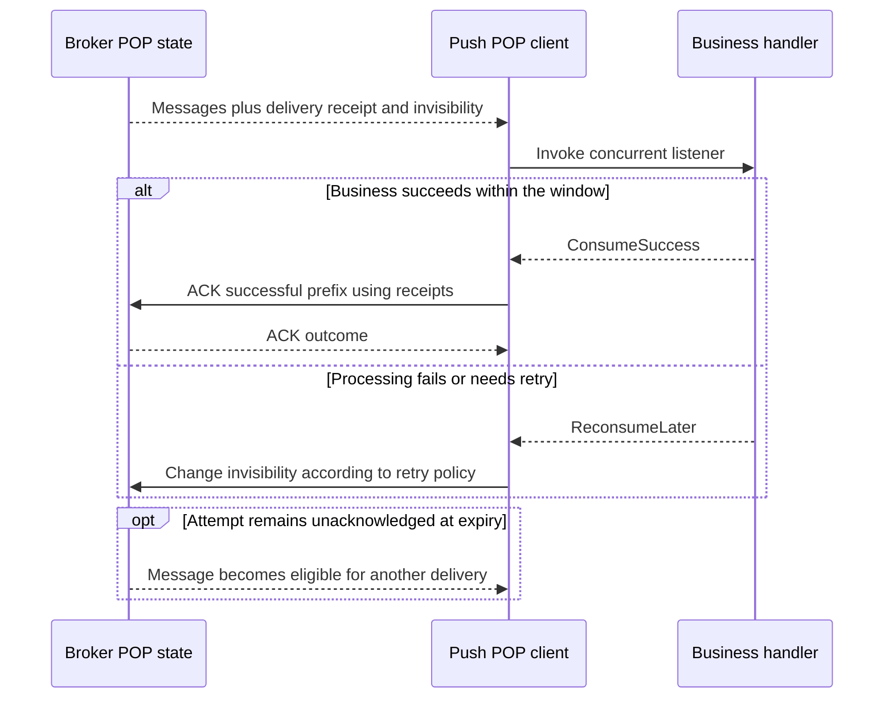

# POP, receipts and acknowledgement

POP temporarily makes a delivered message invisible and uses a receipt to acknowledge that delivery attempt. It differs from advancing a LitePull group's queue offset. A message whose attempt is not successfully acknowledged can become eligible for redelivery after its invisibility window.

The current example uses `DefaultMQPushConsumer` with a concurrent listener and Broker-side request-mode configuration. It is not a separate public `DefaultPopConsumer` constructor.

## Enable the intended path

1. Create the topic and consumer group on the intended cluster, and verify ordinary routing.
2. Use an authorized Admin operation to set that topic/group's request mode to POP.
3. Build the Push consumer with the application's `ClientRuntime` and `client_rebalance(false)`.
4. Register a concurrent listener and subscription, then start the consumer.
5. Complete business work before returning success; close the facade before closing its shared runtime.

`client_rebalance(false)` alone does not install the Broker's request-mode setting. The example uses `SetConsumerRequestModeRequest::try_new(topic, group, ConsumerRequestMode::Pop, 8, 3_000)` through Admin Core. The value 8 is the POP share-queue setting in that request, not an eight-second invisibility period.

From `rocketmq-example/`, inspect `examples/consumer/pop_consumer.rs` before running:

```bash
cargo check --example pop-consumer
cargo run --example pop-consumer
```

The current example changes request mode for `TopicTest` / `please_rename_unique_group_name_4` on the loopback NameServer. Rename and provision those constants for an isolated experiment. It performs a real administrative mutation; do not run it against an unrelated existing group's traffic.

The example illustrates setup, but omits an explicit consumer-facade shutdown after signal handling. Use the cleanup structure in [Push consumers](./push-consumer.md) when integrating it: finish or bound current work, call `consumer.shutdown().await`, then close the shared client and process runtimes. Its full-message debug logging is also unsuitable for production data.

## Understand one receipt's lifetime



A receipt is delivery-attempt metadata, not the business event ID. It carries the information needed to address the relevant Broker/queue and POP checkpoint. Do not substitute a message key or logical offset, forge receipt fields, or reuse a receipt as authority for a different attempt.

The consumer callback receives the message, while the POP service uses its associated metadata for ACK. Retain a separate stable business identity for deduplication across attempts.

## Invisibility is a bounded opportunity

The current Push defaults request `pop_invisible_time = 60_000` milliseconds and `pop_batch_nums = 32`. These are different from listener batch size and ordinary pull timeout. Broker validation and selected mode also constrain requests.

The invisibility clock includes time spent queued before the handler starts. Increasing callback concurrency may help a queueing bottleneck, but does not make a slow downstream dependency safe. A handler can finish after the original window and then coexist with another attempt.

The current concurrent POP service checks expiration before invocation and before applying its result. It does not promise automatic continuous renewal while a long-running callback executes. Size the window for bounded work, or use a documented lower-level/Proxy renewal path that owns refreshed receipt state and its failures.

Changing invisibility is a remote operation with a result. A successful change affects that attempt's timing; it does not commit the business operation. Treat a timed-out renewal as uncertain and use the receipt returned by the selected API where renewal replaces it.

## Listener success is not an ACK receipt

The concurrent service normalizes the successful prefix and calls its batch-ACK path. Individual ACK errors are logged and rely on redelivery; the application listener's `ConsumeSuccess` cannot prove that every Broker ACK succeeded.

For failed messages, the service chooses a retry delay and changes invisibility. Once the configured maximum reconsume count is reached, the current implementation also considers message age and can ACK an old message or delay it again. Do not claim that every failed POP message necessarily enters a DLQ through this client branch.

If business effects commit and ACK fails, the next attempt must detect the already-completed business event. If success is returned before business commit, ACK can remove the attempt from ordinary redelivery while work is incomplete. This is the same application boundary described in [delivery and retry](../guides/delivery-and-retry.md), implemented with receipts instead of LitePull commits.

## Diagnose and change modes

| Symptom | First checks |
| --- | --- |
| POP path is not selected | Broker topic/group request mode, client rebalance setting, assignment response |
| Duplicate delivery while handler runs | Queue wait plus handler time versus invisibility, renewal outcome |
| Callback succeeds but message returns | ACK response/logs, receipt validity, Broker reachability |
| Repeated failures stop appearing | Retry-count/age policy and any application recovery store; do not assume DLQ without evidence |
| Shutdown abandons business work | Owned handler tasks, facade cleanup and remaining attempt lifetime |

A change from Pull to POP changes progress semantics. Stop the old consumers, define how existing offsets and in-flight attempts will be handled, change the group mode deliberately, and observe the new assignment/acknowledgement path. Do not treat a live mode switch as a no-impact tuning option.

This page describes the current concurrent Push POP implementation and the example wiring. It does not establish crash recovery, failover, ordered POP, or identical semantics across Proxy and Java clients.

Sources: [POP example](https://github.com/mxsm/rocketmq-rust/blob/main/rocketmq-example/examples/consumer/pop_consumer.rs), [concurrent POP processing](https://github.com/mxsm/rocketmq-rust/blob/main/rocketmq-client/src/consumer/consumer_impl/consume_message_pop_concurrently_service.rs), [ACK and change-invisibility adapter](https://github.com/mxsm/rocketmq-rust/blob/main/rocketmq-client/src/consumer/consumer_impl/default_mq_push_consumer_impl.rs), [Broker POP processor](https://github.com/mxsm/rocketmq-rust/blob/main/rocketmq-broker/src/processor/pop_message_processor.rs).
