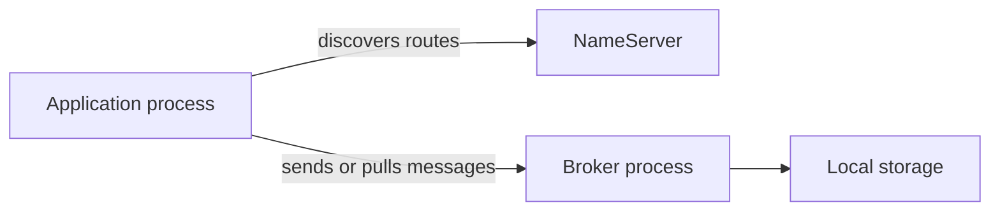

# Contributing documentation

Write a page around a reader's task or question, and deliver its English and Simplified Chinese versions together. The website is the reader-facing documentation system; crate READMEs and source contracts provide implementation evidence.

## Choose an article structure

| Article | Reader's goal | Required content |
| --- | --- | --- |
| Tutorial | Obtain a first working result | Prerequisites, one complete sequence, expected output, diagnosis, cleanup, next step |
| How-to guide | Perform a particular operation | Applicable topology, permissions and inputs, steps, observations, recovery |
| Design explanation | Understand how and why the system works | Responsibilities, ownership, flow, invariants, failure behavior, trade-offs, source references |
| Reference | Look up an exact interface or setting | Name, type, default, unit, conditions, constraints, compatibility, examples |

Lead with the result or design question. Define the scope before alternatives. A diagram and a list of crates do not replace an explanation of why a boundary exists or what happens when a dependency fails.

For commands, state the working directory, shell, inputs, and running services. Include lifecycle setup and cleanup in a complete example. Label excerpts and pseudocode explicitly. Keep code and actual command semantics equivalent in both languages.

## Place paired pages and preserve document identity

These two files describe one logical page:

```text
rocketmq-website/docs/architecture/runtime.md
rocketmq-website/i18n/zh-CN/docusaurus-plugin-content-docs/current/architecture/runtime.md
```

The corresponding document ID is `architecture/runtime`. For new pages, the path under the content root supplies the ID. Inspect existing front matter before rewriting a page and preserve explicit `id` or `slug` values and established URLs.

Use ordinary Docusaurus front matter:

```yaml
---
title: Runtime architecture
sidebar_label: Runtime
description: Task ownership, resource budgets, cancellation, and shutdown.
---
```

Translate these display fields in the Chinese file. Translate the entire body, including prerequisites, failure handling, captions, diagram labels, and alternative text. Keep API symbols, configuration keys, CLI flags, and values unchanged. Explain the Chinese terminology consistently; a summary or an English fallback does not complete the pair.

Use relative links to Markdown pages for related articles. Add the completed ID to `sidebars.ts`; the sidebar is handwritten, so a new file or `_category_.json` alone does not add the page. Category translations belong in `i18n/zh-CN/docusaurus-plugin-content-docs/current.json`. Keep Chinese links locale-relative instead of embedding a second `zh-CN` prefix.

## Support claims at the appropriate boundary

Check the relevant implementation, configuration parser, manifest, and executable example. A README gives orientation; defaults and registration paths often require reading the constructor or entry point.

| Question | Evidence to look for |
| --- | --- |
| Does an implementation exist? | Concrete implementation and public contract |
| Is it active here? | Features, defaults, registration, runtime settings, selected adapter |
| Has this behavior been observed? | The scenario actually run and its output or state |
| Is it in a release? | The corresponding published artifact and release notes |

The current documentation is labeled **Next** and describes development source. A package's version field or an available type does not prove that the feature was released, enabled, or exercised end to end. Keep current-source instructions separate from release-specific dependency versions.

Describe acceptance, local durability, replica acknowledgement, index visibility, consumption, and business success separately. A timeout can leave an uncertain outcome. Configuration references should use external parser names, units, and defaults; field existence does not imply live reload.

State untested conditions precisely. Do not add invented throughput numbers, output, recovery guarantees, or production claims. Readers need the conditions under which an observation holds.

## Draw maintainable technical diagrams

Use Mermaid for topology, sequence, state, or ownership. The site already enables it:



The arrows above show discovery and message access, not a list of Rust dependencies. Supply the same meaning in Chinese labels in the paired page. Explain arrow direction and boundaries in prose; color must not carry the meaning alone.

For vector or bitmap assets, use `static/img/docs/<topic>/`. Shared assets without text can serve both languages; localized illustrations can use `.en.svg` and `.zh-CN.svg`. Keep text readable on narrow screens and in light and dark themes.

An image model can provide a conceptual illustration or background when useful. Check generated relationships and label a conceptual image appropriately. Use accurate editable diagrams for protocol, ownership, and reliability contracts; do not present a generated illustration as a captured interface or measured result.

## Preview and check the affected content

From `rocketmq-website/`, use the Node version in `.nvmrc`, currently 24.13.0. Reuse installed dependencies; run `npm ci` when dependencies are missing or the lockfile changes.

```bash
npm run start
```

To preview Chinese instead, stop the first development server and run:

```bash
npm run start:zh
```

Read both rendered pages, follow affected links, and inspect code blocks and diagrams. Then build the configured languages with the existing command:

```bash
npm run build
```

`npm run serve` previews the static result. Keep `build/`, `.docusaurus/`, and `node_modules/` out of the contribution. Report actual checks and unresolved relevant warnings. A prose change does not need a Rust workspace build; executable Rust examples need the corresponding focused check or run.

Documentation writing requires no fingerprints, hashes, fixed checkout, scores, approval stages, or new CI gates. Product authentication, authorization, and audit requirements still need accurate documentation where they affect operation.

## Evolve the information architecture

Rewrite an established page in place when its topic remains useful. When consolidating pages, leave a short useful explanation and a link at the old entry. Static GitHub Pages hosting does not automatically turn a moved Markdown file into an HTTP 301 redirect.

Keep configuration lookup separate from operational procedures, and link between them. Release announcements belong to the configured `releases` section. Do not create a second documentation tree or copy the same operational procedure into several guides.

For repository-local instructions and setup details, see the [authoring guide](https://github.com/mxsm/rocketmq-rust/blob/main/rocketmq-website/DOCUMENTATION.md), [website README](https://github.com/mxsm/rocketmq-rust/blob/main/rocketmq-website/README.md), and [site configuration](https://github.com/mxsm/rocketmq-rust/blob/main/rocketmq-website/docusaurus.config.ts).
