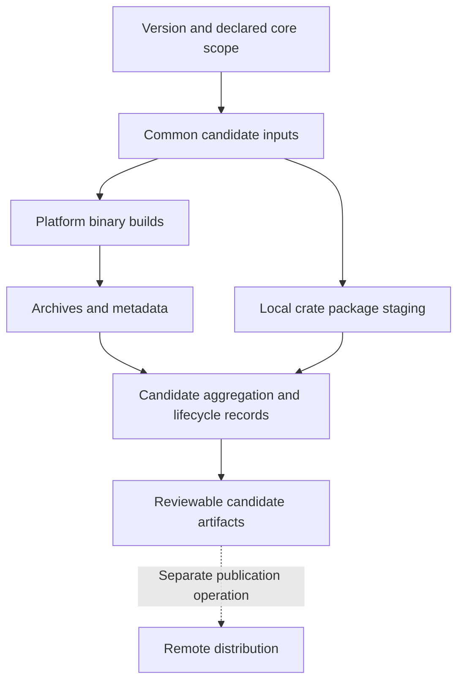

The repository defines a community distribution, candidate preparation, package staging and deployment assets. This page explains how those pieces fit together and how documentation should describe them. It does not announce a published release or execute publication. Start with [release scope](../overview/release-scope.md) for product identity and exclusions.

## Follow the declared scope

The root workspace contains 28 members. `scripts/core-release-scope.json` classifies 27 core packages: 24 registry-publish packages and three binary-only packages. The Dashboard common member is not part of that core package inventory. Registry classification, archive contents and executable service count are separate concepts.

The archive layout selects six executables: NameServer, Broker, Controller, Proxy, Admin CLI and the offline store inspector. Admin TUI's binary-only classification does not imply that it is included in this six-executable archive. Dashboard, MCP and SRE are independent products and are excluded from the core archive capability list; their own source and deployment documentation apply.

The identity is `RocketMQ Rust Community Distribution` with `unofficial-community` identity and `official_apache_release: false`. Use that identity consistently in release notes and downloads. Apache 2.0 licensing does not make an artifact an official Apache project release.

## Candidate preparation and artifact flow



The diagram summarizes responsibilities; crate staging is a related distribution tool, not an assertion that every workflow job invokes it in that exact order. `.github/workflows/release-candidate.yml` has common preparation, platform builds, aggregation, a full-matrix stage and a lifecycle finalizer. It accepts an exact unpublished candidate version and release-series inputs. Existing series state makes candidate preparation a stateful workflow; do not manually invent a parent generation or treat a partial result as a completed candidate.

The workflow uploads candidate artifacts with read-only repository permissions. An uploaded Actions artifact is not a registry publication or public release announcement. The separate `core-service-image-publish.yml` route currently validates local candidate preparation and explicitly rejects `publish: true`; its filename must not be read as proof of a remote image push.

## Understand the archive you are documenting

| Item | Declared content or behavior |
| --- | --- |
| Platform layouts | `x86_64-unknown-linux-gnu` and `x86_64-apple-darwin` use `tar.gz`; `x86_64-pc-windows-msvc` uses `zip` and `.exe` |
| Directories | `bin`, `conf`, `data`, `logs`, `run`, `sbom` and `scripts` |
| Common files | `LICENSE-APACHE`, `NOTICE`, `README.md` and `RELEASE_NOTES.md` |
| Service configuration | Selected files under `distribution/config/` for NameServer, Broker, Controller and Proxy |
| Build features | `distribution/release-layout.json` records requested and effective features per executable; archive features can differ from a developer's default build |
| Offline inspector name | Source binary `rocketmq-cli-rust` is archived as `rocketmq-store-inspect`, with the platform suffix where applicable |
| Metadata | Manifest, provenance and SBOM tooling describe the candidate's contents and build inputs |

These are declared preparation targets, not a claim that every artifact is currently downloadable or every platform has passed a deployment trial. Use a candidate's actual generated manifest and selected configuration when writing its installation instructions. Do not copy the default `cargo build` feature assumptions into an archive guide.

## Crate packaging is a separate operation

`distribution/release-package-policy.json` defines `plan-only` and `package-only` modes, a `local-temp` staging registry and `remote_publication: not-executed`. The planner is `distribution/package_publish_workspace.py` and the stager is `distribution/stage_publishable_crate.py`. A packaging result checks a candidate package boundary; it is not a successful `cargo publish`.

For read-only inspection of the available arguments, run from the repository root:

```bash
python distribution/package_publish_workspace.py --help
python distribution/build_release_archive.py --help
python distribution/verify_release_archive.py --help
```

Actual staging requires the planner's candidate manifest and output-report inputs, plus either `--all-core` or a selected `--project`. Use an existing prepared candidate and its documented lifecycle rather than filling these inputs with unrelated files. Version propagation and build/staging tools can modify their work area or generate files; keep their outputs separate from website source.

## Maintain release and website documentation together

1. **Choose the documented surface.** Identify source-based setup, a specific candidate archive, registry packages or a standalone product. Keep the version and feature assumptions explicit.
2. **Describe actual changes.** Cover behavior, configuration defaults, public APIs, wire/storage compatibility and migration effects. Reuse [Java migration](../migration/java-to-rust.md), [Rust API migration](../migration/rust-api.md) and [upgrade/rollback](../operations/upgrade-rollback.md) for those boundaries.
3. **Separate capabilities from observations.** A registered command, declared target or matrix scenario is an implementation/preparation fact. A successful runtime or recovery result needs an actual observation and its scope.
4. **Update both languages.** Keep page IDs, commands, configuration keys, units and diagram semantics aligned. 1.0.0 development describes the current development documentation; do not silently relabel it as a released version.
5. **Refresh installation links when artifacts exist.** Point to the actual artifact and its instructions, then check the affected website routes and examples. Avoid speculative download URLs or blanket production-readiness claims.

Existing release tools have their own provenance, state and artifact checks. Those describe release processing; they are not prerequisites for writing a page. Documentation work requires no fingerprint ceremony, fixed checkout, new approval stage or additional CI gate. This documentation task does not dispatch release workflows or modify product authorization.

## Source references

- [Core package scope](https://github.com/mxsm/rocketmq-rust/blob/main/scripts/core-release-scope.json), [release identity](https://github.com/mxsm/rocketmq-rust/blob/main/distribution/release-identity.json) and [archive layout](https://github.com/mxsm/rocketmq-rust/blob/main/distribution/release-layout.json).
- [Candidate workflow](https://github.com/mxsm/rocketmq-rust/blob/main/.github/workflows/release-candidate.yml) and [core image candidate route](https://github.com/mxsm/rocketmq-rust/blob/main/.github/workflows/core-service-image-publish.yml).
- [Package policy](https://github.com/mxsm/rocketmq-rust/blob/main/distribution/release-package-policy.json), [package planner](https://github.com/mxsm/rocketmq-rust/blob/main/distribution/package_publish_workspace.py) and [archive builder](https://github.com/mxsm/rocketmq-rust/blob/main/distribution/build_release_archive.py).
