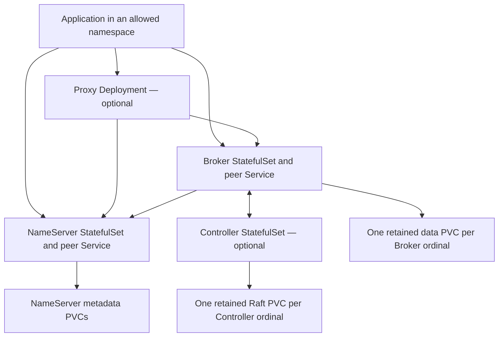

Use `distribution/helm/rocketmq-rust-core` for the NameServer, Broker, Controller, and Proxy workloads described here. Start with one profile and override its images, storage, placement, resources, and credentials for your cluster. The chart supplies infrastructure configuration; an installed release still needs a verified application message path.

## Select a topology

| Profile file | NameServer / Broker / Controller / Proxy replicas | Intended topology |
| --- | --- | --- |
| `values-dev-single.yaml` | 1 / 1 / 0 / 0 | Development; authentication disabled explicitly |
| `values-production-default-ha.yaml` | 2 / 2 / 0 / 0 | Default primary/replica, both replicas required |
| `values-production-controller-ha.yaml` | 2 / 3 / 3 / 0 | Controller-managed Broker group with at least two in-sync replicas |
| `values-production-proxy-tls.yaml` | 2 / 2 / 0 / 2 | Default HA plus TLS on the Proxy gRPC listener |

Production profiles require separate hosts for replicas. Confirm enough schedulable nodes, the selected StorageClass, and resource availability before interpreting Pending Pods as service failures. Read [HA deployment](high-availability.md) before choosing write-availability and replication requirements.



Each StatefulSet ordinal has its own complete TOML and stable peer DNS name. A PVC holds data for that identity; it is not a shared writable directory for multiple replicas. Internal names follow `<release>-<service>-<ordinal>.<release>-<service>-peer.<namespace>.svc.<clusterDomain>`. External remoting clients must be able to reach the addresses returned in routes, not merely a forwarded NameServer port.

## Prepare images and local values

Install Helm and a `kubectl` version suitable for your cluster, select the intended Kubernetes context, and work from the repository root. The examples below use release `core` and namespace `rocketmq`.

The image path is `<global.imageRegistry>/<service>:<global.candidateVersion>`. The default registry/version in values is not evidence that a usable image is published there. Supply images you have built or otherwise verified; see [container packaging](containers.md). A Proxy TLS image must include the `tls` feature.

Create a private deployment workspace outside the repository. Save this starting point as `core-site-values.yaml`, replacing the example registry, tag, and StorageClass:

```yaml
global:
  imageRegistry: registry.example.com/team/rocketmq-rust
  candidateVersion: site-tested-version
  storageClassName: site-block-storage
  clusterName: SiteCluster
services:
  broker:
    storage: 100Gi
```

`100Gi` is an example request, not a capacity recommendation. Calculate storage and limits from [capacity planning](../operations/capacity-performance.md). Keep credentials out of values, generated ConfigMaps, and version control. NetworkPolicy is enabled by default; inspect its namespace selectors and the traffic your clients and collectors actually need.

## Supply existing Secrets

Production profiles enable both authentication and authorization. Create Secrets for each enabled service before installing:

| Default Secret | Required keys |
| --- | --- |
| `rocketmq-namesrv-auth` | `plain_acl.yml` |
| `rocketmq-broker-auth` | `plain_acl.yml`, `inner-client.json` |
| `rocketmq-controller-auth`, when enabled | `plain_acl.yml` |
| `rocketmq-proxy-auth`, when enabled | `plain_acl.yml`, `inner-client.json` |
| `rocketmq-proxy-tls`, for the TLS profile | `tls.crt`, `tls.key`; add `ca.crt` when configuring client-certificate authentication |

The Broker and Proxy JSON credentials use `accessKey`, `secretKey`, and optional `securityToken`. Receiving services must grant the corresponding inner-client identity its required operations. Supplying a Secret file does not automatically grant those permissions.

For example, after preparing actual ACL and credential files in a restricted `private` directory:

```bash
kubectl create namespace rocketmq
kubectl -n rocketmq create secret generic rocketmq-namesrv-auth --from-file=plain_acl.yml=private/namesrv-acl.yml
kubectl -n rocketmq create secret generic rocketmq-broker-auth --from-file=plain_acl.yml=private/broker-acl.yml --from-file=inner-client.json=private/broker-inner-client.json
```

Skip namespace creation if it already exists. Add Controller/Proxy Secrets only for the chosen profile. For the TLS profile:

```bash
kubectl -n rocketmq create secret generic rocketmq-proxy-auth --from-file=plain_acl.yml=private/proxy-acl.yml --from-file=inner-client.json=private/proxy-inner-client.json
kubectl -n rocketmq create secret tls rocketmq-proxy-tls --cert=private/proxy.crt --key=private/proxy.key
```

For `clientAuth: require` or `optional`, use a Secret containing the server certificate/key and the configured CA key, then set `services.proxy.tls.clientAuth`. The server certificate must match the DNS name clients use. See [security configuration and rotation](security.md).

The chart's `securityProfile: production` configures service auth defaults. It is distinct from process-level `ROCKETMQ_SECURITY_PROFILE=secure-enforced` and its required bootstrap material. Neither setting encrypts every cluster connection automatically. The TLS profile configures the Proxy gRPC listener specifically.

## Render, install, and observe

This example selects Controller HA. Use the same profile and values for both rendering and installation:

```bash
helm template core distribution/helm/rocketmq-rust-core -n rocketmq -f distribution/helm/rocketmq-rust-core/values-production-controller-ha.yaml -f core-site-values.yaml > core-rendered.yaml
helm upgrade --install core distribution/helm/rocketmq-rust-core -n rocketmq -f distribution/helm/rocketmq-rust-core/values-production-controller-ha.yaml -f core-site-values.yaml
kubectl -n rocketmq get pods,pvc,svc,pdb
kubectl -n rocketmq describe pod core-broker-0
kubectl -n rocketmq logs core-broker-0 --tail=100
```

Before installation, inspect rendered image names, service DNS, mount paths, Secret references, replica identities, and storage requests. Keep the rendered file local. The commands create or update the named release; they do not populate business Topics or consumer groups.

For Pending Pods, inspect scheduling events and PVC binding. For failed startup, inspect the selected container's current and previous logs, mounted configuration, and Secret key names. Processes run as UID/GID `10001` with a read-only root filesystem; writable state belongs on the intended volume.

The chart uses HTTP `/livez` for startup/liveness, `/readyz` for readiness, and `/drainz` for pre-stop draining on the internal health port, default `8088`. Default shutdown time is 45 seconds inside a 60-second Pod grace period. Probe success is service lifecycle evidence; it does not prove that a Topic is writable, a consumer commits progress, or replicas have caught up.

From an allowed client location, use [Admin observations](../operations/admin.md), create isolated test resources, and perform the [first-message path](../getting-started/quick-start.md) with reachable cluster addresses and credentials. For Proxy, use the TLS/auth equivalent of the [gRPC probe](proxy.md). Record actual payload results and consumer completion.

## Update one workload at a time

NameServer, Broker, and Controller use `OnDelete`. Helm changes their desired Pod template and configuration checksum, but existing Pods keep running until explicitly replaced. Proxy is a Deployment with `maxUnavailable: 0` and `maxSurge: 1`; allow capacity for the extra Pod.

Preserve PVCs and ordinal identities. A configured Controller peer list is not a Raft membership-change operation. Do not change replica count, node IDs, peer addresses, or persisted membership as though these were interchangeable scaling controls.

Use the packaged Controller rollout helper for a planned Controller restart. It requires Python 3.11+, `kubectl`, a matching `rocketmq-admin-cli` on PATH, and Kubernetes permissions to observe the workload and request Pod eviction. If ordinal zero is the **current leader**, keep this command running in another terminal:

```bash
kubectl -n rocketmq port-forward pod/core-controller-0 19878:9878
```

Provide `ROCKETMQ_ACL_ACCESS_KEY`, `ROCKETMQ_ACL_SECRET_KEY`, and optional `ROCKETMQ_ACL_SECURITY_TOKEN` in the operator environment, then restart a different ordinal:

```bash
python distribution/helm/rocketmq-rust-core/files/rollout.py --namespace rocketmq --statefulset core-controller --ordinal 1 --controller-address localhost:19878
```

The helper obtains fresh membership/replication observations, checks peer identity and remaining majority, requests a UID-bound eviction subject to the PDB, then waits for a replacement Pod UID to become Ready. Unsupported/stale evidence, a follower endpoint, or a rejected eviction stops the operation. It does not retry rejected evictions or fall back to direct deletion. Recheck the current leader before each next ordinal.

This helper does not handle Broker role transitions or data catch-up. A two-replica Broker group with `minInSyncReplicas: 2` has no voluntary disruption allowance. Plan the effect on write availability before maintenance; direct Pod deletion bypasses the PDB protection. See [maintenance](../operations/maintenance.md).

The chart guide prescribes controlled restarts after credential/certificate rotation. Its ACL and inner-client credential paths must not be assumed to reload on a Secret update. The current Proxy TLS listener separately supports file-based reloads; verify the active generation and fresh connections as described in [security](security.md). Exercise both allowed and denied requests after rotation.

## Remove a tutorial release

After stopping its applications, `helm uninstall core -n rocketmq` removes the named release. PVC retention defaults to `Retain` for deletion and scaling. Inspect retained claims and backups before separately deciding to remove data; namespace deletion is not a routine cleanup shortcut.

## Scope and limitations

The separate `distribution/helm/rocketmq-rust` chart and `distribution/kubernetes` assets support a different five-service MCP/release integration. Their fixture images and example addresses are not substitutes for this core chart.

These instructions follow chart templates and source configuration. No Kubernetes installation, Pod/PVC recovery, or failover exercise is claimed here. Render/configuration checks do not establish production RPO or RTO.

## Source map

[Core chart guide](https://github.com/mxsm/rocketmq-rust/blob/main/distribution/helm/rocketmq-rust-core/README.md), [values and profiles](https://github.com/mxsm/rocketmq-rust/tree/main/distribution/helm/rocketmq-rust-core), [generated configuration](https://github.com/mxsm/rocketmq-rust/blob/main/distribution/helm/rocketmq-rust-core/templates/_config.tpl), [Controller rollout helper](https://github.com/mxsm/rocketmq-rust/blob/main/distribution/helm/rocketmq-rust-core/files/rollout.py).
