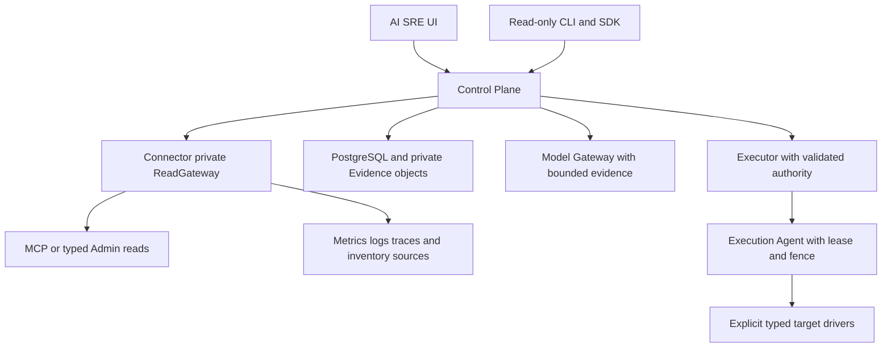

AI SRE is a standalone Rust 2024 workspace for evidence-based diagnosis and supervised operations. It has its own Control Plane, Connector, model gateway, PostgreSQL state, UI, clients and isolated execution services. It does not reuse Dashboard sessions or expose Dashboard mutation APIs to models. [Deployment](./ai-sre-deployment.md) explains the development stack and production boundaries.

## Component responsibilities

| Workspace member | Responsibility and dependency boundary |
| --- | --- |
| `rocketmq-sre-contracts` | Versioned domain, wire, Evidence, Incident, plan and execution contracts; no network, async runtime, database, model SDK or RocketMQ implementation dependency |
| `rocketmq-sre-core` | Deterministic coordination and descriptor registry; its normal dependency is Contracts only |
| `rocketmq-sre-control-plane` | Public API and composition root; onboarding, persistence, diagnosis, conversation, governance, approval and execution coordination |
| `rocketmq-sre-connector` | Private read gateway, MCP wire client, capability handshake, data-source collection and evidence conversion |
| `rocketmq-sre-model-gateway` | Provider-neutral model representation, protocol adapters, capability routing, streaming, budgets, fallback and Critic lineage |
| `rocketmq-sre-executor` | Durable supervised execution state machine, lease/fence coordination, verification and recovery; no target credentials or direct target network |
| `rocketmq-sre-execution-agent` | Individually enabled typed target drivers; owns target credentials, effect ledger and fenced dispatch |
| `rocketmq-sre-probe` | Bounded producer/consumer traffic on dedicated synthetic topics/groups; no Admin or mutation feature |
| `rocketmq-sre-eval` | Deliberate schema export and deterministic evaluation/acceptance utilities |
| `rocketmq-sre-client` / `rocketmq-sre-cli` | Fixed read-only HTTP client and operator commands; local drafts grant no execution authority |

The UI and TypeScript SDK are independent Node projects. The UI can invoke versioned Control Plane workflow routes; the public Rust/TypeScript SDKs and CLI remain a smaller fixed read-only surface. Neither distinction permits raw target requests.

## Observation and execution paths

The Connector consumes MCP over its public wire protocol, not the MCP server crate or Rust DTOs. MCP and read-only Admin adapters share one private ReadGateway for tenant/cluster authorization, rate/concurrency admission, deadlines, cancellation, bounded output, redaction and audit. A fallback to Admin remains a read of the same permitted query; it does not widen scope.

Connector registration and commands use a separate authenticated reverse channel. The public Control Plane port does not expose Connector-only internal routes. A server advertising mutation support, unknown schema major or capability drift is rejected rather than silently accepted. Therefore MCP Control is not a replacement endpoint for the Connector's query MCP configuration.

## Evidence is an observation with provenance

PostgreSQL is the durable system of record. Evidence combines versioned schema, tenant/cluster scope, observation time, freshness, source and partial-result semantics. Larger sanitized JSON payloads move to private object storage; the default inline limit is 64 KiB. The in-memory repository/object adapter is for tests, not a production fallback.

Topology edges come from observed identities. `Topic -> Queue -> Broker -> Store` follows RocketMQ routes/runtime observations. Kubernetes metadata adds Pod/Node/PVC relationships only when an explicit mapping exists; a Broker Pod needs the `rocketmqrust.com/broker-name` label to join a logical Broker. Missing sources remain partial or `not_production_verified`. The system does not invent producer connections or topology edges to fill a diagram.

A typical diagnosis proceeds through scoped collection, normalized Evidence, deterministic Diagnostic Packs, hypotheses and counter-evidence, then a persisted diagnosis revision. Model assistance can explain the bounded evidence and cite it. A missing or stale observation must remain visible in the answer; a plausible model explanation is not a replacement measurement.

## Model assistance has a constrained role

The Model Gateway uses canonical request/response contracts and protocol adapters rather than coupling domain logic to one vendor SDK. Profiles declare capabilities such as tools, structured output, streaming, context, classification and region. Routing rejects an incompatible provider instead of silently changing the request contract. Provider credentials are resolved through references and are never passed to Connector, target adapters or model prompts.

Network model calls are disabled by default in the Control Plane configuration; a deployment can explicitly enable them. The checked-in development Compose stack enables a local model fixture, which is not evidence of a live external provider integration. Provider-family profiles describe supported integration paths, not successful qualification of every vendor/model combination.

Rules and typed contracts remain authoritative. Unsafe, denied or unavailable model paths can produce `RulesOnlyDiagnosisNotExecutable`. Invalid structured output allows at most one bounded, tool-free repair call to the same provider, linked as a separate invocation; failed repair does not trigger schema-driven provider fallback. Finite availability fallback applies to transient timeout, 429, 5xx or transport failures. Conversational tool selection stays within the fixed read-only registry and returns cited, persisted answer revisions.

## Supervised execution is implemented but individually enabled

Current Control Plane code persists plans, policy/Critic evaluation, human approval and execution coordination. The Execution Agent's startup registry conditionally registers reviewed handlers. The earlier local guide's “disabled until P3-05” boundary describes the prerequisite isolation stage; it must not be interpreted as proof that today's source has no execution implementation. Current startup configuration and registered handlers determine availability.

All Agent action switches default to false. Supported configured handler families are:

| Action | Enable suffix after `ROCKETMQ_SRE_AGENT_` |
| --- | --- |
| Allowlisted Broker configuration | `ENABLE_BROKER_CONFIG` |
| Allowlisted Topic configuration | `ENABLE_TOPIC_CONFIG` |
| Allowlisted Subscription Group configuration | `ENABLE_SUBSCRIPTION_GROUP_CONFIG` |
| Logger level with TTL | `ENABLE_LOGGER_TTL` |
| One-unit Proxy scale-out | `ENABLE_PROXY_SCALE_OUT` |
| Proxy image canary | `ENABLE_PROXY_IMAGE_CANARY` |
| Credential rotation with overlap | `ENABLE_CREDENTIAL_ROTATION` |
| One Proxy restart | `ENABLE_PROXY_RESTART` |
| One telemetry collector restart | `ENABLE_TELEMETRY_COLLECTOR_RESTART` |

A switch alone is insufficient: target allowlists, separate credentials, verification endpoints and driver-specific configuration must be valid. A running Executor does not enable an Agent action. The Agent has no generic shell, raw Admin code or arbitrary Kubernetes patch interface.

The execution sequence validates a short-lived request, recovers durable state, establishes a lease/fence, checks the descriptor and live preconditions, acquires resource ownership, records intent and dispatches the typed Agent operation. The Agent persists `Prepared` and `Dispatched` before a driver call; only a bounded verified result becomes `Confirmed`. Non-terminal duplicate effects remain unresolved rather than being dispatched blindly. A new fence waits for in-flight work and rejects unresolved older effects.

Verification combines Agent resource observations with independent Control Plane technical SLI observations. An uncertain result is reconciled through read-only state inspection; compensation is explicit and itself verified. This is not a cross-resource atomic transaction or a guarantee that every failure can be undone. PostgreSQL or Lease Authority unavailability prevents target writes.

## Read capability state before choosing a workflow

- Onboarding can be pending, read-only ready, degraded, rejected or offboarded. Required unavailable sources keep the cluster degraded; offboarding revokes identity while retaining history.
- Query clients can read status, clusters, Incidents, inspections, plans and OpenAPI. A local Plan/Runbook draft is not a server-side approval or execution grant.
- The ordinary Dashboard remains a direct resource-management product. SRE owns cross-signal investigation and governed workflows; credentials and sessions are not shared.
- Compilation, descriptor registration, configured enablement and a successful live scenario are different evidence. Use observed capability/coverage state rather than claiming every declared action is production verified.

The architecture described here follows current manifests, service registration and component documentation. No live SRE diagnosis, model invocation or target execution was performed for this page. Documentation writing has no fingerprint or approval gate; the product's own policy, authority and audit contracts remain part of its technical design.

Sources: [workspace](https://github.com/mxsm/rocketmq-rust/blob/main/rocketmq-ai/rocketmq-sre/Cargo.toml), [Control Plane](https://github.com/mxsm/rocketmq-rust/blob/main/rocketmq-ai/rocketmq-sre/crates/rocketmq-sre-control-plane/README.md), [Connector](https://github.com/mxsm/rocketmq-rust/blob/main/rocketmq-ai/rocketmq-sre/crates/rocketmq-sre-connector/README.md), [Executor](https://github.com/mxsm/rocketmq-rust/blob/main/rocketmq-ai/rocketmq-sre/crates/rocketmq-sre-executor/README.md) and [Agent registration](https://github.com/mxsm/rocketmq-rust/blob/main/rocketmq-ai/rocketmq-sre/crates/rocketmq-sre-execution-agent/src/api.rs).
