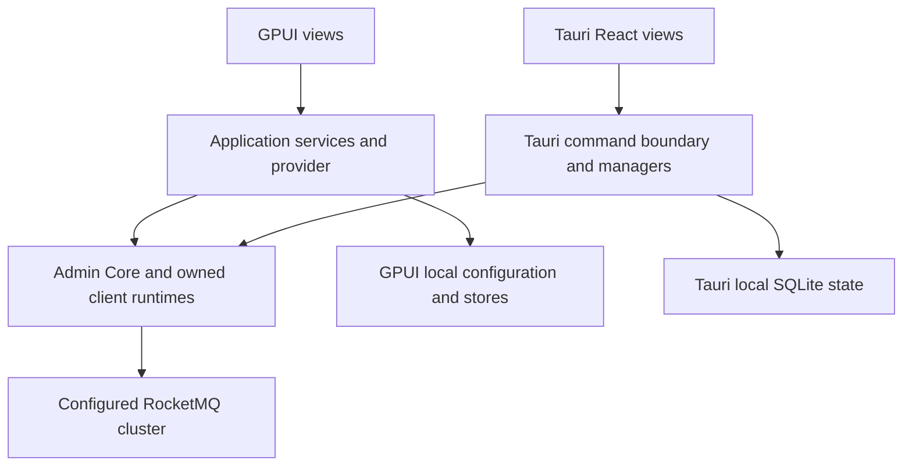

GPUI and Tauri are separate desktop applications with different renderers, configuration stores and authentication lifecycles. Both need their own project build; the root Cargo workspace does not build either application. They connect to an existing RocketMQ deployment rather than starting Broker or Proxy services for you. See [Dashboard selection](./dashboards.md) and [local cluster setup](../getting-started/local-source.md).

## Select the application and native prerequisites

| Area | GPUI | Tauri |
| --- | --- | --- |
| Project root | `rocketmq-dashboard/rocketmq-dashboard-gpui/` | `rocketmq-dashboard/rocketmq-dashboard-tauri/`; Rust root is `src-tauri/` |
| Rendering | GPUI and `gpui-component` native window | React/TypeScript in a Tauri webview with Rust commands |
| Tools | Repository Rust 1.95.0; Rust 2024 | Repository Rust toolchain plus Node/npm; Rust backend uses edition 2024 |
| Windows | MSVC C++ toolchain and Windows SDK; graphical desktop | MSVC/Windows SDK and the Tauri webview runtime/tooling |
| macOS | Xcode command-line tools and graphical session | Xcode tooling and the platform webview/packaging environment |
| Linux | Clang, CMake, Make, Ninja, pkg-config, protobuf compiler, Fontconfig, FreeType, X11/XCB and xkbcommon development packages | Build tools, WebKitGTK 4.1, OpenSSL, xdo, Ayatana AppIndicator and librsvg development packages used by Tauri CI |

Use the platform package set in each project's local guide and CI for that target. Additional native dependencies can come from the selected RocketMQ dependency graph. A headless compilation result does not verify graphics, focus, keyboard interaction or packaging on another OS. No fixed build-time or memory-use claim is implied.

## GPUI: build and run

From the repository root, enter the GPUI directory and stay there:

```bash
cd rocketmq-dashboard/rocketmq-dashboard-gpui
cargo run
```

To build an optimized executable from that same directory:

```bash
cargo build --release
```

With the default Cargo target directory, the binary is `target/release/rocketmq-dashboard-gpui`, with `.exe` on Windows. Running it requires a graphical desktop. Compilation does not produce a Tauri installer or a Web Dashboard bundle.

The process entry initializes telemetry, the component library and the application root. Views delegate work to application services and `GpuiAdminProvider`; Admin Core and an application-owned client runtime perform remote operations. Rendering stays separate from network and persistence work. When the event loop exits, the application closes its runtime and telemetry ownership.



The diagram compares application boundaries. It does not assert identical features or a shared desktop process.

### GPUI configuration and identities

Configuration defaults to `rocketmq-dashboard/gpui/config.json` beneath the OS user configuration directory. `ROCKETMQ_DASHBOARD_GPUI_CONFIG_PATH` overrides the complete file path. Use the application's connection settings to select the NameServer and transport options; configuration persists locally, while query results come from the selected cluster.

Local sign-in and outbound authentication are separate:

- If local login is enabled in configuration, provide `ROCKETMQ_DASHBOARD_USERNAME` and `ROCKETMQ_DASHBOARD_PASSWORD` to the process. The application retains a local session marker after authentication.
- If the Admin credential source is `environment`, provide `ROCKETMQ_ADMIN_ACCESS_KEY` and `ROCKETMQ_ADMIN_SECRET_KEY`; `ROCKETMQ_ADMIN_SECURITY_TOKEN` is optional. These sign outbound RocketMQ requests.
- The configuration stores the credential-source choice rather than credential values. Default authentication settings disable local login and select no Admin credential source; choose the intended policy explicitly for a shared workstation.

Environment values must exist before launching the application, including when a desktop launcher starts it. For diagnostics, set `RUST_LOG` to a bounded application level; avoid collecting credentials or message bodies. Close the application before backing up or intentionally changing its local state.

## Tauri: develop, build and package

In a separate shell starting from the repository root:

```bash
cd rocketmq-dashboard/rocketmq-dashboard-tauri
npm ci
npm run tauri dev
```

Reuse installed Node dependencies when already present. The Tauri command launches the frontend development process and the desktop backend. Vite and `tauri.conf.json` agree on port 8765. Vite uses `strictPort: true`, so an occupied port causes failure instead of silently selecting another port. `npm run dev` alone opens a frontend development server; it does not supply the native command bridge.

Choose the output needed, from the Tauri root:

```bash
npm run build
npm run tauri build
```

The first command produces frontend assets in `build/`. The second invokes the configured frontend build and produces the desktop package; running the first separately is useful only when checking frontend output. `tauri.conf.json` uses `frontendDist: ../build` and enables platform bundle targets. With default Cargo output, installers/packages appear under `src-tauri/target/release/bundle/`; the actual available formats depend on the host and installed packaging tools. Signing/notarization is a separate distribution concern, not established by a local build.

For a Rust-backend-only compile, run from `src-tauri/`:

```bash
cargo check
```

This does not validate React rendering or create installer bundles. Conversely, a successful frontend build does not compile all backend commands. The backend owns client/runtime managers and closes their work during application shutdown.

### Tauri authentication and persistent state

The first startup creates a local `admin` account. Its initial password comes from `ROCKETMQ_DASHBOARD_INIT_PASSWORD` if supplied, otherwise the implementation's bootstrap default is `admin123`. Provision a private initial password before first launch. The first successful login requires a password change before entering the Dashboard. Stored passwords use Argon2; sessions are in memory and can be restored only while the backend process remains alive.

Authentication and saved NameServer/Proxy configuration share `dashboard.db` beneath Tauri's application configuration directory for `com.rocketmqrust.dashboard`:

| Platform | Default database path |
| --- | --- |
| Windows | `%APPDATA%\com.rocketmqrust.dashboard\dashboard.db` |
| macOS | `~/Library/Application Support/com.rocketmqrust.dashboard/dashboard.db` |
| Linux | `$XDG_CONFIG_HOME/com.rocketmqrust.dashboard/dashboard.db`, or `~/.config/com.rocketmqrust.dashboard/dashboard.db` when unset |

Changing the bootstrap environment variable after the account exists is not a password reset. Deleting this database resets both authentication and saved connection configuration. For a deliberate local-state reset, stop the app and back up the database first; do not use removal as routine troubleshooting. Local login is not RocketMQ ACL authentication. Saved Proxy addresses also do not start, stop or reconfigure Proxy server processes.

## Verify a real connection and close cleanly

1. Start the intended NameServer and Broker separately. For the tutorial, choose `127.0.0.1:9876` only when the desktop app and services share the same host.
2. Complete local login if enabled, then inspect and save the intended connection settings. Check advertised Broker addresses from the desktop machine, not only the NameServer port.
3. Refresh cluster/Broker information and locate the known tutorial topic and consumer group. Compare with [read-only Admin inspection](../operations/admin.md) when a view reports an error or unexpected emptiness.
4. Treat topic changes, offset resets and message actions as actual cluster mutations. Check the target and preserve the application's operation confirmation and authorization behavior.
5. Close the window normally and allow process shutdown to finish. Save configuration through the application before exit; do not infer persistence solely from a field still visible in a window.

## Common failures

| Symptom | Likely boundary and next check |
| --- | --- |
| Root Cargo cannot select the desktop package | Enter its standalone project; for Tauri Rust use `src-tauri/` |
| Native linker or system-library error | Verify that platform's UI/build prerequisites and architecture match the selected toolchain |
| Tauri development port unavailable | Identify the owner of 8765; do not terminate unrelated processes or change only one side of the Vite/Tauri port pair |
| Tauri web page renders but commands fail | Run through `npm run tauri dev`; a browser-only Vite session lacks the native bridge |
| Login works but remote queries fail | Local identity succeeded; inspect NameServer, route, outbound credentials and transport separately |
| GPUI ignores environment changes | Confirm the launcher process inherited the intended variables before startup |
| Tauri bootstrap password no longer works | Existing account uses its persisted password; changing the bootstrap variable does not overwrite it |

This page documents source-defined setup and boundaries. It does not claim that a graphical smoke test, installer signing or cross-platform desktop build was performed during documentation work.

Sources: [GPUI README](https://github.com/mxsm/rocketmq-rust/blob/main/rocketmq-dashboard/rocketmq-dashboard-gpui/README.md), [GPUI configuration](https://github.com/mxsm/rocketmq-rust/blob/main/rocketmq-dashboard/rocketmq-dashboard-gpui/src/infrastructure/config_store.rs), [Tauri README](https://github.com/mxsm/rocketmq-rust/blob/main/rocketmq-dashboard/rocketmq-dashboard-tauri/README.md), [Tauri configuration](https://github.com/mxsm/rocketmq-rust/blob/main/rocketmq-dashboard/rocketmq-dashboard-tauri/src-tauri/tauri.conf.json) and [Tauri platform workflow](https://github.com/mxsm/rocketmq-rust/blob/main/.github/workflows/dashboard-tauri-ci.yml).
