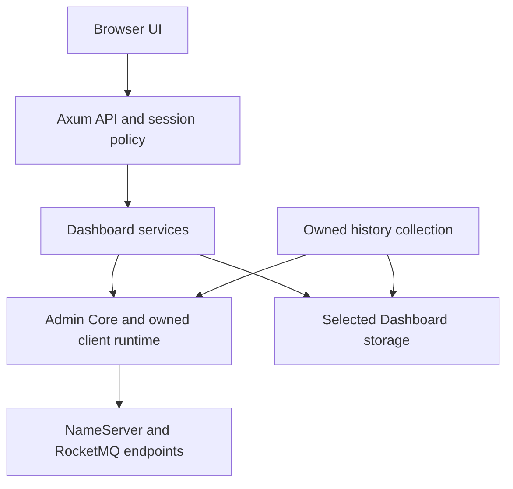

The Web Dashboard consists of an independent Axum backend and a React/TypeScript frontend. It queries and administers configured RocketMQ services and stores its own configuration, sessions, audit and observation data. Its database is not a Broker message store. Use [Dashboard selection](./dashboards.md) to compare it with the desktop products.

## Request and persistence paths



The frontend uses `src/api/client.ts` with credentialed requests. The backend router separates public health/login routes from protected operational routes. Thin handlers call services; reusable models and contracts come from `rocketmq-dashboard-common`. Admin operations have real cluster effects. Refreshing a view and resetting a consumer offset are different operations; the latter needs deliberate target selection and the product's confirmation/authorization path.

## Start a local development instance

Prepare the repository's Rust toolchain, Node/npm and native prerequisites for the backend dependency graph. Start NameServer and Broker using [local source setup](../getting-started/local-source.md). The addresses below assume the tutorial cluster on the same machine. In PowerShell, from the repository root:

```powershell
cd rocketmq-dashboard/rocketmq-dashboard-web/backend
$env:DASHBOARD_WEB_HOST = '127.0.0.1'
$env:DASHBOARD_WEB_PORT = '8082'
$env:NAMESRV_ADDR = '127.0.0.1:9876'
$env:DASHBOARD_WEB_STORAGE_BACKEND = 'file'
$env:DASHBOARD_WEB_STORAGE_PATH = 'data/docs-dashboard'
$env:DASHBOARD_WEB_LOGIN_REQUIRED = 'false'
cargo run --bin rocketmq-dashboard-web-backend
```

Use a new dedicated data directory. Relative paths resolve from the backend working directory. This loopback development example disables login; it is not a shared deployment configuration. The backend also contains a storage utility, so select the server with `--bin` rather than bare `cargo run`.

In a second terminal, independently starting from the repository root:

```powershell
cd rocketmq-dashboard/rocketmq-dashboard-web/frontend
npm ci
npm run dev
```

Reuse installed dependencies when already available. Vite selects port 3003 and proxies `/api` to `http://127.0.0.1:8082` by default. Open the URL actually printed by Vite; an occupied port can change it. `VITE_API_TARGET` changes the development proxy target. It does not reconfigure the Rust backend or become a production reverse proxy.

From another terminal, inspect process and storage readiness:

```powershell
Invoke-RestMethod 'http://127.0.0.1:8082/api/health/live'
Invoke-RestMethod 'http://127.0.0.1:8082/api/health/ready'
```

`/api/health/live` reports process liveness; `/api/health/ready` includes storage readiness, and `/api/health` is a readiness alias. None proves that every RocketMQ endpoint is reachable. In the UI, confirm the selected NameServer, refresh cluster/Broker data, then locate the tutorial topic and consumer group. Inspect an explicit query error before interpreting an empty table as an empty cluster.

## Choose exactly one storage backend

| Backend | Configuration | Ownership and deployment |
| --- | --- | --- |
| File | `DASHBOARD_WEB_STORAGE_BACKEND=file`; `DASHBOARD_WEB_STORAGE_PATH` is a directory | Exclusive process-lifetime directory lock; single-node deployment |
| SQLite | Backend `sqlite`; storage path is an on-disk database file | In-memory URLs are rejected; single-node deployment |
| MySQL | Backend `mysql`; database URL supplied separately | External database; use certificate-verified TLS in production |
| PostgreSQL | Backend `postgres`; database URL supplied separately | External database; use certificate-verified TLS in production |

The selection is strict: an unknown backend, invalid path or missing required URL prevents startup; there is no fallback to File storage. `DASHBOARD_WEB_DATABASE_URL` and `DASHBOARD_WEB_DATABASE_URL_FILE` are mutually exclusive. The file option reads a mounted secret containing the complete URL. These SQL settings do not apply to File or SQLite.

Pool defaults are minimum 1 / maximum 10 connections, 5000 ms connect timeout, 3000 ms acquire timeout, 600 s idle timeout and 1800 s maximum lifetime. The corresponding variables are `DASHBOARD_WEB_DB_MIN_CONNECTIONS`, `DASHBOARD_WEB_DB_MAX_CONNECTIONS`, `DASHBOARD_WEB_DB_CONNECT_TIMEOUT_MS`, `DASHBOARD_WEB_DB_ACQUIRE_TIMEOUT_MS`, `DASHBOARD_WEB_DB_IDLE_TIMEOUT_SECS` and `DASHBOARD_WEB_DB_MAX_LIFETIME_SECS`. The minimum can be zero and cannot exceed the maximum; timeout values and maximum must be positive.

History collection defaults to a 60 s interval, 30-day retention, 500-row retention batches and 30 s lease TTL. Configure `DASHBOARD_WEB_HISTORY_INTERVAL_SECS`, `DASHBOARD_WEB_HISTORY_RETENTION_DAYS`, `DASHBOARD_WEB_HISTORY_RETENTION_BATCH_SIZE` and `DASHBOARD_WEB_HISTORY_LEASE_TTL_SECS` for the deployment. Historical samples are observations, not a transactionally complete record of Broker activity.

## Keep the three identities separate

| Boundary | Configuration and behavior |
| --- | --- |
| Browser to Dashboard | Enable `DASHBOARD_WEB_LOGIN_REQUIRED` and provision `DASHBOARD_WEB_USERNAME` / `DASHBOARD_WEB_PASSWORD`; do not deploy the built-in example credentials. Protected requests validate the persistent session. |
| Browser session | `dashboard_session` is HttpOnly and SameSite=Strict. `DASHBOARD_WEB_SESSION_COOKIE_SECURE` defaults to true; use HTTPS for shared deployments. For an explicitly local plain-HTTP login test, set it false only in that local environment. |
| Cross-origin browser access | `DASHBOARD_WEB_CORS_ORIGIN` accepts one exact HTTP(S) origin. With no value, CORS is disabled; there is no wildcard fallback. SameSite cookie rules still apply, so arbitrary cross-site hosting does not become supported merely by enabling CORS. |
| Dashboard to RocketMQ | Pair `DASHBOARD_WEB_ROCKETMQ_ACCESS_KEY` and `DASHBOARD_WEB_ROCKETMQ_SECRET_KEY`; optional `DASHBOARD_WEB_ROCKETMQ_SECURITY_TOKEN`. `DASHBOARD_WEB_USE_TLS` and `DASHBOARD_WEB_USE_VIP_CHANNEL` select connection behavior. |
| Dashboard to SQL | Use the separate database URL secret and verified server certificate/CA. Never put either database or RocketMQ secrets in frontend `VITE_` variables. |

Session TTL defaults to 28800 s and the active-session limit to 32. Session/audit cleanup has separate retention settings in [AppConfig](https://github.com/mxsm/rocketmq-rust/blob/main/rocketmq-dashboard/rocketmq-dashboard-web/backend/src/config/app_config.rs). Dashboard login does not grant Broker ACL permissions, and configuring Broker credentials does not authenticate a browser user.

## Build and deploy the two parts

From `frontend/`, `npm run build` produces `dist/`. From `backend/`, `cargo build --release --bin rocketmq-dashboard-web-backend` produces the server executable under that Cargo target directory. The Axum router serves APIs; it does not automatically host the frontend bundle. Serve the static bundle and route `/api` to the backend through the deployment's HTTPS reverse proxy. Configure SPA fallback for frontend routes while preserving API JSON errors.

The frontend's `VITE_API_BASE_URL` is a build-time API prefix; leaving it empty supports the same-origin arrangement above. A separately hosted API requires the exact origin, credentialed requests and compatible cookie/site configuration. Rebuilding the frontend is necessary when its build-time API prefix changes.

`deploy/docker-compose.storage.yml` is a backend storage deployment example with one of `file`, `sqlite`, `mysql` or `postgres` profiles. It is not a complete frontend hosting stack. Its SQL profiles use external databases and mounted URL/CA secrets; MySQL uses `ssl-mode=verify_identity` and PostgreSQL `sslmode=verify-full`. Consult the [storage deployment guide](https://github.com/mxsm/rocketmq-rust/blob/main/rocketmq-dashboard/rocketmq-dashboard-web/docs/storage-deployment.md) before choosing replicas, database privileges, backup or migration procedures.

Stop the foreground backend with Ctrl+C and let its owned services finish shutdown; stop Vite separately. Back up the selected Dashboard storage according to its engine, separately from Broker data. Do not remove a database to solve a transient login or readiness error: it also contains other Dashboard state.

## Diagnose by boundary

| Symptom | First checks |
| --- | --- |
| UI loads, all API calls fail | Backend process, Vite proxy or production `/api` routing, actual API prefix |
| Login succeeds but next request is unauthenticated | Browser cookie rejection, HTTPS/Secure setting, SameSite behavior, exact origin and session validity |
| Live is healthy, ready fails | Selected storage, directory lock, database reachability, TLS/CA, pool exhaustion and migration status |
| Storage is healthy, cluster query fails | NameServer selection, advertised Broker addresses reachable from the backend, ACL and TLS |
| A second File instance fails | Another process owns the directory; use the intended single instance, not lock removal |
| History is sparse or delayed | Collection interval/lease, query failures and retention; compare observation timestamps |

This guide was checked against configuration and routing source, with paired document and website checks. It does not claim a live Dashboard login, database failover or browser-to-cluster trial during documentation work.

Sources: [Web README](https://github.com/mxsm/rocketmq-rust/blob/main/rocketmq-dashboard/rocketmq-dashboard-web/README.md), [API router](https://github.com/mxsm/rocketmq-rust/blob/main/rocketmq-dashboard/rocketmq-dashboard-web/backend/src/api/router.rs), [session middleware](https://github.com/mxsm/rocketmq-rust/blob/main/rocketmq-dashboard/rocketmq-dashboard-web/backend/src/middleware/auth_layer.rs), [frontend API client](https://github.com/mxsm/rocketmq-rust/blob/main/rocketmq-dashboard/rocketmq-dashboard-web/frontend/src/api/client.ts) and [Vite configuration](https://github.com/mxsm/rocketmq-rust/blob/main/rocketmq-dashboard/rocketmq-dashboard-web/frontend/vite.config.ts).
