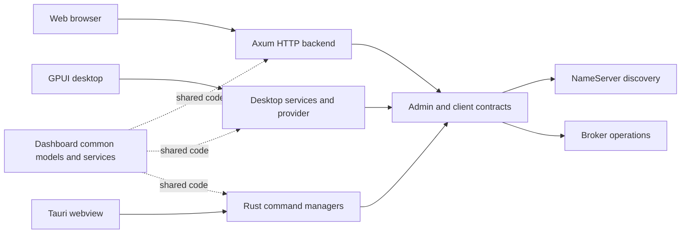

# Choose and run a Dashboard

The repository has three Dashboard applications: Web, GPUI and Tauri. They share RocketMQ administration concepts and selected common code, but have separate application lifecycles, persistence and build roots. Choose by deployment model first, then confirm the operations you need in that implementation.

## Product comparison

| Product | User interface and execution | Persistence / connection owner | Suitable starting point |
| --- | --- | --- | --- |
| Web | React/TypeScript browser UI calling a separate Axum HTTP backend | Backend selects File, SQLite, MySQL or PostgreSQL; backend owns outbound RocketMQ access | A centrally operated browser service |
| GPUI | Native GPUI/gpui-component desktop application | Desktop configuration/history/monitor stores and live admin provider | A native operator workstation with a graphical desktop |
| Tauri | React/TypeScript UI in a Tauri desktop shell, calling Rust commands | Rust application managers and shared configuration services | A packaged desktop application using web UI components |
| Dashboard common | Library, not a user-facing executable | Shared models, configuration and optional admin facade | Reuse of UI-independent domain behavior |

Do not interpret shared terminology as complete feature parity. Query, administration, authentication, history and monitoring flows must be checked in the selected product. These applications can perform mutations; a dashboard is not equivalent to the [read-only MCP](./mcp.md) service.



The applications own separate runtime and persistence lifecycles. The diagram shows shared responsibility, not one shared process or a common live database. NameServer discovery and Broker operations require reachable advertised addresses from the machine running the backend/desktop process.

## Web: separate backend and frontend

Run the backend from its own Cargo root:

```bash
cd rocketmq-dashboard/rocketmq-dashboard-web/backend
cargo run --bin rocketmq-dashboard-web-backend
```

The explicit binary matters because this package also includes a storage utility. The documented backend default is `http://127.0.0.1:8082`. Set `NAMESRV_ADDR` for the intended cluster and review the backend's authentication, storage and connection configuration before exposing it beyond local development.

In a second terminal starting at the repository root:

```bash
cd rocketmq-dashboard/rocketmq-dashboard-web/frontend
npm ci
npm run dev
```

Reuse installed dependencies on subsequent runs. Vite requests port `3003` and proxies `/api` to `http://127.0.0.1:8082` by default; `VITE_API_TARGET` changes the development proxy target. Use the URL Vite actually prints if a port is already occupied. This development proxy is not a production HTTP deployment configuration.

Web persistence is selected strictly at startup. File storage uses a directory with a process-lifetime exclusive lock; SQLite uses an on-disk file. MySQL/PostgreSQL require their database URL and corresponding connectivity/TLS configuration. An unknown backend or unavailable required configuration must not be interpreted as a fallback to File storage.

`GET /api/health/live` reports process liveness. `GET /api/health/ready` includes storage readiness; `/api/health` remains the readiness endpoint. These do not by themselves prove that every RocketMQ operation or downstream Broker is healthy.

Build frontend assets with `npm run build` from the frontend directory. Backend deployment, durable storage, session authentication and the reverse-proxy/API origin remain separate tasks. See the [Web product README](https://github.com/mxsm/rocketmq-rust/blob/main/rocketmq-dashboard/rocketmq-dashboard-web/README.md) for detailed environment variables and storage operation procedures.

## GPUI: native desktop ownership

From the repository root:

```bash
cd rocketmq-dashboard/rocketmq-dashboard-gpui
cargo run
```

For an optimized executable, use `cargo build --release` in that directory. A graphical desktop is required. Windows needs the MSVC C++ toolchain and Windows SDK; macOS needs Xcode command-line tools; Linux needs the GUI development libraries in the [GPUI guide](https://github.com/mxsm/rocketmq-rust/blob/main/rocketmq-dashboard/rocketmq-dashboard-gpui/AGENTS.md). This is a standalone Rust 2024 workspace.

Configuration defaults to `rocketmq-dashboard/gpui/config.json` beneath the OS user configuration directory. `ROCKETMQ_DASHBOARD_GPUI_CONFIG_PATH` overrides the complete file path. NameServer and connection settings are stored there.

Local dashboard login and outbound RocketMQ credentials are separate. When local login is enabled, the application requires `ROCKETMQ_DASHBOARD_USERNAME` and `ROCKETMQ_DASHBOARD_PASSWORD`. When the Admin credential source is `environment`, it uses `ROCKETMQ_ADMIN_ACCESS_KEY` and `ROCKETMQ_ADMIN_SECRET_KEY`, with optional `ROCKETMQ_ADMIN_SECURITY_TOKEN`. Supply secrets using the workstation's managed environment; do not put actual values in shared screenshots or reports.

The GPUI entry point initializes components and owns the application runtime. Admin and persistence work runs through injected child scopes rather than the render path. Closing the event loop triggers runtime cleanup. See [GPUI README](https://github.com/mxsm/rocketmq-rust/blob/main/rocketmq-dashboard/rocketmq-dashboard-gpui/README.md).

## Tauri: frontend build versus desktop package

From the repository root:

```bash
cd rocketmq-dashboard/rocketmq-dashboard-tauri
npm ci
npm run tauri dev
```

Install the target operating system's Tauri prerequisites before this native build. The React interface calls Rust command managers; the Rust application owns a shared client runtime and closes its admin managers during shutdown. A browser-only preview does not exercise that desktop command bridge.

| Command and directory | Result |
| --- | --- |
| `npm run build` in the Tauri app root | TypeScript/Vite frontend assets |
| `cargo check` or `cargo build` in `src-tauri` | Rust backend checking or binary compilation |
| `npm run tauri build` in the app root | Desktop package/bundle for the configured platform |

The default bundle location is `src-tauri/target/release/bundle/` unless the target directory is overridden. Do not report a frontend build as a packaged or tested desktop application. See [Dashboard build guide](https://github.com/mxsm/rocketmq-rust/blob/main/rocketmq-dashboard/README.md) and [Tauri application owner](https://github.com/mxsm/rocketmq-rust/blob/main/rocketmq-dashboard/rocketmq-dashboard-tauri/src-tauri/src/lib.rs).

## Diagnose the correct boundary

| Symptom | First distinction |
| --- | --- |
| Web UI loads but requests fail | Browser-to-backend API/proxy/session failure versus backend-to-RocketMQ failure |
| Login succeeds but cluster access fails | Local/product authentication versus outbound RocketMQ authentication and authorization |
| Empty topic or consumer table | Selected cluster, actual response, loading/error state and permitted visibility; not proof that the cluster has no data |
| Web service fails during startup | Selected storage driver, path/URL, exclusive lock and readiness; do not change backend to hide a persistence failure |
| Native build fails | Correct standalone directory, Rust edition/toolchain, Node dependencies and OS-native prerequisites |
| Data differs between products | Different selected cluster, sampling time, product persistence or implemented operation; common models do not synchronize application state |

Start with read operations against an isolated development cluster. Inspect the target and operation effect before a metadata, offset or message mutation; retain product confirmation and authorization behavior. No Web, GPUI or Tauri application was built or launched as part of writing this overview, and no cross-platform or operation-parity result is claimed.

Sources: [Dashboard common](https://github.com/mxsm/rocketmq-rust/blob/main/rocketmq-dashboard/rocketmq-dashboard-common/Cargo.toml), [Web architecture](https://github.com/mxsm/rocketmq-rust/blob/main/rocketmq-dashboard/rocketmq-dashboard-web/AGENTS.md), [Web development proxy](https://github.com/mxsm/rocketmq-rust/blob/main/rocketmq-dashboard/rocketmq-dashboard-web/frontend/vite.config.ts), [GPUI guide](https://github.com/mxsm/rocketmq-rust/blob/main/rocketmq-dashboard/rocketmq-dashboard-gpui/README.md), [Tauri scripts](https://github.com/mxsm/rocketmq-rust/blob/main/rocketmq-dashboard/rocketmq-dashboard-tauri/package.json).

## Detailed setup guides

- [Web Dashboard setup and operations](./dashboard-web.md)
- [GPUI and Tauri desktop setup](./dashboard-desktop.md)
