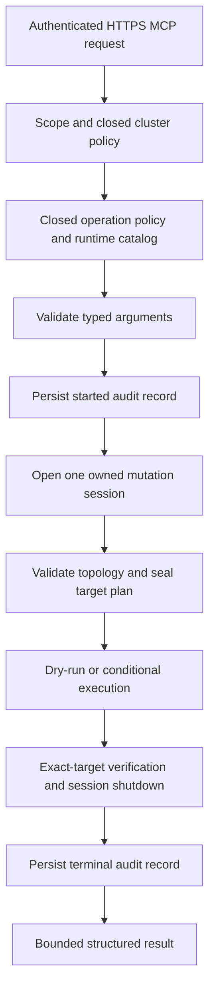

`rocketmq-mcp-control` is an independent HTTPS MCP server for five typed RocketMQ mutations. It is separate from [read-only MCP](./mcp.md): adding a query-MCP planning feature does not enable these tools. The default Control build contains no Admin Core dependency and no production mutation tools. Actual use requires the build capability, runtime policy, authenticated claims, configured cluster and durable audit path to agree.

## Supported operations and boundaries

| MCP tool | Closed policy operation | Scope and important constraint |
| --- | --- | --- |
| `rocketmq_upsert_topic` | `topic_upsert` | Complete Topic replacement on 1–64 explicit logical broker masters; queue counts 1–127, supported permission and message-type values |
| `rocketmq_upsert_consumer_group` | `consumer_group_upsert` | Complete Consumer Group replacement on 1–64 explicit logical broker masters; system groups are rejected |
| `rocketmq_reset_consumer_offset` | `consumer_offset_reset` | Topic/group and timezone-qualified RFC3339 timestamp; seals at most 1000 broker/queue targets and uses expected-offset CAS |
| `rocketmq_patch_broker_config` | `broker_config_patch` | Exactly one logical Broker and a nonempty patch restricted to six known properties |
| `rocketmq_set_consumer_request_mode` | `consumer_request_mode` | Topic/group, `pull` or `pop`, nonnegative shared-queue count and timeout 1–24000 ms |

Broker patches accept only `autoCreateTopicEnable`, `autoCreateSubscriptionGroup`, `brokerPermission`, `defaultTopicQueueNums`, `messageIndexEnable` and `traceTopicEnable`. Boolean strings must be lowercase; null/empty values and unknown keys are rejected. See the [complete tool schemas and examples](https://github.com/mxsm/rocketmq-rust/blob/main/rocketmq-ai/rocketmq-mcp-control/docs/tool-reference.md) for required fields and exact limits.

There is no delete, skip, resend, arbitrary Admin command, shell, subprocess, free-form RPC or stdio transport. The optional `write-tools` feature enables only Admin Core's mutation-client adapter, not a read/full adapter. Necessary preflight/post-read observations belong to that typed mutation session; they do not create a general query surface.

## Authorization, audit and session order



OAuth and operation/cluster authorization complete before mutation argument parsing. A durable `started` record completes before session creation or RPC. The owned supervisor keeps the acquired session through bounded shutdown even if the caller disconnects, cancels or times out. A successful transport response alone does not describe the target effect.

Every operation validates the complete selected-cluster topology before target state RPCs. Conditional changes use the sealed target/session and are not retried by resolving a new route after conflict. Topic upsert treats the complete NameServer order-Topic KV as a no-write guard: selected ordered entries must already match the requested queue count, and selected unordered entries must be absent. The targeted path never repairs that global KV. A change before CAS prevents broker writes; a change afterward retains applied Broker truth and reports partial reconciliation failure.

## Build the independent service

From the repository root, enter the Control project. The first command builds the default no-mutation surface; the second selects the production tool capability:

```powershell
cd rocketmq-ai/rocketmq-mcp-control
cargo build --locked --release
cargo build --locked --release --features write-tools
```

Choose the build needed rather than treating both as deployment steps. The executable is `target/release/rocketmq-mcp-control`, with `.exe` on Windows, unless Cargo's target directory is overridden. Root workspace builds do not include this project. The package selects Rust 2021 and MSRV 1.95.0.

## Prepare configuration and real identity infrastructure

Start from [conf/mcp-control.example.toml](https://github.com/mxsm/rocketmq-rust/blob/main/rocketmq-ai/rocketmq-mcp-control/conf/mcp-control.example.toml). It is a template with example hosts and missing certificate/credential material, not a self-contained local environment.

| Section | Required setup |
| --- | --- |
| `server` | Explicit non-wildcard bind; example `127.0.0.1:8090` and `/mcp`. Use a canonical public HTTPS base URL and a real certificate/key pair. |
| `oauth` | Exact HTTPS issuer, audience and public HTTPS JWKS URL. Only RS256 OAuth JWTs are accepted, including bounded `kid`, signature, expiry, subject and `rocketmq:write` scope. |
| `clusters` | Map a closed logical alias to its private NameServer endpoint and TLS policy; use environment-variable references for optional access/secret/security-token credentials. Inline secrets are rejected. |
| `mutations` | Initially `mutations_enabled=false`, `dry_run=true` and empty operation/cluster allowlists. Enable only the intended operation and logical cluster when prerequisites are ready. |
| `audit` | Writable durable JSONL destination; example capacity 4096 and maximum record size 4096 bytes. Preserve and recover the existing trail rather than replacing it on restart. |

Configuration rejects unknown fields and loads only at startup. TLS/audit path strings are used as configured; the loader does not rebase them to the TOML directory. Use absolute paths or keep a deliberate process working directory. `ROCKETMQ_MCP_CONTROL_CONFIG` selects the file; this binary has no `--config` CLI route.

JWKS retrieval rejects private, loopback, link-local or reserved DNS answers and rechecks addresses at connection time. A local fake issuer is therefore not a substitute for the production authentication path. Keys have a bounded five-minute generation lifetime with refresh/negative-cache controls. Static tokens, HS algorithms and development authentication are unavailable. The HTTPS listener bounds requests to 1 MiB and 30 s; the example mutation operation timeout is 24 s.

The identity provider must issue matching `rocketmq_operations` and `rocketmq_clusters` claims plus `rocketmq:write`. `conf/permissions.example.toml` describes that vocabulary; it is not a local permission file that bypasses OAuth. The subject must satisfy the safe bounded operator grammar documented in the tool/runbook sources.

After provisioning a configuration file, from the Control directory:

```powershell
$env:ROCKETMQ_MCP_CONTROL_CONFIG = (Resolve-Path 'conf/mcp-control.local.toml').Path
cargo run --locked --release --features write-tools
```

For the first discovery, keep mutations disabled. To discover a selected tool, set `mutations_enabled=true`, add its closed operation and cluster allowlists, ensure a matching registry entry and OAuth claims, then restart. Even a dry-run requires those tool-enablement conditions. The fixed resource `rocketmq-control://capabilities` reports compile/runtime/registered state; `mutation_supported` is not true merely because the binary was built with a feature. Prompts and resource templates are empty.

## Perform a dry-run before an intentional change

Use an authenticated, initialized HTTPS MCP session. The following complete call requests a plan for an example logical cluster and Broker; replace those names with configured and authorized targets. It can read target state and write audit records, but `dry_run=true` does not apply the Broker patch:

```json
{
  "jsonrpc": "2.0",
  "id": 2,
  "method": "tools/call",
  "params": {
    "name": "rocketmq_patch_broker_config",
    "arguments": {
      "schema_version": "rocketmq-mcp-control.arguments.v1",
      "cluster": "production-a",
      "broker_name": "broker-a",
      "properties": { "traceTopicEnable": "true" },
      "dry_run": true,
      "confirm": false
    }
  }
}
```

Inspect aggregate `before` and `requested` plus broker-sorted target evidence. For an intentional execution, preserve the reviewed target/payload, explicitly set `dry_run=false` and `confirm=true`, and provide a safe reason such as `CHG-10016 enable tracing`. A reason is trimmed 5–256 byte ASCII using letters, digits, spaces and `._,#-`; token-, address- and endpoint-shaped content is rejected. Dry-run can omit the reason. `confirm` defaults to false.

An optional `request_key` provides process-local singleflight/result reuse for 10 minutes, bounded to 4096 entries. It is scoped by principal, operation, cluster, sorted targets and canonical payload. Reusing a key with a different payload is rejected. Cache hits/followers open no new Admin session, but each invocation still persists its own audit pair. This is not cross-restart exactly-once execution; a caller timeout is not a rollback guarantee.

## Interpret results and recover

Results use `rocketmq-mcp-mutation.v1` with aggregate `before`, `requested` and `after`, plus per-target persistence and verification evidence.

| Status | Interpretation |
| --- | --- |
| `planned` | Dry-run plan; no applied mutation |
| `applied` | Applied or unchanged success; `changed=false` is the no-change case |
| `conflict` | `precondition_conflict`; expected state changed and no automatic conflict retry occurs |
| `partial` | `partial_apply`; inspect each target rather than treating the operation as atomic |
| `failed` | May still include an applied target with failed persistence/post-read verification; inspect `error_code` and target evidence |

Conflict, partial and failed outcomes set MCP `isError=true` while retaining structured data. A failed result does not universally mean no effect. `order_reconciliation_failed` preserves Broker-applied state instead of rewriting the global order KV.

Reliable audit failures normalize to `audit_unavailable`. Failed `started` persistence prevents sessions and RPC; terminal audit failure can occur after an effect and after bounded session shutdown. A partial disk tail or poisoned live audit trail needs explicit repair/recovery handling. Do not blindly retry a write after an ambiguous terminal failure.

Audit v2 alone can retain the validated OAuth subject and safe reason as operator evidence. Responses, ordinary logs, tracing and errors exclude them; all surfaces exclude credentials, tokens, endpoints, message bodies and raw backend errors. See the [operations runbook](https://github.com/mxsm/rocketmq-rust/blob/main/rocketmq-ai/rocketmq-mcp-control/docs/operations-runbook.md) for audit recovery and partial-target investigation.

To stop new mutations, disable `mutations_enabled` or remove the operation/cluster allowlist and restart; configuration does not hot reload. Reconcile uncertain target state through separately authorized operational tools. The Control server does not invent compensating writes. These are product runtime controls; omitting documentation approval gates does not remove them.

This page verifies source-defined configuration, catalog and schemas. No OAuth deployment, real Control session or cluster mutation was executed during documentation work.

Sources: [manifest](https://github.com/mxsm/rocketmq-rust/blob/main/rocketmq-ai/rocketmq-mcp-control/Cargo.toml), [configuration loader](https://github.com/mxsm/rocketmq-rust/blob/main/rocketmq-ai/rocketmq-mcp-control/src/config.rs), [process entry](https://github.com/mxsm/rocketmq-rust/blob/main/rocketmq-ai/rocketmq-mcp-control/src/main.rs), [catalog](https://github.com/mxsm/rocketmq-rust/blob/main/rocketmq-ai/rocketmq-mcp-control/src/catalog.rs) and [product boundary](https://github.com/mxsm/rocketmq-rust/blob/main/rocketmq-ai/rocketmq-mcp-control/AGENTS.md).
