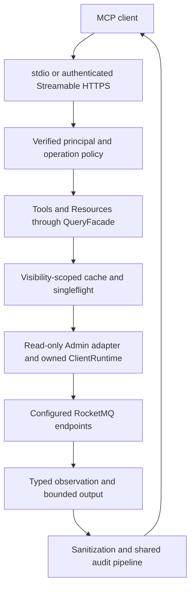

# Read-only MCP diagnostics

`rocketmq-mcp` is a standalone Model Context Protocol server for RocketMQ queries, diagnosis and runbook prompts. It runs outside Broker, NameServer and Dashboard processes and uses Admin Core's `read-client-adapter`. Its default tools do not open mutation sessions. The optional planning feature produces proposals; it does not apply them.

## Request path and ownership



The MCP process owns its lifecycle, query runtime, cache and asynchronous audit writer. Shutdown closes admission, drains accepted audit records, flushes the sink and closes owned tasks against a deadline. A cached observation describes when data was observed, not a new remote read or a guarantee that the cluster has not changed.

## Build the selected transport

From the repository root, enter the standalone project:

```bash
cd rocketmq-ai/rocketmq-mcp
cargo build --locked --release
```

The default features are `read-only`, `diagnose` and `stdio`. In that same directory, an HTTPS build can use:

```bash
cargo build --locked --release --features streamable-http
```

`streamable-http` includes the authentication feature; it is not an unauthenticated HTTP mode. `observability` enables in-process signals, while `otlp` selects the implemented OTLP gRPC support. `change-planning` adds five planning tools subject to runtime policy. None of these features turns Query MCP into MCP Control.

The binary is `target/release/rocketmq-mcp`, or `rocketmq-mcp.exe` on Windows. Root-workspace `cargo build` does not build this standalone package. Native dependencies come from its selected dependency graph; see [features/platforms](../reference/features-platforms.md).

## Prepare a local stdio configuration

Copy [conf/mcp.example.toml](https://github.com/mxsm/rocketmq-rust/blob/main/rocketmq-ai/rocketmq-mcp/conf/mcp.example.toml) to your own configuration file. Keeping it in the same `conf` directory preserves the example's relative permission-file path; when moving it elsewhere, also copy the policy file and deliberately resolve audit/TLS references. Choose a new filename rather than replacing an existing operator configuration.

For the first-message development cluster, edit the existing cluster entry to these values instead of appending another default cluster:

```toml
[[clusters]]
name = "local-dev"
rocketmq_cluster_name = "DocsCluster"
namesrv_addr = "127.0.0.1:9876"
default = true
```

This is a replacement fragment, not a complete configuration. Remove unused sample Proxy/Controller aliases or set them to the real services you intend to query. A logical MCP cluster name can differ from the physical RocketMQ cluster name. Tools take configured logical aliases rather than arbitrary network addresses.

| Setting | Checked-in example / behavior |
| --- | --- |
| `security.profile` | `diagnose` for local diagnosis scope |
| `security.allow_change_planning` | `false`; compilation alone cannot allow planning calls |
| `security.permissions_file` | `permissions.example.toml`, loaded relative to the config file |
| `security.sanitize_output` | `true` |
| `security.max_concurrent_requests_per_cluster` | 8 |
| `security.rate_limit_per_minute` | 60 per principal/cluster/operation policy |
| `audit.enabled` / `sink` | `true` / `file`; choose a writable audit path |
| `cache.enabled` / `max_entries` | `true` / 256; per-query TTLs govern freshness |
| `server.stdio.log_to_stderr` | `true`; stdout is reserved for MCP frames |

Start from the MCP directory after editing `conf/mcp.local.toml`:

```bash
cargo run --locked -- --config conf/mcp.local.toml --transport stdio
```

Configure your local MCP client to launch the built binary with those arguments and an explicit absolute config path. Stdio is a local-development process integration; a terminal waiting for protocol input is not an HTTP server. Do not prepend shell banners or redirect diagnostic text into stdout.

The config path is required through `--config` or `ROCKETMQ_MCP_CONFIG`. Permission, TLS, JWKS CA and audit paths resolve relative to the config file. The CLI currently assigns its `--transport` value after loading the file, and that argument defaults to `stdio`. Always pass `--transport streamable-http` explicitly for HTTPS; setting only `server.transport` in the file is insufficient for this CLI path. Optional `--bind` and `--endpoint` override their corresponding file values.

## Streamable HTTPS and identities

HTTPS requires the compiled transport, a readable certificate/private-key pair, an allowed origin policy and authentication configuration. The example listens on `127.0.0.1:8089` with endpoint `/mcp` and public base URL `https://127.0.0.1:8089`. These defaults do not supply actual certificate files or credentials.

| Boundary | Identity and configuration |
| --- | --- |
| Local development HTTP | `development-token` is restricted to loopback development; the token is read through the configured environment reference. |
| Production HTTP | `oauth-jwt` validates RS256 tokens with `kid`, signature, issuer, audience, expiry and required scopes against HTTPS JWKS. |
| Private JWKS CA | Configure `jwks_ca_path` with a readable PEM trust bundle; relative paths belong to the config directory. |
| Tool execution | Verified roles/scopes, configured clusters, cluster claims, tenant binding, rate limits and operation policy apply at their defined stages. |
| Outbound RocketMQ | Separate request-signing credentials from configured file/environment references; the incoming bearer token is never forwarded. |

Production OAuth has no static `jwt_key_env` fallback. Key refresh failures preserve an already verified generation within the configured stale window. The protected-resource metadata endpoint is intentionally available without a bearer token for discovery. The MCP endpoint itself remains authenticated.

After configuring these materials, launch from the MCP directory:

```bash
cargo run --locked --features streamable-http -- --config conf/mcp.local.toml --transport streamable-http --bind 127.0.0.1:8089 --endpoint /mcp
```

An HTTP-capable MCP client connects to the HTTPS endpoint and sends its authorization header and `Accept: application/json, text/event-stream`. Certificate validation, protocol initialization and the session/stream lifecycle belong to the MCP client. A bare unauthenticated GET is not a complete tool invocation.

RocketMQ signing credentials must be separate from HTTP identity. A configured YAML credential file contains `access_key`, `secret_key` and optional `security_token` and is bounded to 64 KiB. Alternatively, configure environment-variable references. Inline secret values and mixed file/environment sources are rejected. Credentials are resolved at startup and for new read sessions, supporting mounted-secret rotation. Grant the Broker identity only the required read access.

## Discover and call tools

The checked-in protocol version is `2025-11-25`; initialization rejects another version. After initialization, use `tools/list` for the caller-visible catalog. The source default catalog contains 24 tools, but policy can reduce discovery.

| Query family | Default tool names |
| --- | --- |
| Cluster / inventory | `rocketmq_get_cluster_overview`, `rocketmq_list_topics`, `rocketmq_list_consumer_groups` |
| Topic | `rocketmq_describe_topic`, `rocketmq_get_topic_route`, `rocketmq_get_topic_config_state`, `rocketmq_get_topic_stats`, `rocketmq_get_topic_config` |
| Consumers / connections | `rocketmq_get_consumer_lag`, `rocketmq_list_consumer_connections`, `rocketmq_list_producer_connections`, `rocketmq_get_consumer_group_config_state`, `rocketmq_get_consumer_group_details`, `rocketmq_get_consumer_progress` |
| Broker | `rocketmq_describe_broker`, `rocketmq_get_broker_diagnostics`, `rocketmq_get_broker_config_summary`, `rocketmq_get_broker_log_filter_state` |
| Infrastructure | `rocketmq_get_proxy_drain_state`, `rocketmq_get_ha_status`, `rocketmq_get_controller_metadata`, `rocketmq_get_nameserver_config_summary` |
| Message / diagnosis | `rocketmq_get_message_metadata`, `rocketmq_diagnose_consumer_lag` |

Use a simple explicit-cluster query first. This is a `tools/call` request for an already initialized MCP session, not a standalone HTTP command:

```json
{
  "jsonrpc": "2.0",
  "id": 2,
  "method": "tools/call",
  "params": {
    "name": "rocketmq_list_topics",
    "arguments": {"cluster": "local-dev", "limit": 25}
  }
}
```

`limit` is 1–200 and defaults to 50. Follow the opaque `data.next_cursor` while `has_more` is true; do not invent a cursor or treat it as a queue offset. Supply the same logical target and corresponding query parameters. See the [complete Tool Reference](https://github.com/mxsm/rocketmq-rust/blob/main/rocketmq-ai/rocketmq-mcp/docs/tool-reference.md) for exact schemas and per-tool output.

Discovery checks scopes and Tool allow/deny policy; it does not establish that a particular cluster/tenant call is authorized. The two inventory tools allow omitted clusters with a default/sole-cluster fallback; the current implementation does not run the same explicit per-cluster/tenant checks on that omitted-cluster path. Use explicit clusters in operational clients and account for this limitation in deployment policy; do not describe omission as a stronger isolation guarantee.

## Interpret observations, partial data and failures

Successful calls carry a `rocketmq-mcp.v2` envelope with request ID, logical cluster, observation time, freshness, cache status, partial flag, warnings and typed data. `hit`, `miss` and `bypass` distinguish query reuse. Failures are not cached. Query state and continuation cursors are separated into `standard` and `sensitive` visibility classes; state does not cross that class boundary.

Output arrays are bounded to 1,000 rows and structured output to 1 MiB. Truncation and source failures can produce partial results. Inspect warnings and `partial` before presenting an observation as complete. Message metadata tools omit bodies, and connection identities are pseudonymous; missing sensitive values are not necessarily a backend failure.

| Symptom/code | Next action |
| --- | --- |
| Missing tool | Inspect compiled feature, principal scope and Tool policy; planning additionally needs runtime permission at call time. |
| `unauthorized_scope` / `cluster_not_allowed` / `tenant_mismatch` | Check verified identity and configured policy; changing the query alias cannot grant access. |
| `source_unavailable` | Check the MCP process's route to configured NameServer/Broker/Proxy/Controller endpoints and outbound read credentials. |
| `rate_limited` | Reduce query rate and respect bounded retry; avoid multiplying retries across the AI client and MCP layer. |
| `output_too_large` or partial warning | Narrow the query, paginate where supported and preserve the warning in the diagnosis. |
| Stale observation | Inspect observation time, TTL/cache status and selected cluster before inferring a current outage. |
| stdio parse failure | Confirm protocol version and clean stdout; inspect stderr for redacted startup/transport diagnostics. |

Planning tools, when enabled, generate create-topic, update-topic-config, update-topic-permissions, update-Broker-config and reset-offset plans. They contain no Apply mode and call no mutation API. Execution belongs to separately designed operator/control workflows, not this diagnostic process.

This guide was checked against configuration, registration and protocol sources, with TOML/JSON and website rendering checks. It does not claim a live MCP-client session, OAuth/JWKS deployment or external-cluster diagnosis was tested during documentation writing.

Sources: [configuration parser](https://github.com/mxsm/rocketmq-rust/blob/main/rocketmq-ai/rocketmq-mcp/src/config.rs), [entry point](https://github.com/mxsm/rocketmq-rust/blob/main/rocketmq-ai/rocketmq-mcp/src/main.rs), [tool catalog](https://github.com/mxsm/rocketmq-rust/blob/main/rocketmq-ai/rocketmq-mcp/src/tools/catalog.rs), [protocol server](https://github.com/mxsm/rocketmq-rust/blob/main/rocketmq-ai/rocketmq-mcp/src/protocol/server.rs), [permission example](https://github.com/mxsm/rocketmq-rust/blob/main/rocketmq-ai/rocketmq-mcp/conf/permissions.example.toml), [read-only boundary](https://github.com/mxsm/rocketmq-rust/blob/main/rocketmq-ai/rocketmq-mcp/AGENTS.md).
