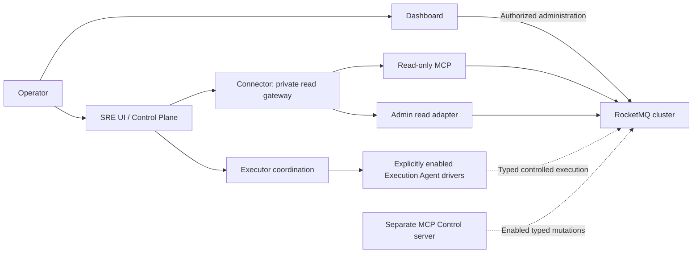

The ecosystem adds human-facing administration, read-only diagnostics and separately controlled automation around the core message services. Select a product by the work it owns, then follow its own build, configuration and identity boundary.

## Product selection

| Product | Role | Deployment boundary | Start here |
| --- | --- | --- | --- |
| Web Dashboard | Browser-based cluster/resource administration | Rust HTTP backend plus React frontend and selected persistent storage | [Web guide](./dashboards.md) |
| GPUI Dashboard | Native desktop administration | Standalone Rust desktop package | [GPUI project](./dashboards.md) |
| Tauri Dashboard | Desktop application with web UI | Node frontend, Rust backend and OS packaging | [Dashboard build guide](./dashboards.md) |
| MCP | Bounded read-only cluster diagnostics and optional non-mutating planning | Standalone server with stdio or configured Streamable HTTP | [MCP guide](./mcp.md) |
| MCP Control | Typed supervised cluster mutations | Independent TLS/OAuth server, feature and policy enablement | [Control guide](https://github.com/mxsm/rocketmq-rust/blob/main/rocketmq-ai/rocketmq-mcp-control/README.md) |
| AI SRE | Evidence, diagnosis, incidents, plans and execution coordination | Separate SRE workspace, services, UI and storage | [SRE guide](https://github.com/mxsm/rocketmq-rust/blob/main/rocketmq-ai/rocketmq-sre/README.md) |

`rocketmq-dashboard-common` is a shared root-workspace library. It does not replace a Dashboard application's backend or UI. The SRE UI and ordinary Dashboard are separate products and do not share sessions or raw mutation surfaces.

## Read and write paths remain distinct

The read gateway applies the SRE product's tenant/cluster, budget, deadline, redaction and audit policy. A model recommendation does not authorize the dotted mutation paths. The SRE Executor has no target credentials or target network access; registered Execution Agent drivers own the actual target interaction.

The default MCP Control build has no production mutation tools. With `write-tools`, runtime enablement and an operation allowlist still determine registration. Its reviewed surface is limited to the specified typed operations, not an arbitrary Admin command or shell interface.

## Build the system in useful order

1. Start the core cluster and verify its ordinary message path with [quick start](../getting-started/quick-start.md).
2. Configure the access identity and network reachability needed by the selected operations product.
3. Build that product from its own project root and prepare its persistent state.
4. Connect read-only inventory/diagnostics first and confirm the target cluster identity.
5. Enable only the management or execution capabilities required by the deployment, using that product's actual policy and credential path.
6. Configure observability, retention, shutdown and recovery for the product itself as well as for the target cluster.

An operational UI being reachable does not prove that it can authenticate to the target cluster. Likewise, the core message store and an operations product's database are separate state stores with different backup and scaling requirements.

## Dashboard-specific considerations

Web Dashboard has a Rust 2024/Axum backend and a React/TypeScript/Vite frontend. The backend is standalone and contains more than one binary, so select `rocketmq-dashboard-web-backend` when starting the HTTP server.

Its configured storage can be File, SQLite, MySQL or PostgreSQL. Startup selects one backend strictly; it does not silently fall back to File storage. File/SQLite deployments have different single-node constraints from deployments using an external SQL server. Readiness includes the selected storage's readiness; process liveness is a separate observation.

For Tauri, `npm run build` builds frontend assets. `npm run tauri build` packages the desktop application with its Rust side and platform tooling. For GPUI, use its standalone Cargo project and platform prerequisites. These checks are not interchangeable.

## MCP and SRE-specific considerations

MCP stdout is reserved for protocol frames in stdio mode. Streamable HTTP has its own authentication configuration; an incoming bearer token is not forwarded to RocketMQ as a cluster credential. Optional change planning returns non-mutating suggestions.

SRE is an independent Rust 2024 workspace with eleven crates, plus a UI and read-only Rust/TypeScript client interfaces. PostgreSQL is its durable system of record, and larger evidence payloads use private object storage. Model gateways, evidence retention and execution agents require explicit configuration.

Current Execution Agent action switches default to false, and only fully configured drivers are registered. A broad product capability table or a compiled type does not mean every action is enabled in a running deployment. Read the selected service's configuration and capability response.

MCP Control and SRE execution are independent mutation paths. Installing one does not automatically turn the read-only MCP server or SDK into a write interface.

## Keep product and cluster health separate

Track target-cluster availability, product database availability, credential validity, evidence freshness, model availability and execution-driver readiness as separate conditions. A stale or partial observation must remain marked as such; it cannot silently become a current healthy result.

For deeper system context, read [architecture overview](../architecture/overview.md), [module map](../architecture/module-map.md) and [deployment overview](../deployment/overview.md). Each product guide linked above owns its complete installation and operational procedure.
