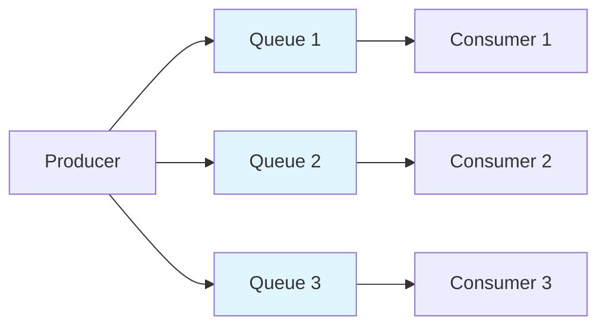

# Basic Concepts

Understanding RocketMQ-Rust's core concepts is essential for building effective messaging applications.

## Core Components

### Message

A message is the fundamental unit of communication in RocketMQ. Each message contains:

- **Topic**: The category to which the message belongs
- **Body**: The actual data payload (byte array)
- **Tags**: Optional labels for filtering messages within a topic
- **Keys**: Optional message keys for indexing and querying
- **Properties**: Additional key-value pairs for metadata

```rust
use rocketmq::model::Message;

let message = Message::new("TopicTest".to_string(), b"Hello".to_vec());
message.set_tags("tag1");
message.set_keys("key1");
```

### Topic

A topic is a logical grouping of messages. Producers send messages to topics, and consumers subscribe to topics.

Topics are partitioned into multiple queues for parallel processing and load distribution.

```
Topic: OrderEvents
├── Queue 0
├── Queue 1
├── Queue 2
└── Queue 3
```

### Producer

Producers are applications that send messages to RocketMQ brokers.

**Key Features:**
- Asynchronous sending
- Transactional messages
- Retry mechanisms
- Load balancing across brokers

```rust
use rocketmq::producer::Producer;

let producer = Producer::new(producer_option);
producer.start().await?;
producer.send(message).await?;
```

### Consumer

Consumers are applications that receive and process messages from RocketMQ brokers.

**Types of Consumers:**
- **Push Consumer**: Messages are pushed to the consumer
- **Pull Consumer**: Consumer actively pulls messages from the broker

```rust
use rocketmq::consumer::PushConsumer;

let consumer = PushConsumer::new(consumer_option);
consumer.subscribe("TopicTest", "*").await?;
consumer.start().await?;
```

### Broker

Brokers are RocketMQ servers that store and deliver messages. They handle:

- Message storage and persistence
- Message querying
- Consumer offset management
- High availability through replication

### Name Server

The Name Server is a lightweight service that provides:

- Route information for brokers
- Topic-to-broker mapping
- Heartbeat management

Brokers register with the Name Server on startup, and clients query the Name Server to discover broker addresses.

## Message Models

### Clustering Model (Default)

In clustering mode, messages are distributed among consumers in a consumer group. Each message is consumed by only one consumer.

```
Consumer Group: OrderProcessors
├── Consumer A → Queue 0, Queue 1
├── Consumer B → Queue 2, Queue 3
└── Consumer C → Queue 4, Queue 5

Message M1 (Queue 0) → Consumer A only
Message M2 (Queue 2) → Consumer B only
```

### Broadcasting Model

In broadcasting mode, each consumer receives all messages in the topic.

```
Consumer Group: LogAggregators
├── Consumer A → All messages
├── Consumer B → All messages
└── Consumer C → All messages

Message M1 → Consumer A, B, and C
```

## Message Delivery Semantics

### At Least Once (Default)

RocketMQ guarantees that each message is delivered at least once. This means:

- Messages are never lost
- Duplicate messages are possible
- Consumers should handle idempotency

### Ordering Guarantees

**Order within a queue**: Messages in the same queue are consumed in FIFO order.

**Order across queues**: No guaranteed order across different queues in the same topic.

For strict ordering, use a single queue or message queue selector.



## Consumer Groups

A consumer group is a logical grouping of consumers that work together to consume messages from a topic.

**Key Properties:**
- All consumers in a group share the same group name
- Each message is consumed by only one consumer in the group (clustering mode)
- Load balancing is automatic within the group
- Each group maintains its own consumer offsets

```rust
consumer_option.set_group_name("my_consumer_group");
```

## Next Steps

Now that you understand the basic concepts:

- [Architecture Overview](../category/architecture) - Deep dive into RocketMQ architecture
- [Producer Guide](../category/producer) - Learn advanced producer features
- [Consumer Guide](../category/consumer) - Learn advanced consumer features
