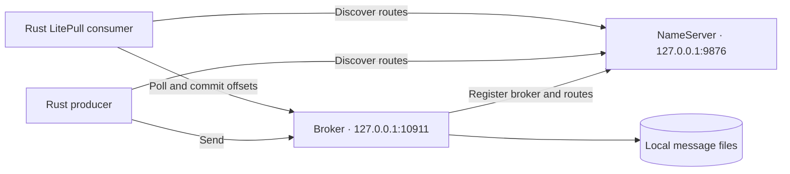

This walkthrough starts one Rust NameServer and one Rust Broker on the same machine. It uses local file storage, explicit resource creation, and loopback-only listeners. Complete [installation](installation.md) first and keep every terminal at the repository root.

## Topology and addresses



The NameServer supplies addresses; it does not relay message bodies. Both clients must reach the Broker address returned by route lookup. For this tutorial that address is loopback, so clients must run on the same machine and outside separate container network namespaces.

| Port | Purpose | Configuration |
| --- | --- | --- |
| 9876 | NameServer remoting | `listenPort` in `namesrv.toml` |
| 10911 | Broker remoting | `broker.listenPort` |
| 10909 | Broker fast remoting | Derived as the Broker port minus two |
| 10912 | Broker HA listener | `store.haListenPort` |

Keep these ports available. The single Broker is not a failover topology; an HA listener alone does not create a replica.

## Configuration and data directories

Use the checked-in [namesrv.toml](https://github.com/mxsm/rocketmq-rust/blob/main/rocketmq-website/examples/first-message/namesrv.toml) and [broker.toml](https://github.com/mxsm/rocketmq-rust/blob/main/rocketmq-website/examples/first-message/broker.toml). Their paths resolve relative to the working directory:

```text
.rocketmq-doc-demo/
  namesrv/       NameServer KV/config files
  broker/        Broker metadata and default log location
  store/         Message-store files
```

Create the directories before starting. In PowerShell:

```powershell
New-Item -ItemType Directory -Force .rocketmq-doc-demo/namesrv, .rocketmq-doc-demo/broker, .rocketmq-doc-demo/store
```

In a Unix shell:

```bash
mkdir -p .rocketmq-doc-demo/namesrv .rocketmq-doc-demo/broker .rocketmq-doc-demo/store
```

The Broker configuration uses the canonical `[broker]` and `[store]` sections. Its identity is cluster `DocsCluster`, broker `docs-broker`, ID `0`, with role `ASYNC_MASTER` and store type `LocalFile`. Automatic Topic and Consumer Group creation are disabled so that [quick start](quick-start.md) can show the administration steps explicitly.

`brokerIp1` is the advertised client address. `broker.brokerServerConfig.bindAddress` controls binding. Changing only the binding does not correct an unreachable advertised address. Keep `broker.listenPort` authoritative; the nested server port is derived from it. Broker metadata and message storage have separate `storePathRootDir` settings in the two sections.

## Terminal 1: start the NameServer

Set the development profile in each service terminal. PowerShell:

```powershell
$env:ROCKETMQ_HOME = "$PWD"
$env:ROCKETMQ_SECURITY_PROFILE = "development-insecure-loopback"
cargo run -p rocketmq-namesrv --bin rocketmq-namesrv-rust -- -c rocketmq-website/examples/first-message/namesrv.toml
```

Unix shell:

```bash
export ROCKETMQ_HOME="$PWD"
export ROCKETMQ_SECURITY_PROFILE=development-insecure-loopback
cargo run -p rocketmq-namesrv --bin rocketmq-namesrv-rust -- -c rocketmq-website/examples/first-message/namesrv.toml
```

Leave the process running. Inspect startup output for a bind or configuration error before proceeding. The profile explicitly permits insecure local development and requires loopback listeners. It is not suitable for exposing the services to a shared or public network.

## Terminal 2: start the Broker

PowerShell:

```powershell
$env:ROCKETMQ_HOME = "$PWD"
$env:ROCKETMQ_SECURITY_PROFILE = "development-insecure-loopback"
cargo run -p rocketmq-broker --bin rocketmq-broker-rust -- -c rocketmq-website/examples/first-message/broker.toml -n 127.0.0.1:9876
```

Unix shell:

```bash
export ROCKETMQ_HOME="$PWD"
export ROCKETMQ_SECURITY_PROFILE=development-insecure-loopback
cargo run -p rocketmq-broker --bin rocketmq-broker-rust -- -c rocketmq-website/examples/first-message/broker.toml -n 127.0.0.1:9876
```

The explicit `-n` selects the intended NameServer even if the environment contains another address. Normal Broker startup requires a usable NameServer registration path. Printing configuration with `-p` is useful for parsing checks but does not start listeners or validate the complete running system.

## Terminal 3: confirm registration

Set the NameServer in this terminal before running the admin commands. In PowerShell:

```powershell
$env:NAMESRV_ADDR = "127.0.0.1:9876"
```

In a Unix shell:

```bash
export NAMESRV_ADDR=127.0.0.1:9876
```

The current `clusterList` and `updateSubGroup` subcommands use the environment and do not accept `-n`. The Topic and progress commands below accept their own `-n` option; it is not a global CLI flag.

Run this read-only query:

```bash
cargo run -p rocketmq-admin-cli -- cluster clusterList
```

Look for `DocsCluster`, `docs-broker`, broker ID `0`, and `127.0.0.1:10911` in the result. A running process without this registration is not ready for the tutorial. If it is absent, inspect the Broker's registration error and the NameServer's listener before creating resources.

Continue with [quick start](quick-start.md). Keep the two services running while the producer and consumer execute.

## Stop and restart

Stop the client applications first. Press **Ctrl+C** in the Broker terminal and allow its shutdown to finish, then stop the NameServer the same way. Reuse the same configuration and data directories to restart. Do not start two Brokers against one store directory.

Restarting preserves metadata and stored consumption progress where applicable; it does not create an empty demonstration. Directory deletion is not part of normal shutdown or troubleshooting. Use the dedicated tutorial Topic and Group to keep the exercise separate from application resources.

Sources: [NameServer setup](https://github.com/mxsm/rocketmq-rust/blob/main/rocketmq-namesrv/README.md), [Broker configuration and lifecycle](https://github.com/mxsm/rocketmq-rust/blob/main/rocketmq-broker/README.md).
