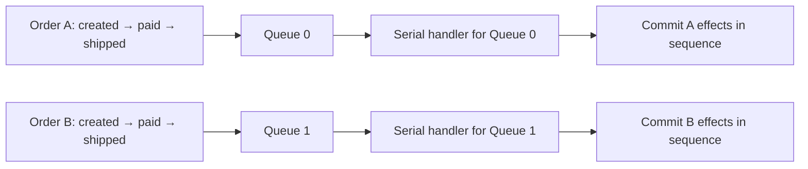

# Ordered messages

Ordering is a contract across producer routing, queue storage, consumer scheduling and business completion. Putting an order ID into a message key alone does not establish that contract.

For one business entity, send events serially to the same queue and process that queue through the intended orderly consumer path. Independent queues can progress in parallel and have no global ordering relation.

## Define the ordering scope



The arrows show per-queue sequencing. There is no arrow requiring an event on Queue 0 to finish before one on Queue 1. Several entities can share a queue; one blocked entity can then hold up others on that queue.

## Route related events consistently

The producer selector returns a queue from the current candidates. This excerpt assumes a started producer, an existing topic and an application-defined `order_id: usize`:

```rust
let message = Message::builder()
    .topic("OrderSendTestTopic")
    .key(format!("order-{order_id}"))
    .body("created")
    .build()?;
let result = producer.send_with_selector(
    message,
    |queues, _message, key: &usize| {
        if queues.is_empty() { None }
        else { Some(queues[*key % queues.len()].clone()) }
    },
    order_id,
).await?;
```

Inspect the send result before sending the next dependent event. A queue selector controls placement; it does not serialize two concurrent producers or await downstream business work.

Modulo routing is suitable for explaining the mechanism, but its mapping changes when the candidate list or queue count changes. An operational change needs a handover policy for in-flight sequences. Do not send the next event to a different queue merely because the first queue is temporarily unavailable.

## Consume through the orderly interface

Use `DefaultMQPushConsumer` with `MessageListenerOrderly`, a consistent group/subscription and the desired message model. In clustering mode, the client coordinates queue locks with the Broker and serializes local processing. Concurrent listeners do not provide the same ordering boundary.

An orderly listener receives `&mut ConsumeOrderlyContext` and returns `ConsumeOrderlyStatus`. With automatic commit in the context, return `Success` only after the ordered business effects complete. `SuspendCurrentQueueAMoment` postpones the current queue for retry. Legacy manual commit/rollback status handling must be understood before changing the context's auto-commit behavior.

Do not start independent asynchronous business work and return success immediately. The next callback may then commit its effect before the previous one. A database sequence/version check can reject duplicates and detect gaps across process restarts or ownership transfers.

## Handle failure without inventing global order

| Failure | Consequence |
| --- | --- |
| Send response is lost | The event may already exist; reconcile/retry with stable identity before advancing the business sequence |
| Same key is sent concurrently | Broker arrival order may differ from the business intention |
| Queue count or candidate ordering changes | Simple selector mapping may move an entity |
| Current handler fails | Queue suspension/retry can stop later work on that queue |
| Rebalance or lock loss | Ownership changes; external business effects still require idempotency and sequence checks |
| Retry/discard policy eventually moves past a failed event | Application must decide how a business sequence gap is repaired |

Orderly processing does not imply exactly-once effects or unlimited retry. Changing retry limits affects whether later business events can proceed after a poison event. Cross-topic workflows need application orchestration or state checks; there is no automatic order across separate topics.

## Exercise the matched example pair

The existing producer and orderly consumer both use `OrderSendTestTopic`. Provision that topic and `consumer_orderly_group` using the resource-creation procedure in [quick start](../getting-started/quick-start.md), substituting these names. Both examples use `127.0.0.1:9876`.

From `rocketmq-example/`, compile the pair:

```bash
cargo check --example producer-order-send --example consumer-orderly
```

Start the consumer in one terminal, then the producer in a second terminal, both from that directory:

```bash
cargo run --example consumer-orderly
```

```bash
cargo run --example producer-order-send
```

The producer emits created, paid, packed and shipped events for four order IDs. Compare queue/offset and business sequence per order; interleaving between different queues is expected. The consumer uses first-offset behavior for a new group and waits for a signal before shutdown. Existing group progress or old data changes the observed sample.

These targets demonstrate one fixed-topology run. They do not prove ordering through failover, queue expansion, concurrent multi-producer sends or a consumer database crash. Keep those as separate application scenarios.

Sources: [producer example](https://github.com/mxsm/rocketmq-rust/blob/main/rocketmq-example/examples/producer/order_send.rs), [consumer example](https://github.com/mxsm/rocketmq-rust/blob/main/rocketmq-example/examples/consumer/orderly_consumer.rs), [orderly service](https://github.com/mxsm/rocketmq-rust/blob/main/rocketmq-client/src/consumer/consumer_impl/consume_message_orderly_service.rs), [selector send facade](https://github.com/mxsm/rocketmq-rust/blob/main/rocketmq-client/src/producer/default_mq_producer.rs).
