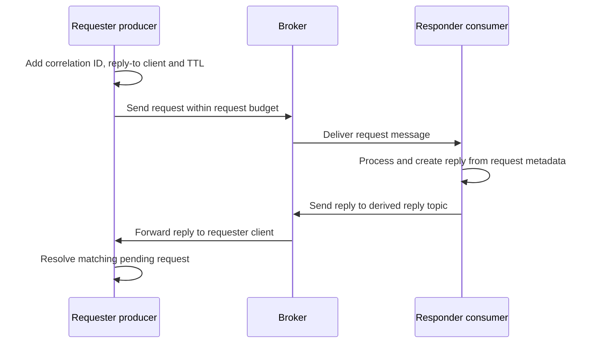

# Request/reply messaging

Request/reply correlates a message sent by a requester with a reply produced by a consumer. It uses RocketMQ messaging and a client-side pending-request table; it is not an atomic RPC transaction spanning the requester, responder and business database. A timeout means the caller did not obtain the expected reply in its budget, not that the responder performed no work.

## The correlation path



`prepare_send_request` generates a correlation ID, records the requester client ID in the reply-to property and sets the message TTL from the request timeout. It can refresh routes and send a heartbeat before sending. The request path subtracts elapsed preparation/send time before waiting for the response; do not treat the full timeout as an additional reply wait after an unlimited send.

`MessageUtil::create_reply_message` requires the request's cluster property and derives the cluster reply topic. It copies reply-to client, correlation and TTL properties when present and marks the message as a reply. Preserve those properties through your handler; constructing an unrelated ordinary message with the same body does not create a correlated reply.

## Run the checked-in example pair

Use the local NameServer/Broker from [source setup](../getting-started/local-source.md). These examples hard-code `127.0.0.1:9876` and the identifiers below. Changing an unrelated environment variable does not replace those constants.

| Component | Checked-in value |
| --- | --- |
| Request topic | `RequestSendTestTopic` |
| Request tag | `RequestTag` |
| Requester producer group | `producer_request_send_group` |
| Responder consumer group | `consumer_request_reply_group` |
| Responder reply producer group | `producer_request_reply_responder_group` |
| Request and reply-send timeouts | 3,000 ms each at their respective call sites |
| Responder mode | Clustering Push consumer, batch size 1, selector `*` |

The first-message cluster uses `DocsCluster` and disables automatic topic/group creation. Prepare the request topic, its derived reply topic and responder group using Admin CLI from the repository root. These commands create/update metadata in the selected local Broker; replace the cluster-derived reply topic if your Broker has a different cluster name.

```bash
export NAMESRV_ADDR='127.0.0.1:9876'
cargo run -p rocketmq-admin-cli -- topic updateTopic -n 127.0.0.1:9876 -b 127.0.0.1:10911 -t RequestSendTestTopic -r 4 -w 4
cargo run -p rocketmq-admin-cli -- topic updateTopic -n 127.0.0.1:9876 -b 127.0.0.1:10911 -t DocsCluster_REPLY_TOPIC -r 1 -w 1
cargo run -p rocketmq-admin-cli -- consumer updateSubGroup -b 127.0.0.1:10911 -g consumer_request_reply_group
```

PowerShell uses `$env:NAMESRV_ADDR = '127.0.0.1:9876'` instead of `export`; the Cargo command lines are the same. Check the selected deployment's authorization for both request consumption and reply publication. Do not delete or overwrite an existing group's progress to rerun a demonstration.

Build only the two examples from their standalone project:

```bash
cd rocketmq-example
cargo check --example producer-request-send --example consumer-request-reply
```

In the first terminal, remain in `rocketmq-example` and start the responder:

```bash
cargo run --example consumer-request-reply
```

After it starts, open a second terminal in the same directory and run the requester:

```bash
cargo run --example producer-request-send
```

The requester sends the example body and, on success, prints `request response: topic=..., body=reply to ...`. The responder waits for a termination signal; stop it after the requester finishes. The requester's printed body is demonstration output for this controlled sample, not a logging policy for production payloads.

This procedure is grounded in the current paired examples. Compilation is checked separately from a live request/reply run; this documentation change does not claim that the pair completed against a running cluster.

## Understand the example's completion limitation

The checked-in responder's synchronous listener calls `tokio::spawn` for reply creation/sending, then immediately returns `ConsumeSuccess`. Reply-send failures are logged inside that detached task. Therefore consumer success can precede a failed or incomplete reply, and responder shutdown does not explicitly join each reply task in the listener.

The requester also uses early `?` returns before its explicit producer shutdown on some failures. Its shared support wrapper closes the client/process runtime, but that is not the same as demonstrating complete per-facade cleanup on every path. These examples show the API exchange; do not copy their detached completion pattern as a production lifecycle design.

For an application, place asynchronous reply work in an established owned lifecycle boundary with bounded admission and completion reporting. Define when the consumed request may be acknowledged relative to durable business work and reply delivery. Stop admission before shutdown and await owned in-flight work. Do not solve the synchronous callback boundary with nested `block_on` or an unbounded detached queue. [Runtime ownership](../architecture/runtime.md) and [Push consumption](../consumer/push-consumer.md) describe the surrounding contracts.

## Handle failure and duplicate work

| Observation | Meaning and application response |
| --- | --- |
| Request send failed | Inspect the error and whether the outcome is known; a connection failure after dispatch can still leave accepted work. |
| Request timeout after send | Reply may be late, lost or still processing. Retry only with a business idempotency strategy. |
| Reply creation fails | Required cluster metadata is missing or the request was not preserved correctly; do not fabricate routing properties blindly. |
| Reply send succeeds | The send result still has its own status; it is not proof that the original requester remained connected and consumed the reply. |
| Requester restarts | Its in-memory pending-request state and client identity are not a durable business result store. |
| Request is redelivered | Reuse the business operation identity and decide whether to return a stored result or safely repeat work. |
| Late or duplicate reply | It may no longer match an active pending request; never count each reply as a new business operation. |

The correlation ID identifies an exchange attempt. Reissuing `request` creates a new correlation value; retain a separate stable business key across retries. TTL is request metadata and a timeout budget, not a cancellation transaction that reverses responder side effects.

For long-running business work, consider an asynchronous result workflow with a durable operation record instead of holding a short request/reply timeout open. If an external side effect and reply publication must recover together, define an outbox or equivalent business recovery design; RocketMQ request/reply alone does not provide that atomicity.

Sources: [requester example](https://github.com/mxsm/rocketmq-rust/blob/main/rocketmq-example/examples/producer/request_send.rs), [responder example](https://github.com/mxsm/rocketmq-rust/blob/main/rocketmq-example/examples/consumer/request_reply_responder.rs), [request preparation and response wait](https://github.com/mxsm/rocketmq-rust/blob/main/rocketmq-client/src/producer/producer_impl/default_mq_producer_impl/send.rs), [reply construction](https://github.com/mxsm/rocketmq-rust/blob/main/rocketmq-client/src/utils/message_util.rs), [Broker reply processor](https://github.com/mxsm/rocketmq-rust/blob/main/rocketmq-broker/src/processor/reply_message_processor.rs), [example runtime wrapper](https://github.com/mxsm/rocketmq-rust/blob/main/rocketmq-example/examples/support/mod.rs).
