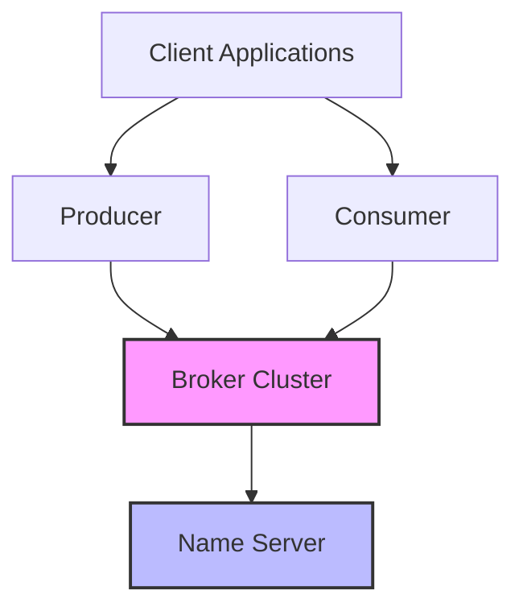

# Introduction to RocketMQ-Rust

**RocketMQ-Rust** is a high-performance, distributed messaging middleware built with [Rust](https://www.rust-lang.org/), reimplementing the battle-tested architecture of [Apache RocketMQ](https://rocketmq.apache.org/).

## Overview

RocketMQ-Rust brings the proven messaging patterns and reliability of Apache RocketMQ to the Rust ecosystem, leveraging Rust's memory safety, performance guarantees, and modern async ecosystem.

### Key Features

- **High Performance**: Built with Rust for zero-cost abstractions and minimal overhead
- **Memory Safety**: Leverages Rust's ownership model to prevent entire classes of bugs
- **Async/Await**: Fully asynchronous architecture using Tokio runtime
- **Production Ready**: Designed for mission-critical, enterprise applications
- **Type Safe**: Strong typing prevents bugs at compile-time
- **Cloud Native**: Ready for containerized and Kubernetes deployments

## Why RocketMQ-Rust?

### Performance

RocketMQ-Rust delivers exceptional throughput and low latency, making it suitable for:

- High-volume streaming data processing
- Real-time analytics pipelines
- Event-driven architectures
- Microservices communication

### Reliability

Built on Apache RocketMQ's proven architecture:

- Reliable message delivery guarantees
- Fault tolerance and high availability
- Message tracing and monitoring
- Comprehensive error handling

### Developer Experience

- Clear, idiomatic Rust APIs
- Excellent compile-time error messages
- First-class IDE support
- Comprehensive documentation

## Architecture

## Quick Links

- [Getting Started](./getting-started/installation)
- [Architecture Overview](./architecture/overview)
- [GitHub Repository](https://github.com/mxsm/rocketmq-rust)
- [Contributing](./contributing/overview)

## License

Licensed under the [Apache License 2.0](https://www.apache.org/licenses/LICENSE-2.0).
