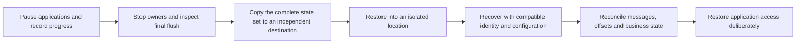

A usable backup is a consistent set of data, metadata, configuration, and identities that a compatible deployment can reopen. A copied CommitLog directory alone is not a complete cluster backup. This page provides a stopped-source procedure for the isolated LocalFile tutorial and explains what additional state other deployments require.

## Inventory the recovery set

| State | Include and identify |
| --- | --- |
| Primary message data | Every configured writable/read-only CommitLog path, segment layout, and relevant persisted format metadata |
| Local derived state | ConsumeQueue, key indexes, checkpoints, recovery cursors, and backend-specific metadata |
| Broker metadata | Topics, queue mapping, subscription groups, consumer offsets, order/filter state, and configured Broker identity/epoch paths |
| Timer, transaction, retry, POP | Their authoritative records, checkpoints, metadata, and application reconciliation requirements for the enabled mode |
| RocksDB / tiered state | Corresponding database/secondary files and metadata, consistent with the primary log; a secondary path is not automatically a standalone backup |
| NameServer | Persistent KV/config files; live routes are repopulated by Broker registration |
| Controller | Persistent Raft log/state/snapshot and membership for each recorded identity; Controller data does not contain message bodies |
| Deployment and security | Effective configuration, compatible binaries/features, identity-to-volume mapping, ACL/auth snapshots, certificate and secret recovery access |
| Application | Business idempotency/transaction state and any client-local offsets needed to interpret recovered messages |

Use effective paths rather than default directory names. Broker `[broker].storePathRootDir` and `[store].storePathRootDir` can differ, as they do in the local tutorial. Include external mounts and all multipath roots. Store backups containing credentials require the same restricted access as the originals.



## Establish consistency before copying

For the stopped-source route, pause producers and coordinate consumers, record acknowledged results and committed queue positions, then shut down the Broker normally. Inspect its final flush/shutdown result and confirm no process still owns the store. Stop the tutorial NameServer after the Broker.

Do not copy an active database or a changing set of files and label it application-consistent. A storage-platform snapshot can have a different crash-consistency contract; simultaneous volumes, database checkpoints, and application state still need an explicit coordination procedure. A RocksDB checkpoint by itself does not coordinate every external CommitLog and Broker metadata path.

For distributed deployments, decide whether you are backing up a full stopped deployment or using a specifically supported online checkpoint/recovery integration. Do not independently copy arbitrary replica directories at different times and assume they represent one Controller/Broker authority state. This page does not prescribe a generic online cluster snapshot command.

## Copy the stopped local tutorial

The following PowerShell example is for the [first-message tutorial](../getting-started/local-source.md) only: one NameServer, one LocalFile Broker, relative state under `.rocketmq-doc-demo`, no Controller or external store roots. Run from the repository root **after its processes and applications are stopped**. Choose a fresh destination name:

```powershell
$ErrorActionPreference = "Stop"
$docsBackup = Join-Path $env:USERPROFILE "rocketmq-backups/first-message-copy"
if (Test-Path -LiteralPath $docsBackup) { throw "Choose a new backup destination." }
if (-not (Test-Path -LiteralPath ".rocketmq-doc-demo")) { throw "Tutorial state is missing." }
New-Item -ItemType Directory -Path $docsBackup | Out-Null
New-Item -ItemType Directory -Path (Join-Path $docsBackup "configuration") | Out-Null
Copy-Item -LiteralPath ".rocketmq-doc-demo" -Destination $docsBackup -Recurse
Copy-Item -LiteralPath "rocketmq-website/examples/first-message/namesrv.toml" -Destination (Join-Path $docsBackup "configuration/namesrv.toml")
Copy-Item -LiteralPath "rocketmq-website/examples/first-message/broker.toml" -Destination (Join-Path $docsBackup "configuration/broker.toml")
Get-ChildItem -LiteralPath $docsBackup
```

This creates a separate copy and leaves source state intact. Record the actual binary version/features, backup time, successful shutdown observations, Topic/group/queue positions, and any outstanding business work beside it. If your running configuration differs from the checked-in tutorial, save the actual configuration instead and include every resulting state path.

A copy on the same physical disk does not protect against that disk's loss. Transfer a completed backup to independently protected storage as required by the failure scenario. Check storage availability and access through a restore exercise, not merely a successful copy command.

## Restore into a new location

Keep the original backup unchanged. This example creates another fresh directory; the original tutorial processes must remain stopped because the copied configuration uses the same loopback ports and identities:

```powershell
$ErrorActionPreference = "Stop"
$docsBackup = Join-Path $env:USERPROFILE "rocketmq-backups/first-message-copy"
$docsRestore = Join-Path $env:USERPROFILE "rocketmq-recovery/first-message-trial"
if (Test-Path -LiteralPath $docsRestore) { throw "Choose a new restore destination." }
New-Item -ItemType Directory -Path $docsRestore | Out-Null
Copy-Item -LiteralPath (Join-Path $docsBackup ".rocketmq-doc-demo") -Destination $docsRestore -Recurse
Copy-Item -LiteralPath (Join-Path $docsBackup "configuration") -Destination $docsRestore -Recurse
```

Use the compatible NameServer/Broker executables built for the backup's format. In each service terminal, change the working directory to `$docsRestore`, set `ROCKETMQ_HOME` to that directory and `ROCKETMQ_SECURITY_PROFILE=development-insecure-loopback`, then invoke the executable by its absolute path with `-c configuration/namesrv.toml` or `-c configuration/broker.toml`. Start NameServer first, then Broker.

The working directory matters: the copied files retain relative `.rocketmq-doc-demo` paths. Do not start the restore from the repository root and accidentally reopen the original data. Avoid changing persisted identity merely to get another process running.

Before starting consumers, query the restored route, queue bounds, and group progress using [Admin operations](admin.md). Compare them with the recorded backup observations. Existing committed positions may mean the old five tutorial messages are not delivered again. Do not reset production offsets to manufacture a successful restore demonstration.

Reconcile retained messages and business completion, then use an isolated new test operation to confirm fresh send/consume and shutdown. Distinguish messages acknowledged before backup, uncertain sends, and writes made after the backup point. Their treatment determines the actual recovery outcome.

## Inspect a copied CommitLog offline

Build `rocketmq-store-inspect`, whose executable is `rocketmq-cli-rust`:

```bash
cargo build -p rocketmq-store-inspect --bin rocketmq-cli-rust
cargo run -p rocketmq-store-inspect --bin rocketmq-cli-rust -- read-message-log -c /recovery/store/commitlog/00000000000000000000 -f 0 -t 2
```

Replace the path with an actual retained segment. The reader prints message IDs, not bodies. `-f` / `-t` count records, not bytes; both start values 0 and 1 include the first record, while 2 starts with the second. It does not acquire the Broker's exclusive Store lock. Use a stable copy or stopped store.

Invalid/truncated frame sizes can end a scan without a complete corruption report. Reading two IDs proves only that those records were inspected; it does not certify the entire recovery set.

## Extend to HA and alternative backends

Restore a failed replica according to the chosen HA mode and current authority, preserving its identity and observing catch-up before returning it to service. Do not start a copied former primary as independently writable alongside the surviving cluster.

Full Controller recovery must preserve a coherent persisted membership and node-to-storage mapping. A stale Controller snapshot plus unrelated Broker data is not a safe new cluster. Use the recovery support for the exact version and topology; there is no generic instruction here to wipe Raft state or invent new member IDs.

Derived indexes can be rebuilt only where the backend's recovery contract supports it and required primary data remains available. Changing `storeType` does not migrate data. Keep original files until the recovered deployment and application reconciliation are established.

No restore, disk-loss, or distributed RPO/RTO exercise is claimed here. Measure recovered acknowledged messages, duplicates/reconciliation work, unavailable interval, and elapsed restore time in the actual scenario before reporting recovery objectives as achieved.

## Source map

[Broker metadata paths](https://github.com/mxsm/rocketmq-rust/blob/main/rocketmq-broker/src/broker_path_config_helper.rs), [store configuration](https://github.com/mxsm/rocketmq-rust/blob/main/rocketmq-store/src/config/message_store_config.rs), [offline tool](https://github.com/mxsm/rocketmq-rust/blob/main/rocketmq-tools/rocketmq-store-inspect/README.md), [store recovery boundaries](../architecture/storage-backends.md), [Controller authority](../architecture/ha-controller.md).
