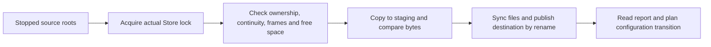

# Offline storage tools

The `rocketmq-store-inspect` package builds the `rocketmq-cli-rust` executable. It reads or transforms local storage files; it does not connect to a live RocketMQ cluster. Choose the subcommand by its state effect, and keep its result separate from a complete recovery or rollback decision.

## Select the operation

| Command | Input | Output | State effect and limits |
| --- | --- | --- | --- |
| `read-message-log` | One CommitLog segment | File size and a table of message/client IDs | Read-only scan, no exclusive Broker Store lock; not a complete integrity report |
| `downgrade-preflight` | Canonical Broker TOML and target version | Structured compatibility report, stdout or a selected output file | Acquires exclusive Store lock; checks selected persisted formats without converting them |
| `consolidate-multipath` | Source CommitLog roots, new target, segment size and actual Store root | A new consolidated directory and JSON report | Copies/publishes new files under the Store lock; source files remain intact |

From the repository root:

```bash
cargo build -p rocketmq-store-inspect --bin rocketmq-cli-rust
cargo run -p rocketmq-store-inspect --bin rocketmq-cli-rust -- --help
```

Use `target/debug/rocketmq-cli-rust` after a debug build, with `.exe` on Windows. Package and executable names differ from `rocketmq-admin-cli`, which performs online administration. `--verbose` adds controlled diagnostic fields; it is not a switch to expose raw storage contents or credentials.

## Prepare a consistent input

For a simple scan, use a stable copy or a stopped store. For preflight or consolidation, stop the owning Broker and use its actual Store root. An unrelated empty directory does not provide the lock that fences the Broker's data.

Record the primary CommitLog roots, mapped segment size, metadata paths and active storage profile. Keep a recoverable source copy and enough space for the selected operation. Use explicit absolute paths in an inspection configuration so the tool does not inspect a default user-home store or a path resolved from the wrong working directory.

The examples below contain deployment-specific paths. Replace them deliberately; they are not instructions to inspect or modify an arbitrary live host's data.

## Read message identifiers

```bash
target/debug/rocketmq-cli-rust read-message-log -c /data/commitlog/00000000000000000000 -f 0 -t 2
```

`-c / --config` means the segment file for this subcommand, despite the option's name. `-f / --from` and `-t / --to` are record counters, not byte or logical queue offsets. With the current counter increment before filtering, `from=0` and `from=1` both include the first record; `from=2` starts at the second. `to=2` limits scanning to the first two records.

The reader prints `message_id` and `client_message_id` and skips bodies. A short table is not proof that the whole segment was valid: truncated or invalid frame sizes can end scanning without a comprehensive corruption report. Use it to inspect identifiers, not to certify CRC coverage, recover missing records or infer consumer completion.

## Check a proposed downgrade

Stop the Broker before running:

```bash
target/debug/rocketmq-cli-rust downgrade-preflight --target-version 0.9.0 --config /etc/rocketmq-rust/broker.toml --output downgrade-report.json
```

`0.9.0` is an example target value, not a recommendation to install or downgrade to that release. Select the actual target version and a current inspection tool that understands the source formats. The command reads canonical TOML and evaluates Rust-owned layout concerns including multipath, POP, timer, compaction and tiered state.

Read `allowed`, each check and its required action. A denied result exits with code `2`; other failures use typed CLI error codes. Without `--output`, the report goes to stdout. With it, preserve the report at a suitable output location. A tool invocation that failed to acquire the lock or parse configuration is not an allowed downgrade.

An allowed report concerns only inspected formats. It does not establish Controller membership compatibility, message-level coverage, application compatibility or complete cluster rollback qualification. Do not edit format markers to make a denial disappear; select an actually supported conversion or compatible recovery source. See [upgrade and rollback](./upgrade-rollback.md).

## Consolidate supported multipath segments

Run against the stopped Broker's actual layout:

```bash
target/debug/rocketmq-cli-rust consolidate-multipath --source-root /data-a/commitlog --source-root /data-b/commitlog --target /data-consolidated/commitlog --mapped-file-size 1073741824 --store-root /var/lib/rocketmq-rust/store
```

The destination must not exist. Its parent and the Store root must already exist. The segment size must match the source layout; `1073741824` is the example's one-GiB size, not an instruction to reinterpret smaller segments.



The tool validates supported segment ownership/continuity and frame structure, checks space, copies into staging, compares bytes, synchronizes files and publishes the new destination by rename. Source files remain available. The new target is a copy result, not an automatic Broker configuration update.

After success, inspect the report, point the intended configuration at the consolidated CommitLog only as part of the selected transition, and repeat the applicable format preflight if downgrading. Keep other Store metadata and derived-state recovery requirements aligned. Do not remove source roots merely because the target directory exists.

On failure, retain the source and error/report context. Inspect staging/target state before retrying; do not force a retry by deleting unknown directories. Consolidation does not repair missing segments, merge arbitrary overlapping histories or convert all other persisted formats.

## Interpret completion at the right level

| Result | What remains to do |
| --- | --- |
| IDs were printed | Assess whether the scan covered the intended records and whether a different diagnostic is required |
| Downgrade report allowed | Apply the version-specific cluster/configuration transition and recovery observations |
| Consolidated directory published | Update the intended configuration and verify startup/recovery under the selected procedure |
| Broker starts after a transition | Check route/authority, storage progress, application replay and business completion |

Use [backup/recovery](./backup-recovery.md) to preserve a recovery path and [storage backends](../architecture/storage-backends.md) to interpret primary versus derived state. This page documents source-defined command behavior. No data scan, consolidation or downgrade was executed against a real store for this writing task.

Sources: [CLI arguments](https://github.com/mxsm/rocketmq-rust/blob/main/rocketmq-tools/rocketmq-store-inspect/src/command_line.rs), [reader](https://github.com/mxsm/rocketmq-rust/blob/main/rocketmq-tools/rocketmq-store-inspect/src/content_show.rs), [preflight](https://github.com/mxsm/rocketmq-rust/blob/main/rocketmq-tools/rocketmq-store-inspect/src/downgrade_preflight.rs), [consolidation](https://github.com/mxsm/rocketmq-rust/blob/main/rocketmq-tools/rocketmq-store-inspect/src/multipath_consolidate.rs), [tool README](https://github.com/mxsm/rocketmq-rust/blob/main/rocketmq-tools/rocketmq-store-inspect/README.md).
