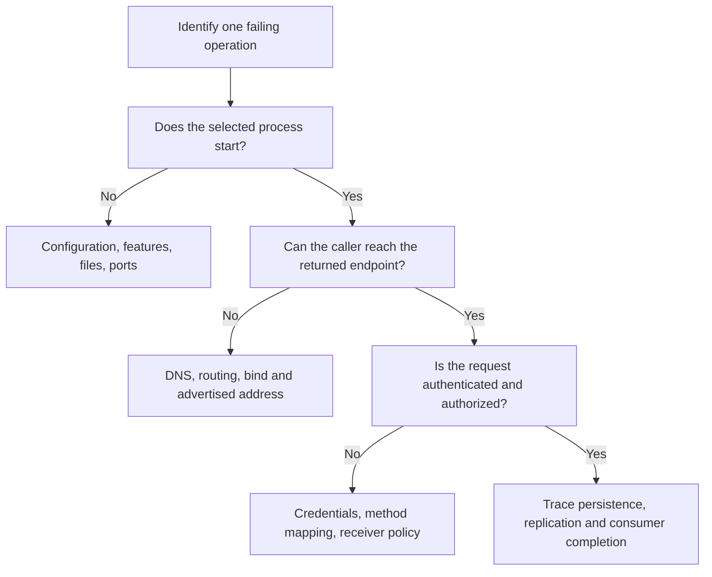

Start with the failing operation, its endpoint, time, client mode, and result. Compare the same Topic/group/queue across client, route, Broker, and store observations. Use [first diagnosis](first-diagnosis.md) for the short path and [Admin operations](admin.md) for exact commands.

## Preserve a useful observation

Record the service version/build features, non-secret configuration fields relevant to the symptom, stable error code, command exit status, and whether the operation timed out before a result was known. Collect public diagnostics rather than full request/config dumps. Do not include credentials, ACL/TLS material, or message bodies in a support report.



## Startup or build failure

| Observation | Check | Next action |
| --- | --- | --- |
| Cargo compilation/link failure | Repository toolchain, selected package/features, native compiler/LLVM/protobuf dependencies | Follow [installation](../getting-started/installation.md); keep the failing package and diagnostic visible |
| Missing `protoc` | Proxy's protobuf generation and `PATH` / `PROTOC` | Provide the compiler and standard imports; enabling a different backend does not remove the shared protocol build |
| Exporter feature-disabled error | Runtime exporter versus compiled service feature | Build the matching exporter or intentionally disable that signal; see [monitoring](monitoring.md) |
| TOML parse or invalid configuration | Exact section scope, camelCase field, path, selected mode, printed non-secret configuration | Compare the service's current configuration schema; do not copy Java properties directly into TOML |
| Address already in use | Actual process owning the port, including Broker's fast/HA listeners and health listener | Stop only the intended old instance or allocate a non-overlapping topology |
| Store lock or permission failure | Another live owner, data root, volume mount/identity, filesystem permissions | Restore exclusive ownership and intended permissions; deleting a lock file does not resolve a live owner |

A clean rebuild or dependency update is not a general remedy for configuration or runtime failures. Avoid changing the repository toolchain merely because an old FAQ gives a different minimum version.

## Connection refused or no route

Distinguish three steps: reaching NameServer, obtaining a Topic route, and reaching the returned Broker address. A successful TCP probe covers only the selected address/port and says nothing about protocol authentication.

On Windows, for the local tutorial:

```powershell
Test-NetConnection 127.0.0.1 -Port 9876
Test-NetConnection 127.0.0.1 -Port 10911
```

Then run `cluster clusterList` and `topic topicRoute` as shown in [Admin operations](admin.md). If the Topic is absent, check whether it was intentionally provisioned and whether automatic creation is disabled. Create the missing resource only in the intended cluster, with the intended queue/permission settings.

If the route exists but its endpoint is unreachable, inspect bind versus advertised address, container/Pod DNS, firewall rules, and the caller's network location. Forwarding NameServer alone does not make internal Broker DNS reachable. With multiple NameServers, query them individually and check Broker registration before treating different results as a single atomic view.

## Send failure or uncertain result

| Result | Investigation |
| --- | --- |
| Invalid message or unsupported feature | Check body/size/properties and the selected [sending API](../producer/sending-messages.md), transaction, or timer path |
| Auth failure | Separate identity/signature failure from a valid identity lacking the requested resource/action |
| Store unavailable or write rejected | Check disk pressure, lifecycle state, current write authority, and required synchronized replicas |
| Flush/replication timeout | Inspect local durability and HA progress; an append may already exist |
| Client timeout or lost response | Treat remote acceptance as uncertain; correlate the business operation and use safe retry/idempotency |

Increasing a timeout changes waiting behavior, not storage capacity or write authority. Switching to asynchronous flush changes the durability contract and is not a neutral latency fix. For HA, inspect [authority and replication](../architecture/ha-controller.md); never infer the writable primary solely from a historical Broker ID or an open socket.

## Connected consumer receives nothing

1. Confirm the exact Topic, group, namespace, and subscription expression. SQL filtering needs the supported Broker configuration; see [filtering](../consumer/message-filtering.md).
2. Inspect current queue assignment and whether another consumer owns the queue. More consumers than assignable queues do not automatically increase parallelism.
3. Compare committed position with the queue's minimum/maximum retained offsets. A new subscription's starting policy and an existing group's saved position are different inputs.
4. Inspect listener failures, retries, delayed delivery, transactional visibility, and downstream processing. A normal route does not make a pending transaction visible.
5. Inspect completion for the actual mode: Push listener result and retry, LitePull remote offset persistence, or POP ACK/invisibility.

Do not reset offsets merely to test connectivity. A reset can replay business operations or skip work. Use a new isolated test Topic/group for a fresh first-message test instead.

## Duplicate messages, retries, and lag

Duplicates can follow a lost producer response, failed progress persistence, POP ACK failure, or a consumer restart after business completion. Record a durable business idempotency key with the business change; an in-memory set cleared on restart or when full does not protect that boundary.

For growing lag, compare per-queue ingress and completed consumption over a time interval. Distinguish one hot ordered queue, slow downstream I/O, repeated poison-message processing, and insufficient capacity. A queue-offset gap is not a direct byte count or a complete measure of POP in-flight work. See [capacity planning](capacity-performance.md) and [delivery/retry](../guides/delivery-and-retry.md).

## Storage pressure or recovery failure

Observe the actual configured roots, filesystem free space, segment growth, retention/cleanup activity, and disk I/O latency. Include external CommitLog paths, metadata paths, and logs rather than checking only the default home directory.

For abnormal recovery, preserve the original state and first failure diagnostics. Use an isolated copy for inspection. Do not delete CommitLog, ConsumeQueue, RocksDB metadata, timer checkpoints, or Broker identity as a generic repair. Derived data recovery has backend- and version-specific constraints; see [storage backends](../architecture/storage-backends.md) and [backup/recovery](backup-recovery.md).

For memory growth, compare resident memory, operating-system page cache, inflight message bytes, retained response streams, consumer queues, and application collections. Resident memory alone does not identify a leak. Bound producers and processing concurrency based on measured retention and downstream capacity.

## Proxy and security failures

| Symptom | Distinguish |
| --- | --- |
| TLS handshake failure | Client trust root, endpoint name, certificate expiry/key pair, client-certificate policy, active TLS generation |
| gRPC OK with failed message | Transport status versus payload and per-message statuses |
| Inbound auth succeeds, send fails downstream | Proxy outbound signer, mounted inner credentials, Broker ACLs, route reachability |
| Local-mode resource missing | Embedded metadata/store versus the separate standalone Broker cluster |
| Resource exhausted / request rejected | Admission, bounded queue/inflight capacity, slow downstream work, retained streams, or drain state |
| Credential rotation appears ineffective | Actual watcher/restart behavior, inline credential precedence, new connection, and active receiver state |

Follow [Proxy deployment](../deployment/proxy.md) and [deployment security](../deployment/security.md). Do not disable authentication, trust all client certificates, or introduce a broad IP bypass as a default troubleshooting step.

## Missing monitoring or incomplete shutdown

For missing telemetry, inspect compiled features, active exporters, inherited endpoint variables, collector connectivity, and sampling; see [monitoring](monitoring.md). The Rust services do not acquire JVM/JMX tooling simply because they speak the RocketMQ protocol.

For shutdown that exceeds its budget, inspect owned tasks, blocked operations, admitted requests, response streams, and telemetry drain reports. Cancellation or a timeout does not prove a running blocking operation has stopped. Preserve that distinction before restarting against the same data root; see [maintenance](maintenance.md).

If escalation is needed, include a minimal reproducer, the affected path and mode, public error codes, sanitized observations, and what changed immediately before the failure. Keep original data available for a targeted recovery decision.
