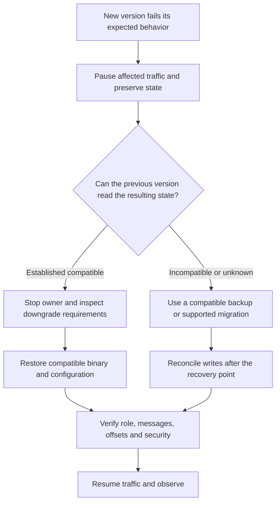

An upgrade changes more than an executable. Compare configuration, client/server APIs, wire behavior, storage formats, and persisted Controller/Broker identities before selecting a rollout. A Helm rollback or replacement with an older binary does not reverse data already written in a newer format.

## Describe the version transition

| Surface | Compare between source and target |
| --- | --- |
| Build and deployment | Toolchain/native dependencies, selected features, image entrypoint, user/paths, platform support |
| Configuration | Removed/renamed fields, section structure, defaults, units, environment precedence, startup-only values |
| Client and protocol | Public API changes, supported operation mapping, payload/headers, retry and completion behavior |
| Store | CommitLog layout/multipath, derived metadata, timer mode, POP metadata, compaction and tiered formats |
| HA and Controller | Node IDs, write authority/epochs, persisted membership, peer endpoints, available ACK capacity |
| Security and telemetry | Credentials, ACL semantics, TLS integration, exporter features and effective signal selection |

Read the release-specific changes and the current configuration/reference pages for the actual versions. Do not infer compatibility from a shared crate version or from Apache RocketMQ protocol naming. Keep the prior binary, matching configuration, and compatible offline inspection tool available during the rollback window.

## Prepare a recoverable state

Follow [backup/recovery](backup-recovery.md) to establish the state set and consistency point. Record acknowledged message bounds and application progress so later writes can be distinguished from the backup point. Reserve enough destination and temporary space; a backup that cannot be restored within available storage is not an executable recovery plan.

Exercise the new version against an isolated compatible copy and a representative application workload. Include startup recovery, send/consume completion, relevant transaction/timer/POP paths, security, and shutdown. A configuration parse alone does not demonstrate a mixed-version rolling cluster.

Classify the fallback before rollout:

| Situation | Fallback |
| --- | --- |
| Only configuration changed and the old process can still read all resulting state | Restore compatible configuration and restart the selected node through normal maintenance |
| New binary wrote state explicitly supported by the older target | Stop the owner, inspect compatibility, then perform the documented reverse transition |
| New persistent format or irreversible migration is incompatible | Restore a compatible prior state set or use a supported migration; account for newer accepted writes |
| Compatibility or authority state is unknown | Stop advancing the rollout and investigate without letting an older binary modify the original state |

## Roll out with the selected availability contract

Use [maintenance](maintenance.md) for one-node draining and catch-up. For an explicitly supported mixed-version transition, update one instance at a time and observe actual routes, role/authority, replication, application completion, and telemetry before the next.

NameServers can be replaced individually when clients and Brokers have working alternatives. Default HA replicas and primaries have different interruption consequences; Controller-mode Brokers follow current authority. Controller changes must preserve majority and persisted membership; in the core chart, use the packaged Controller rollout helper. Proxy can roll with spare capacity and verified downstream compatibility.

There is no universal “always upgrade these services in this order” rule for an arbitrary version pair. If a change does not support mixed versions, schedule a coordinated pause and the version-specific transition instead of inventing a rolling order. Keep `OnDelete` StatefulSet behavior and PVC retention distinct from image/configuration changes.

## Check storage before starting an older Broker

Stop the Broker and confirm the Store is no longer owned. Use the current compatible inspection tool and a Broker configuration with the **actual** `[store]` paths:

```bash
cargo run -p rocketmq-store-inspect --bin rocketmq-cli-rust -- downgrade-preflight --target-version 0.9.0 --config /etc/rocketmq-rust/broker.toml --output downgrade-report.json
```

`0.9.0` is an example target accepted by the documented tool interface, not a recommendation to downgrade to that release. Select the actual target. Use explicit absolute store paths in the inspection configuration to avoid opening a different default/relative root.

The command acquires the exclusive Store lock and reports inspected Rust-owned format compatibility, including multipath, POP, timer, compaction, and tiered checks. A denied downgrade exits with code `2`; other failures use typed CLI error codes. Inspect `allowed`, per-check status, and required actions. Do not start an older Broker on a denied or failed inspection.

An allowed report applies to the formats the tool inspected. It does not establish Controller membership compatibility, application API compatibility, recovered business state, or whole-cluster rollback qualification. Do not edit persisted format markers merely to make the report pass.

## Consolidate multipath only when the transition requires it

The offline tool can copy supported multipath CommitLog segments into one new destination:

```bash
cargo run -p rocketmq-store-inspect --bin rocketmq-cli-rust -- consolidate-multipath --source-root /data-a/commitlog --source-root /data-b/commitlog --target /data-consolidated/commitlog --mapped-file-size 1073741824 --store-root /var/lib/rocketmq-rust/store
```

Replace every path and segment size with the actual layout. The Broker must be stopped, the Store root and destination parent must exist, and the target must not exist. The Store root must be the one whose lock protects the Broker, not an unrelated empty directory.

The tool checks supported segment ownership, continuity, frame structure, and space, copies to staging, checks copied bytes, synchronizes, and publishes the destination by rename. Sources remain intact. Read the JSON report, update the intended configuration to the new path only after successful consolidation, and run the applicable downgrade inspection again. Consolidation does not convert every other persisted format or repair missing segments.

## Execute the selected rollback



Record the new version's accepted writes before restoring an earlier backup. Restoring older offsets or data can cause duplicate processing or lose visibility of later business work; reconcile with the application rather than treating a successful process start as completion.

After rollback, observe the current authority, replica catch-up, recovered message interval, consumer completion, permissions, and exporter behavior. Preserve the failed state copy and diagnostics for a targeted fix. Do not simultaneously start old and new owners against the same writable root.

These procedures are source-backed operational guidance. No downgrade, consolidation, mixed-version failover, or full-cluster rollback exercise is claimed by this page.

## Source map

[Offline tool interface](https://github.com/mxsm/rocketmq-rust/blob/main/rocketmq-tools/rocketmq-store-inspect/README.md), [downgrade checks](https://github.com/mxsm/rocketmq-rust/blob/main/rocketmq-tools/rocketmq-store-inspect/src/downgrade_preflight.rs), [multipath consolidation](https://github.com/mxsm/rocketmq-rust/blob/main/rocketmq-tools/rocketmq-store-inspect/src/multipath_consolidate.rs), [HA design](../architecture/ha-controller.md), [storage backends](../architecture/storage-backends.md).
