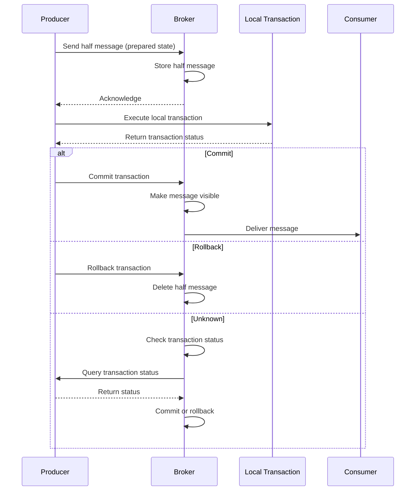

# Transaction Messages

Transaction messages enable distributed transaction consistency between message sending and local database operations.

## Overview

Transaction messages ensure that:
1. Message sending and local transactions succeed or fail atomically
2. Messages are delivered only after the local transaction commits
3. System eventually reaches a consistent state

## Transaction Flow



## Creating a Transaction Producer

```rust
use rocketmq::producer::TransactionProducer;
use rocketmq::conf::ProducerOption;

#[tokio::main]
async fn main() -> Result<(), Box<dyn std::error::Error>> {
    let mut producer_option = ProducerOption::default();
    producer_option.set_name_server_addr("localhost:9876");
    producer_option.set_group_name("transaction_producer_group");

    let producer = TransactionProducer::new(producer_option)?;
    producer.start().await?;

    Ok(())
}
```

## Implementing Transaction Listener

```rust
use rocketmq::listener::TransactionListener;
use rocketmq::error::TransactionSendResult;

struct OrderTransactionListener {
    db_connection: DatabaseConnection,
}

impl TransactionListener for OrderTransactionListener {
    /// Execute local transaction
    async fn execute_local_transaction(
        &self,
        message: &Message,
        arg: &str,
    ) -> TransactionSendResult {
        // Parse message to get order data
        let order: Order = serde_json::from_slice(message.get_body())?;

        // Execute local transaction
        match self.db_connection.create_order(&order).await {
            Ok(_) => {
                println!("Order created successfully");
                TransactionSendResult::Commit
            }
            Err(e) => {
                eprintln!("Failed to create order: {:?}", e);
                TransactionSendResult::Rollback
            }
        }
    }

    /// Check transaction status (called by broker on unknown status)
    async fn check_local_transaction(
        &self,
        msg_id: &str,
    ) -> TransactionSendResult {
        // Check if order exists in database
        match self.db_connection.get_order_by_msg_id(msg_id).await {
            Ok(Some(_)) => TransactionSendResult::Commit,
            Ok(None) => TransactionSendResult::Rollback,
            Err(_) => TransactionSendResult::Unknown,
        }
    }
}
```

## Sending Transaction Messages

```rust
use rocketmq::model::Message;

// Create transaction listener
let listener = OrderTransactionListener {
    db_connection: db_conn,
};

// Register listener
producer.set_transaction_listener(listener);

// Prepare message
let order = Order {
    id: "order_12345".to_string(),
    amount: 99.99,
    customer_id: "customer_67890".to_string(),
};

let body = serde_json::to_vec(&order)?;
let mut message = Message::new("OrderEvents".to_string(), body);
message.set_tags("order_created");
message.set_keys(&order.id);

// Send transaction message
let result = producer.send_transactional_message(message, &order.id).await?;

println!("Transaction message sent: {:?}", result);
```

## Transaction States

### Commit

The local transaction succeeded, message should be delivered:

```rust
async fn execute_local_transaction(
    &self,
    message: &Message,
    arg: &str,
) -> TransactionSendResult {
    match self.process_order(message).await {
        Ok(_) => TransactionSendResult::Commit,
        Err(_) => TransactionSendResult::Rollback,
    }
}
```

### Rollback

The local transaction failed, message should be discarded:

```rust
async fn execute_local_transaction(
    &self,
    message: &Message,
    arg: &str,
) -> TransactionSendResult {
    if self.validate_business_rules(message).await {
        TransactionSendResult::Commit
    } else {
        TransactionSendResult::Rollback
    }
}
```

### Unknown

Transaction status is unclear, broker will check back later:

```rust
async fn execute_local_transaction(
    &self,
    message: &Message,
    arg: &str,
) -> TransactionSendResult {
    match self.process_order(message).await {
        Ok(_) => TransactionSendResult::Commit,
        Err(_) if is_transient_error() => TransactionSendResult::Unknown,
        Err(_) => TransactionSendResult::Rollback,
    }
}
```

## Transaction Check

The broker periodically checks transaction status when state is unknown:

```rust
async fn check_local_transaction(
    &self,
    msg_id: &str,
) -> TransactionSendResult {
    // Query database for transaction status
    let tx_status = self.db_connection
        .get_transaction_status(msg_id)
        .await?;

    match tx_status {
        TransactionStatus::Committed => TransactionSendResult::Commit,
        TransactionStatus::RolledBack => TransactionSendResult::Rollback,
        TransactionStatus::Pending => TransactionSendResult::Unknown,
    }
}
```

## Common Patterns

### Account Transfer

```rust
struct TransferTransactionListener {
    db: DatabaseConnection,
}

impl TransactionListener for TransferTransactionListener {
    async fn execute_local_transaction(
        &self,
        message: &Message,
        arg: &str,
    ) -> TransactionSendResult {
        let transfer: Transfer = serde_json::from_slice(message.get_body())?;

        // Execute transfer in local transaction
        match self.db.transfer_funds(&transfer).await {
            Ok(_) => TransactionSendResult::Commit,
            Err(_) => TransactionSendResult::Rollback,
        }
    }

    async fn check_local_transaction(
        &self,
        msg_id: &str,
    ) -> TransactionSendResult {
        match self.db.get_transfer_status(msg_id).await {
            Some(status) if status == "completed" => TransactionSendResult::Commit,
            Some(status) if status == "failed" => TransactionSendResult::Rollback,
            _ => TransactionSendResult::Unknown,
        }
    }
}
```

### Inventory Update

```rust
struct InventoryTransactionListener {
    db: DatabaseConnection,
}

impl TransactionListener for InventoryTransactionListener {
    async fn execute_local_transaction(
        &self,
        message: &Message,
        arg: &str,
    ) -> TransactionSendResult {
        let order: Order = serde_json::from_slice(message.get_body())?;

        // Check and reserve inventory
        match self.db.reserve_inventory(&order.items).await {
            Ok(_) => TransactionSendResult::Commit,
            Err(_) => TransactionSendResult::Rollback,
        }
    }

    async fn check_local_transaction(
        &self,
        msg_id: &str,
    ) -> TransactionSendResult {
        match self.db.get_inventory_reservation(msg_id).await {
            Some(_) => TransactionSendResult::Commit,
            None => TransactionSendResult::Rollback,
        }
    }
}
```

## Configuration

```rust
let mut producer_option = ProducerOption::default();

// Transaction check timeout (milliseconds)
producer_option.set_transaction_check_timeout(3000);

// Maximum number of check retries
producer_option.set_transaction_check_max_retry(15);

// Check interval (milliseconds)
producer_option.set_transaction_check_interval(60000);
```

## Best Practices

1. **Keep transactions short**: Local transactions should complete quickly
2. **Implement idempotency**: Ensure local transactions can be safely retried
3. **Handle check logic**: Implement robust check logic for unknown states
4. **Monitor transaction status**: Track transaction success/failure rates
5. **Set appropriate timeouts**: Balance between consistency and performance
6. **Use proper error handling**: Distinguish between transient and permanent errors
7. **Log transaction outcomes**: Maintain audit trail for debugging

## Limitations

- Transaction messages add latency compared to normal messages
- Requires additional database queries for check operations
- Not suitable for high-frequency transactions
- Broker resources are consumed during transaction checking

## Next Steps

- [Configuration](../category/configuration) - Configure transaction settings
- [Consumer Guide](../category/consumer) - Learn about consuming transaction messages
- [Troubleshooting](../faq/troubleshooting) - Debug transaction issues
