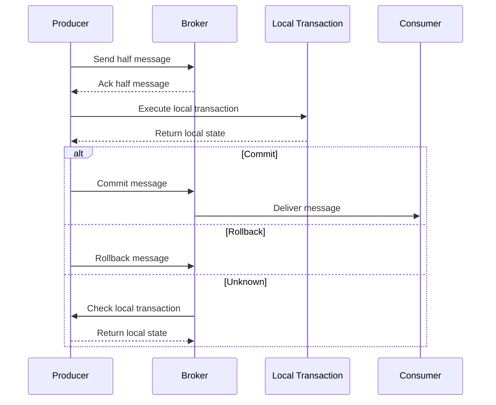

# Transaction Messages

Transaction messages are used to keep message delivery and local business state consistent.

## Overview

Transaction messages ensure that:

1. The half message is persisted before local business execution.
2. The final visibility (commit/rollback) depends on local transaction state.
3. Unknown states can be checked by broker callbacks.

## Transaction Flow


```mermaid
sequenceDiagram
    participant P as Producer
    participant B as Broker
    participant L as Local Transaction
    participant C as Consumer

    P->>B: Send half message
    B-->>P: Ack half message
    P->>L: Execute local transaction
    L-->>P: Return local state

    alt Commit
        P->>B: Commit message
        B->>C: Deliver message
    else Rollback
        P->>B: Rollback message
    else Unknown
        B->>P: Check local transaction
        P-->>B: Return local state
    end
```

## Creating a Transaction Producer

```rust
use rocketmq_client_rust::producer::mq_producer::MQProducer;
use rocketmq_client_rust::producer::transaction_mq_producer::TransactionMQProducer;
use rocketmq_error::RocketMQResult;

#[tokio::main]
async fn main() -> RocketMQResult<()> {
    let mut producer = TransactionMQProducer::builder()
        .producer_group("transaction_producer_group")
        .name_server_addr("localhost:9876")
        .topics(vec!["OrderEvents"])
        .transaction_listener(OrderTransactionListener::default())
        .build();

    producer.start().await?;
    // Send transaction messages ...
    producer.shutdown().await;
    Ok(())
}
```

## Implementing Transaction Listener

```rust
use std::any::Any;

use cheetah_string::CheetahString;
use rocketmq_client_rust::producer::local_transaction_state::LocalTransactionState;
use rocketmq_client_rust::producer::transaction_listener::TransactionListener;
use rocketmq_common::common::message::message_ext::MessageExt;
use rocketmq_common::common::message::MessageTrait;

#[derive(Default)]
struct OrderTransactionListener;

impl TransactionListener for OrderTransactionListener {
    fn execute_local_transaction(
        &self,
        msg: &dyn MessageTrait,
        _arg: Option<&(dyn Any + Send + Sync)>,
    ) -> LocalTransactionState {
        // Implement your local transaction with msg body/properties.
        let _tx_id: Option<&CheetahString> = msg.transaction_id();
        LocalTransactionState::Unknown
    }

    fn check_local_transaction(&self, _msg: &MessageExt) -> LocalTransactionState {
        // Query local storage and return CommitMessage / RollbackMessage / Unknown.
        LocalTransactionState::Unknown
    }
}
```

## Sending Transaction Messages

```rust
use rocketmq_client_rust::producer::mq_producer::MQProducer;
use rocketmq_common::common::message::message_single::Message;

let message = Message::builder()
    .topic("OrderEvents")
    .tags("order_created")
    .key("order_12345")
    .body("{\"order_id\":\"order_12345\"}")
    .build()?;

let result = producer
    .send_message_in_transaction(message, Some("order_12345".to_string()))
    .await?;

println!("Transaction message sent: {}", result);
```

## Local Transaction State Handling (Pseudo Code)

```text
execute_local_transaction(message):
  if local business succeeds:
    return CommitMessage
  if local business fails permanently:
    return RollbackMessage
  if local result is uncertain:
    return Unknown

check_local_transaction(message):
  query local transaction table by transaction id
  return CommitMessage / RollbackMessage / Unknown
```

## Configuration

`TransactionMQProducer::builder()` currently exposes thread-pool and check queue controls:

```rust
let mut producer = TransactionMQProducer::builder()
    .producer_group("transaction_producer_group")
    .name_server_addr("localhost:9876")
    .topics(vec!["OrderEvents"])
    .transaction_listener(OrderTransactionListener::default())
    .check_thread_pool_min_size(2)
    .check_thread_pool_max_size(8)
    .check_request_hold_max(2_000)
    .build();
```

## Best Practices

1. Keep local transaction execution short and deterministic.
2. Persist transaction outcome before returning commit/rollback.
3. Implement idempotent local transaction logic.
4. Return `Unknown` only for transient uncertainty, not for permanent errors.
5. Monitor transaction check frequency and unknown-state duration.

## Limitations

- Transaction messages have higher latency than normal messages.
- Brokers hold half messages until commit/rollback is resolved.
- Poorly designed check logic can cause long pending windows.

## Next Steps

- [Client Configuration](../configuration/client-config) - Configure producer/client options
- [Consumer Guide](../consumer/overview) - Learn consumer-side handling
- [Troubleshooting](../faq/troubleshooting) - Diagnose production issues
