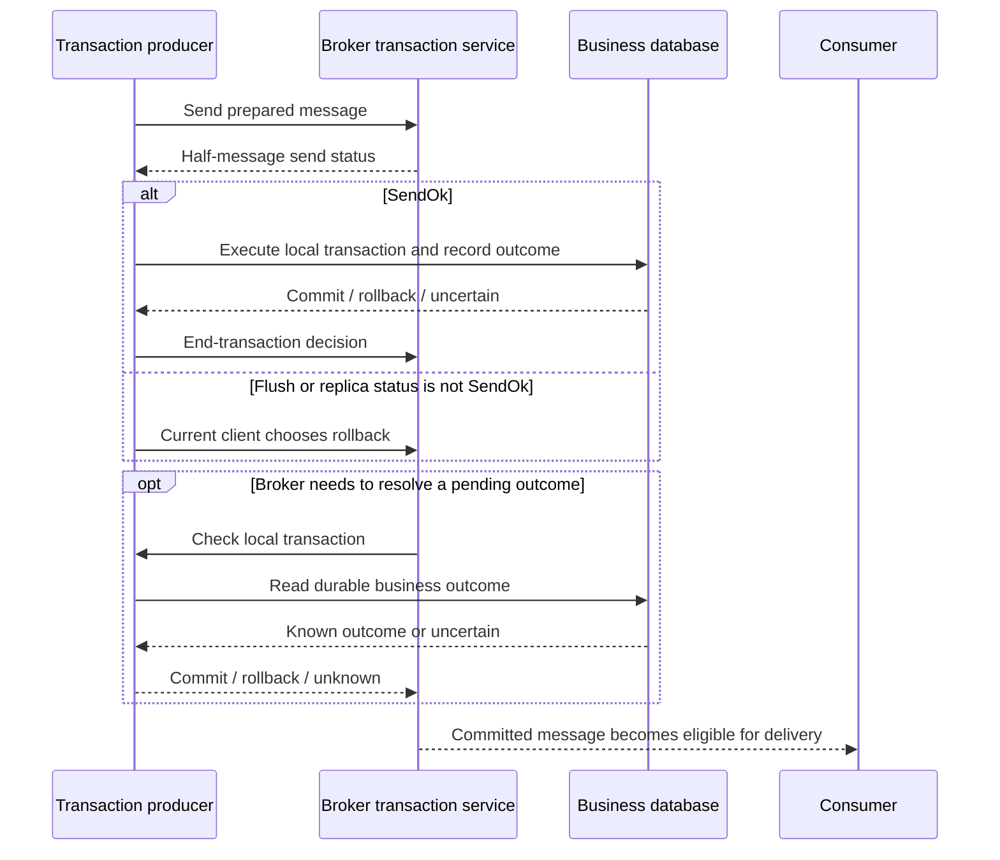

# Transaction messages

Transaction messages coordinate visibility of an event with a producer-side business transaction. The Broker first stores a prepared, or half, message; the producer then reports commit, rollback, or an unknown local outcome. This is not a distributed ACID transaction spanning Broker storage and the application's database.

Use a `TransactionMQProducer` with a registered `TransactionListener` and an injected `ClientRuntime`. The ordinary producer's similarly named method is not a replacement for transaction-producer initialization. Start with the [producer lifecycle](./overview.md), and provision the intended business topic.

## Prepare, decide, and check


```mermaid
sequenceDiagram
    participant P as Transaction producer
    participant B as Broker transaction service
    participant D as Business database
    participant C as Consumer
    P->>B: Send prepared message
    B-->>P: Half-message send status
    alt SendOk
        P->>D: Execute local transaction and record outcome
        D-->>P: Commit / rollback / uncertain
        P->>B: End-transaction decision
    else Flush or replica status is not SendOk
        P->>B: Current client chooses rollback
    end
    opt Broker needs to resolve a pending outcome
        B->>P: Check local transaction
        P->>D: Read durable business outcome
        D-->>P: Known outcome or uncertain
        P-->>B: Commit / rollback / unknown
    end
    B-->>C: Committed message becomes eligible for delivery
```

The final arrow describes eligibility, not an immediate callback or proof of business processing. The half-message response inherits the configured storage/replication policy; do not label every accepted half message durably replicated.

In the current client, `SendOk` triggers the local listener. `FlushDiskTimeout`, `FlushSlaveTimeout`, and `SlaveNotAvailable` select rollback without executing that listener. A transport error before a usable send result returns an error instead. These branches matter because some non-success statuses can still describe an accepted log append.

## Implement a durable decision

`TransactionListener` has two synchronous callbacks:

| Callback | Responsibility |
| --- | --- |
| `execute_local_transaction(&dyn MessageTrait, Option<&(dyn Any + Send + Sync)>)` | Execute idempotent local business work and return `LocalTransactionState` |
| `check_local_transaction(&MessageExt)` | Read the authoritative persisted outcome and return the same state domain |

Both return `CommitMessage`, `RollbackMessage`, or `Unknown`. Keep the callback bounded. The client runs local execution through its managed blocking boundary; a caller timeout or panic mapping does not roll back an already committed external transaction.

The following is application pseudocode, not a complete database implementation:

```text
execute(message):
    event_id = stable business identifier carried in message
    within one local database transaction:
        if recorded outcome exists: return it
        apply the business change idempotently
        persist event_id and the final business outcome
    return CommitMessage only after commit is known

check(message):
    read authoritative outcome using event_id
    committed -> CommitMessage
    definitively aborted -> RollbackMessage
    unavailable or unresolved -> Unknown
```

Do not use a process-local map as the recovery authority. A restarted producer, or another eligible producer in the same group, must be able to answer a check from durable business state. The callback's optional in-memory argument is not sent back by the Broker as durable transaction metadata.

Missing state needs a business policy: it may mean “not executed,” “not yet visible,” or “storage unavailable.” Returning rollback for every lookup failure can hide a committed business change. Returning unknown forever leaves unresolved work and eventually meets the Broker's configured check/discard policy.

## Integrate the producer

The excerpt below assumes `client_runtime` is the application's shared runtime and `listener` is a real `TransactionListener` implementation:

```rust
let mut producer = TransactionMQProducer::builder(client_runtime.clone())
    .producer_group("docs_transaction_group")
    .name_server_addr("127.0.0.1:9876")
    .topics(vec!["TransactionSendTestTopic"])
    .transaction_listener(listener)
    .build();
```

Start the producer before sending, and inspect both fields in the returned `TransactionSendResult`:

```rust
let message = Message::builder()
    .topic("TransactionSendTestTopic")
    .key("order-1001:event-1")
    .body("order created")
    .build()?;
let outcome = producer
    .send_message_in_transaction::<(), _>(message, None)
    .await?;
```

`send_result` describes the prepared-message send. `local_transaction_state` describes the client's decision. **Neither field is a final Broker commit receipt.** The current implementation logs an end-transaction request failure and can still return `Ok(TransactionSendResult)`. Keep transaction checking available to reconcile that window.

Once outstanding work is resolved or handed to an explicit recovery procedure, close the transaction producer, then the shared ClientRuntime, RuntimeOwner, and telemetry. Stopping immediately after returning unknown removes this process's ability to answer later checks.

## Failure windows

| Window | Application consequence |
| --- | --- |
| Half-message outcome is uncertain | Do not assume no message exists; reconcile by stable business identity |
| Business commits, process exits before reporting commit | Broker checks must recover the durable committed outcome |
| End-transaction request fails | A local commit return does not establish immediate consumer visibility |
| Check reaches a producer without shared state | The group cannot reliably resolve pending transactions |
| Business work or check panics | Current client maps the callback failure to unknown; investigate the underlying operation |
| Consumer commits a side effect but its progress is not persisted | The consumer can receive the committed message again |

Transaction messages do not remove consumer idempotency requirements. See [delivery and retry](../guides/delivery-and-retry.md).

## Bounds and supported combinations

The current transaction path rejects delayed/timer properties, including delay-level, relative delay and absolute delivery timestamp properties. Do not combine the ordinary batch API with a transaction send and infer batch-transaction semantics.

Check settings validate positive min/max sizes, min not greater than max, and a positive request hold limit. The implementation uses admission semaphores: max size bounds concurrent checks and hold max bounds admitted check work. The min value is validated; it is not evidence that a dedicated minimum-sized OS thread pool is created.

Broker check intervals, maximum checks, transaction-service availability, and producer connectivity affect resolution. Treat them as part of the deployment; an available listener type alone does not prove the full transaction path is configured.

## Inspect the example without treating it as recovery proof

From `rocketmq-example/`:

```bash
cargo check --example producer-transaction-send
cargo run --example producer-transaction-send
```

First provision `TransactionSendTestTopic` on the loopback cluster. The example alternates commit, rollback and unknown decisions in memory, then shuts down after six sends. It illustrates listener wiring and the result structure. It does not persist a business transaction log or stay alive to establish eventual resolution of every unknown message.

To validate an application transaction integration, keep a checking producer available, observe only committed business events at a consumer, and separately exercise restart between local commit and end-transaction reporting. Record that scenario's actual result; compiling the example is not that test.

Sources: [transaction facade](https://github.com/mxsm/rocketmq-rust/blob/main/rocketmq-client/src/producer/transaction_mq_producer.rs), [send and decision path](https://github.com/mxsm/rocketmq-rust/blob/main/rocketmq-client/src/producer/producer_impl/default_mq_producer_impl/transaction.rs), [check dispatch](https://github.com/mxsm/rocketmq-rust/blob/main/rocketmq-client/src/producer/producer_impl/default_mq_producer_impl/lifecycle.rs), [example](https://github.com/mxsm/rocketmq-rust/blob/main/rocketmq-example/examples/producer/transaction_send.rs).
