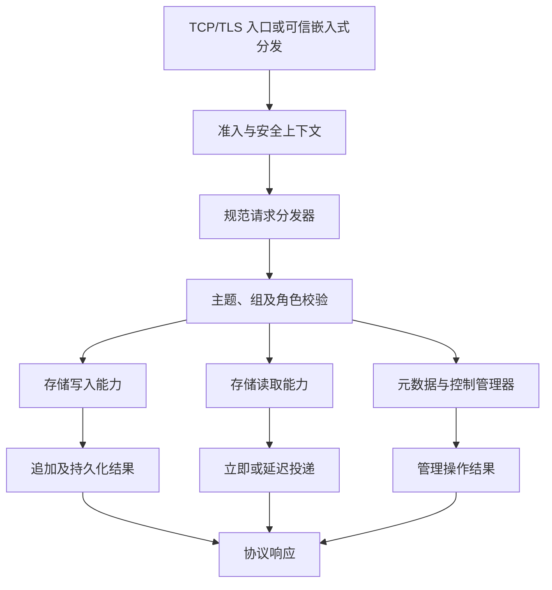

Broker 拥有消息服务：校验请求，管理主题/消费者组和消费元数据，调用存储能力，协调投递、重试，并参与注册与复制。有效的协议请求在这个边界上，才会转化为针对特定存储及 Broker 角色的已授权操作。

## 启动是一个装配过程

独立二进制使用经过校验的配置组装 `BrokerRuntime`。配置分为 `[broker]`、`[store]`、`[logging]` 和 `[observability]`；解析器会拒绝未知字段及不支持的组合，不会默默接受一份近似的 Java properties 配置。

主要阶段包括配置校验、元数据/存储初始化及恢复、处理器和服务接线、网络启动、定时注册/协调，以及就绪判断。启动日志账本记录已经启动的组件，使部分初始化失败时也有清理路径。

存储通过其装配层打开。Broker 处理器取得所需能力，而生命周期仍由组装后的存储拥有。主题配置、订阅组、消费偏移量、消费者连接和生产者连接分别由不同管理器负责，不是同一张元数据表中可以互换的条目。

Broker 配置中的元数据根目录与存储配置中的主数据根目录是不同设置。只迁移其中一个目录，可能保留了消息字节，却丢失解释这些消息或恢复服务所需的元数据。

## 请求路径

规范分发器按请求码选择发送、拉取、客户端管理、消费者管理、POP、确认及其他受支持处理器。受保护操作分发前，安全检查使用可信入口事实。嵌入式 Proxy 分发同样经过该流水线；位于同一进程不代表可以不受限制地访问存储。

发送时，处理器检查消息/主题约束及 Broker 可用性，将请求转成存储侧表示，并把追加结果映射为发送响应。接纳、本地持久化、副本确认是不同结果。接纳后的超时不能解释为“消息不存在”。

读取时，处理器结合消费者组/订阅信息、队列位置、过滤及存储状态。长轮询请求可能不会立即响应，而由延迟响应服务继续拥有。POP 除消息本身外还具有 receipt 和不可见期状态，详见 [POP 消费](../consumer/pop.md)。

## 控制工作与后台服务

Broker 注册向 NameServer 发布路由。Controller 模式的协调获取角色和写租约信息，HA 服务负责传输消息数据。定时投递、事务回查、重试处理、元数据持久化、维护和延迟请求，则分别由具有生命周期所有者的服务负责。

这些操作共享 CPU、I/O 和保留内存。运行时任务所有权、请求准入、存储 I/O 能力及有界队列分别解决其中不同的问题。并发许可本身不能限制所有消息字节；监听器就绪也不证明存储可写。

Controller 模式下 Broker 以禁止写入状态启动。就绪判断关注恢复后的存储是否具备晋升条件、处理器和安全组件是否装配完成；写权限由 Controller 另行授予。因此监控必须区分进程就绪与作为主节点接纳写入的权限。

## 关闭与部分失败

关闭首先禁止新增延迟生产工作，停止受跟踪的生产、Remoting 和处理器工作，处理延迟资源所有权，再在绝对截止时间内关闭其余服务及存储。认证、元数据、复制和存储分别贡献自己的结果。组件的具体顺序由生命周期代码规定，不取决于应用句柄偶然被释放的先后。

应检查结构化 Broker 关闭报告，包括未结束资源及存储关闭结果。单独的运行时任务报告不能证明元数据已刷盘、文件租约已释放或复制状态已正常关闭。截止时间耗尽意味着关闭不完整，即便进程随后退出。

启动失败同样需要清理已经启动的组件。运行诊断应保留原始错误与清理结果；将二者都简化为“Broker 失败”，会掩盖究竟是恢复、地址冲突、认证，还是关闭超时造成问题。

## 设计限制

当前配置校验拒绝 DLedger 模式。本地文件存储和 RocksDB 派生存储通过受支持 feature 及有效配置选择，不能当作可随意在现有数据目录上替换的插件。依赖旧式、缺少任务所有权队列路径的冷数据流控也会被配置校验拒绝。

本章说明组件接线及生命周期契约，不证明某个部署的吞吐、恢复时间或可用性。这些指标依赖存储/HA 策略及实际运行条件下的测量。

## 源码地图与后续阅读

- [Broker 配置及启动说明](https://github.com/mxsm/rocketmq-rust/blob/main/rocketmq-broker/README.md)。
- [运行时装配](https://github.com/mxsm/rocketmq-rust/blob/main/rocketmq-broker/src/broker_runtime.rs)、[生命周期](https://github.com/mxsm/rocketmq-rust/blob/main/rocketmq-broker/src/broker_runtime/lifecycle.rs)、[请求分发器](https://github.com/mxsm/rocketmq-rust/blob/main/rocketmq-broker/src/processor/dispatcher.rs)。
- [存储后端](storage-backends.md)、[HA 与 Controller](ha-controller.md)、[安全边界](security.md)及[运行时所有权](runtime.md)。
