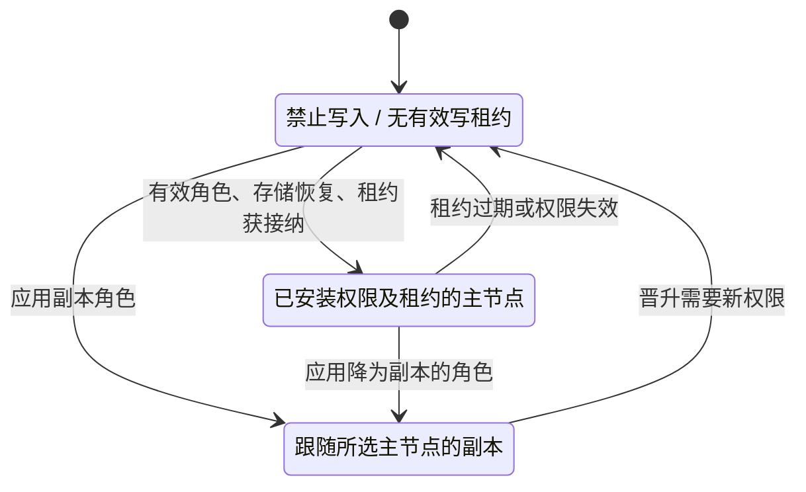
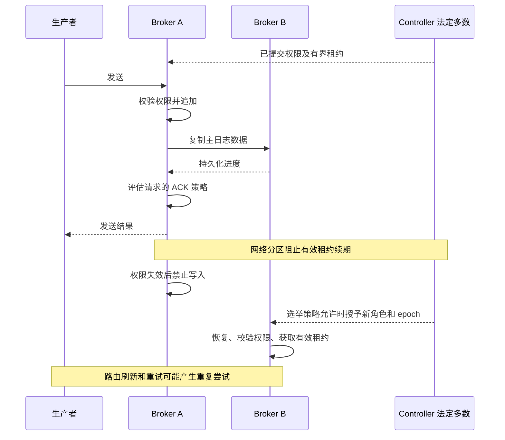

高可用组合了两种不同机制：Broker 复制消息数据，Controller 共识协调元数据、主节点选择和同步状态集合。Controller 的 Raft 复制不传输 Broker CommitLog。

## 控制平面与数据平面

`ControllerManager` 装配 OpenRaft、Controller 持久化状态、Broker 心跳跟踪、请求处理和角色变更通知。面向 Broker 的协调使用 Remoting；Controller 之间的 Raft 使用独立 gRPC 端点。NameServer 仍负责路由发现。

Broker 副本管理器应用 Controller 的角色和成员信息，控制平面集成将校验后的写租约安装到存储。HA 服务连接主、副本存储，交换数据及进度。追加何时可以确认，由本地存储和 HA 契约决定。

Controller 默认使用 RocksDB 持久化，也提供需显式启用的文件后端和内存测试后端。多节点 peer 列表描述端点，不证明 Raft 成员关系已经提交或法定多数能够工作。多成员自动初始化要求明确启用，并由最小节点 ID 执行；已有提交状态不会重新初始化。

## 先有权限，再谈确认

| 值 | 不变量与作用 |
| --- | --- |
| `MasterEpoch` | Controller 签发的正 epoch；旧权限不能授权当前写入 |
| `WriteAuthority` | 精确的 Broker ID 与主 epoch 二元组 |
| `SyncStateSetEpoch` | 同步状态成员集合的正版本，与主 epoch 分离 |
| `SyncStateSet` | 非空且去重的 Broker ID 集合；用于确认观察时必须包含当前主节点 |
| `WriteLeaseToken` | 精确权限及非零租约 generation |
| `ReplicaAck` | 副本的持久化排他偏移量，不只是收到的字节数 |

写租约 token 有意不包含墙上时钟过期时间。Broker 根据预期权限校验授权，扣除安全余量和请求耗时，将剩余时长安装为进程本地单调截止时间。过期/不匹配授权或已耗尽的有效时长不能开启写入。

Controller 模式的 Broker 以禁止写入状态启动。选中角色本身不使其可写：存储必须具有有效权限和租约状态。必须安装租约而安装失败时，控制平面会禁止写入。权限丢失时停写属于设计的一部分，不是静默降低持久性要求的理由。

这是写权限的概念状态图。实际启动就绪还检查恢复存储的晋升条件及处理器/安全装配；进程就绪与可写主节点状态始终不同。

## ACK 策略能证明什么

不依赖后端的 `decide_replication` 在无 I/O、重试、修改或隐式降级的情况下评估一次观察。它先拒绝过期/不匹配权限，再要求本地持久化水位覆盖请求的排他偏移量。

| 策略 | 所需证据 | 结果持久性 |
| --- | --- | --- |
| `LocalDurable` | 本地持久化水位覆盖追加 | `Local` |
| `ReplicaCount(n)` | 至少 `n` 个不同的当前同步成员，包含本地主节点；`n >= 2` | `Replicated` |
| `AllInSyncSet` | 本地持久化及当前集合中的每一个远端成员 | 有远端成员时为 `Replicated`；单成员集合为 `Local` |

同一个副本的重复 ACK 只计一次。当前集合之外的成员 ACK 不满足策略。进度不足产生 `Wait`；权限无效产生 `Reject`。`ReplicationAcknowledgement` 由成功决策构造，携带已证明的偏移量和持久性。

例如成员为 A/B/C，策略为 `ReplicaCount(2)` 时，A 的持久化水位和 B 合格的持久化 ACK 可以满足要求。采用 `AllInSyncSet` 时，C 也必须覆盖该偏移量。已连接但落后的副本不构成合格 ACK。

## 追加、分区与恢复时序

时序说明顺序义务，不代表已经测量的故障切换测试。追加后响应丢失会使生产者不确定，不会回滚记录。接纳后的本地/副本刷盘超时必须结合追加结果解释。

重新加入的旧主节点不能使用旧 epoch 恢复写入。它必须应用角色、协调日志、建立持久化进度和同步成员关系，才能以新角色提供服务。即便部分 Broker TCP 连接仍健康，Controller 不可用也可能阻止安全晋升或租约续期。

非同步副本选主设置会改变资格和恢复风险。不能只根据“三个 Controller”或“同步主节点”，推导零数据丢失、固定 RPO/RTO 或承受任意网络分区。所选 ACK 策略、实际同步集合、故障方式及恢复数据共同决定结果。

## 兼容性与源码地图

面向 Broker 的 Controller 响应模型遵循其文档化 RocketMQ 契约。内部 OpenRaft gRPC 和持久化状态不是 Java JRaft/DLedger 兼容接口。不要混用这些实现组成一个共识组，也不要移植其内部状态目录。

- [Controller 装配与配置](https://github.com/mxsm/rocketmq-rust/blob/main/rocketmq-controller/README.md)。
- [HA 值契约与决策](https://github.com/mxsm/rocketmq-rust/blob/main/rocketmq-store-api/src/ha_contract.rs)。
- [角色应用](https://github.com/mxsm/rocketmq-rust/blob/main/rocketmq-broker/src/controller/replicas_manager.rs)、[租约校验](https://github.com/mxsm/rocketmq-rust/blob/main/rocketmq-broker/src/controller/write_lease.rs)、[控制平面集成](https://github.com/mxsm/rocketmq-rust/blob/main/rocketmq-broker/src/broker/broker_control_plane/bootstrap.rs)。
- [自动切换 HA](https://github.com/mxsm/rocketmq-rust/blob/main/rocketmq-store/src/ha/auto_switch/auto_switch_ha_service.rs)、[存储](storage.md)。
