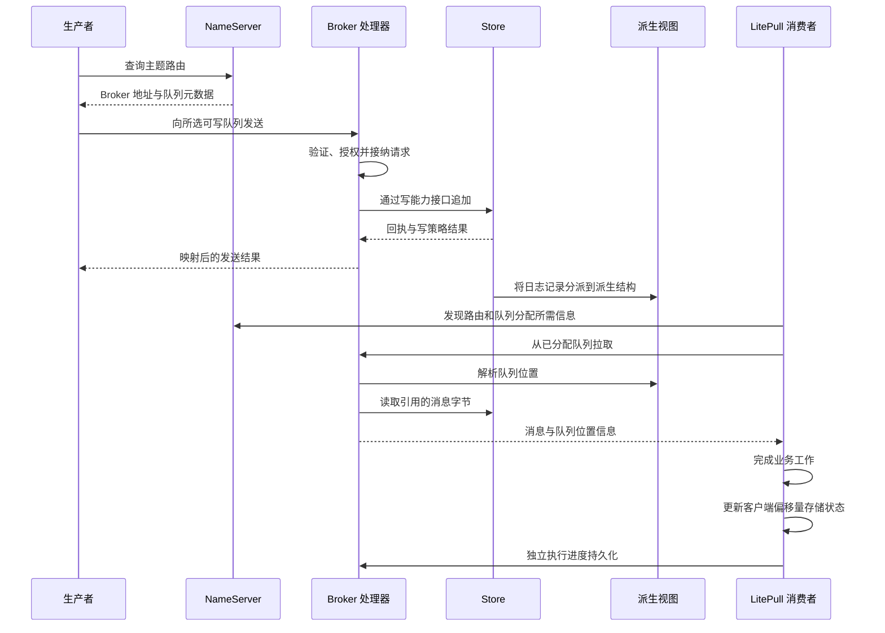

本页从路由发现开始，追踪一条普通消息到业务处理和消费进度的完整路径，以 Rust 客户端直连 Broker、使用 LocalFile 存储的组合作为参考。事务、延迟投递、POP 和 Proxy 会增加具有各自契约的分支。

## 从路由到进度

图中按职责组织步骤，不为发送响应与每次分派操作规定统一时序。后台分派和持久化工作可能交叠，需要分别解释发送结果与查询可见性。

## 1. 发现可写目标

Broker 注册向 NameServer 提供身份、地址和主题元数据。生产者取得路由，选择可写队列并直接联系该 Broker。缓存路由减少发现开销，但成员、地址或权限变化后可能过时。

NameServer 成功响应只说明返回了路由数据。所选 Broker 仍可能不可达、不可用或不能接受写入。[首次诊断](../operations/first-diagnosis.md)需要同时检查这两跳。

## 2. 编码、准入与验证

Protocol 持有命令身份、类型化头部和编码；Transport 持有连接、帧大小限制、请求准入和截止时间；Broker 处理器结合 Broker 角色、安全、主题配置及存储可用性解释请求。

这种拆分让同一协议契约经过有界传输，而不将消息持久化所有权交给 Transport。本地 writer 完成，不能证明远端处理器已经执行。准入拒绝与接纳写入后发生超时，也不一定具有相同副作用含义。

## 3. 追加并返回结果

发送处理器使用 Broker 写存储能力。组合后的 Store 将编码记录追加到主日志，返回描述状态、追加范围和持久性信息的回执，再由处理器映射为生产者收到的协议响应。

部分超时或副本不可用状态仍对应已经接纳的追加。追加成功后，生产者也可能丢失响应。因此，应用重试需要容忍重复，不能假设错误代表日志中没有记录。

本地持久化与配置的副本确认是不同条件。派生索引追平，不能增强之前的主日志回执。[存储设计](storage.md)给出准确的水位模型。

## 4. 构建读取视图

分派解释主日志记录，并更新不同操作使用的结构。ConsumeQueue 将逻辑队列位置映射到物理消息位置；key 索引服务消息查询；定时和其他可选组件维护各自的派生状态。

不同派生视图可能具有不同进度。消息已被接纳时，特定查询路径可能尚未追平。这不自动表示另一份权威消息副本，也不能保证消息已达到持久存储。

恢复会验证可用主日志状态，重建或推进兼容的派生状态，再按相应生命周期顺序恢复服务。恢复不能创造超出配置确认策略和故障模型的更强保证。

## 5. 拉取并保留消息数据

LitePull 客户端管理订阅队列分配和后台拉取。Broker 验证拉取请求，解析逻辑队列位置，并通过读能力接口读取引用的数据。

传输时，存储租约可以使底层文件区域一直保留到 writer 完成。Transport 选择适用的可移植或可选文件传输路径。零拷贝 API 表示避免了特定复制，不承诺所有数据包都使用内核零拷贝，也不代表远端应用已经处理数据。

轮询将消息交给应用代码。应用批次、并发和下游依赖决定业务工作何时完成，它们需要独立于客户端网络缓冲区进行限制。

## 6. 有意识地推进进度

处理成功后，应用按消费模型推进进度。当前 LitePull 的 `commit_all` 更新客户端偏移量存储状态，与远端持久化分离，并可能在内部记录单个队列错误。其返回不能证明所有队列的进度已持久保存。

业务提交完成，但组进度未保留时，重放可能再次执行事件；进度在业务完成前推进，则可能在重启后跳过该业务。应用必须自行协调完成顺序和幂等。

Push 监听器结果与 POP receipt ACK 使用不同路径，应按各自模型说明，不能直接插入 LitePull 偏移量时序。

## 观察失败所在边界

| 症状 | 首先检查的边界 |
| --- | --- |
| 没有主题路由 | Broker 注册与主题元数据 |
| 路由存在但连接失败 | 公布地址与 Transport 端点 |
| 发送结果报告刷盘/副本超时 | Store 确认策略与进度 |
| 发送成功，但读取/查询落后 | 对应派生视图与消费条件 |
| 轮询取得数据，但业务结果缺失 | 应用处理与下游事务 |
| 重启后业务重复 | 重试身份与持久化消费进度 |

关联有界请求/错误元数据和队列位置，不将消息体或凭证作为常规诊断标签。[投递与重试指南](../guides/delivery-and-retry.md)解释这些失败窗口如何影响业务设计。

来源：[发送处理器](https://github.com/mxsm/rocketmq-rust/blob/main/rocketmq-broker/src/processor/send_message_processor.rs)、[拉取处理器](https://github.com/mxsm/rocketmq-rust/blob/main/rocketmq-broker/src/processor/pull_message_processor.rs)、[Store 组合](https://github.com/mxsm/rocketmq-rust/blob/main/rocketmq-store/README.md)、[LitePull 实现](https://github.com/mxsm/rocketmq-rust/blob/main/rocketmq-client/src/consumer/consumer_impl/default_lite_pull_consumer_impl.rs)。
