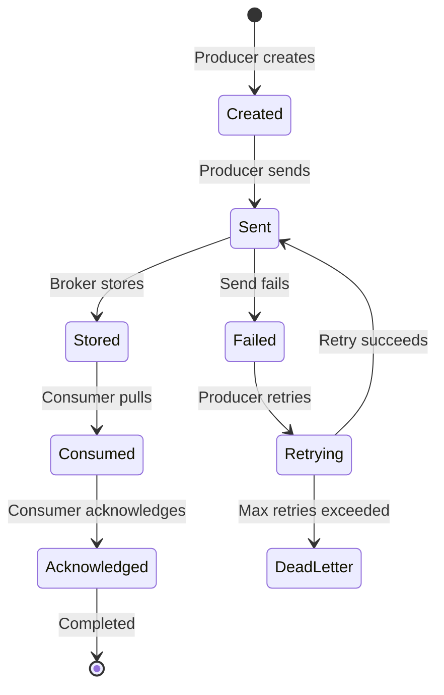

# 消息模型

理解 RocketMQ 的消息模型，是设计高质量消息应用的关键。

## 消息结构

### 基础消息

RocketMQ 中的一条消息通常包含以下字段：

```rust
pub struct Message {
    // Topic 名称
    topic: String,

    // 消息体（字节数组）
    body: Vec<u8>,

    // 可选标签，用于过滤
    tags: Option<String>,

    // 可选键，用于索引
    keys: Option<String>,

    // 可选属性
    properties: HashMap<String, String>,
}
```

### 消息示例

```rust
use rocketmq_common::common::message::message_single::Message;

let message = Message::builder()
    .topic("OrderEvents")
    .body_slice(b"{\"order_id\": \"12345\", \"amount\": 99.99}")
    .tags("order_created")
    .key("order_12345")
    .raw_property("region", "us-west")?
    .raw_property("priority", "high")?
    .build()?;
```

## Topics 与 Queues

### Topic

Topic 是消息的逻辑通道，用于分类消息：

- **层次化命名**：如 `orders`、`payments`、`logs`
- **多租户隔离**：不同应用可使用不同 Topic
- **逻辑隔离**：不同 Topic 的消息互不影响

### Queue

Topic 会被拆分成多个 Queue，以支持并行处理：

```text
Topic: OrderEvents (4 queues)

┌───────────────────────────────────────┐
│ Queue 0 │ Queue 1 │ Queue 2 │ Queue 3 │
├───────────────────────────────────────┤
│ Msg 0   │ Msg 1   │ Msg 2   │ Msg 3   │
│ Msg 4   │ Msg 5   │ Msg 6   │ Msg 7   │
│ Msg 8   │ Msg 9   │ Msg 10  │ Msg 11  │
└───────────────────────────────────────┘
```

**多队列的价值：**

- 多消费者并行消费
- 负载分摊
- 提升吞吐

## 消息类型

### 普通消息

无特殊语义的常规消息：

```rust
let message = Message::builder()
    .topic("NormalTopic")
    .body(body)
    .build()?;
producer.send(message).await?;
```

### 顺序消息

同一队列内按顺序消费的消息：

```rust
let message = Message::builder()
    .topic("OrderEvents")
    .body("ordered payload")
    .build()?;

let order_id = "order_123".to_string();
producer
    .send_with_selector(
        message,
        |queues: &[MessageQueue], _msg: &Message, id: &String| {
            let hash = compute_hash(id);
            let index = (hash % queues.len() as u64) as usize;
            queues.get(index).cloned()
        },
        order_id,
    )
    .await?;
```

### 事务消息

与本地事务保持原子性的消息：

```rust
use rocketmq_client_rust::producer::mq_producer::MQProducer;
use rocketmq_client_rust::producer::transaction_mq_producer::TransactionMQProducer;

let mut transaction_producer = TransactionMQProducer::builder()
    .producer_group("tx_group")
    .name_server_addr("localhost:9876")
    .topics(vec!["OrderEvents"])
    .transaction_listener(OrderTransactionListener::default())
    .build();

let tx_result = transaction_producer
    .send_message_in_transaction(message, Some("order_123".to_string()))
    .await?;

println!("tx_result = {}", tx_result);
```

### 延迟消息

经过指定延迟后再投递的消息：

```rust
let message = Message::builder()
    .topic("DelayedTopic")
    .body(body)
    .delay_level(3) // 延迟等级 3（例如 10 秒）
    .build()?;
producer.send(message).await?;
```

## 消息过滤

### 基于 Tag 的过滤

在 Broker 侧按 Tag 进行过滤：

```rust
let message = Message::builder()
    .topic("OrderEvents")
    .body("payload")
    .tags("order_paid")
    .build()?;

// 消费者订阅指定 tag
consumer.subscribe("OrderEvents", "order_paid || order_shipped").await?;
```

### SQL92 过滤

使用 SQL92 表达式进行高级过滤：

```rust
let message = Message::builder()
    .topic("OrderEvents")
    .body("payload")
    .raw_property("region", "us-west")?
    .raw_property("amount", "100")?
    .build()?;

// 消费者使用 SQL 表达式
consumer.subscribe("OrderEvents", "region = 'us-west' AND amount > 50").await?;
```

## 消息属性

### 系统属性

RocketMQ 会自动为每条消息写入系统属性：

- `MSG_ID`：全局唯一消息 ID
- `TOPIC`：Topic 名称
- `QUEUE_ID`：Queue ID
- `QUEUE_OFFSET`：消息在队列中的位置
- `STORE_SIZE`：消息存储大小
- `BORN_TIMESTAMP`：消息创建时间
- `STORE_TIMESTAMP`：消息落盘时间

### 用户属性

你也可以写入自定义属性：

```rust
let message = Message::builder()
    .topic("OrderEvents")
    .body("payload")
    .raw_property("source", "mobile_app")?
    .raw_property("version", "2.1.0")?
    .raw_property("user_id", "user_12345")?
    .build()?;
```

## 消息生命周期



### 发送流程

```text
1. 创建消息
2. 设置 topic、body、tags、keys、properties
3. 选择队列（负载均衡或自定义选择器）
4. 发送到 broker
5. broker 写入 CommitLog
6. broker 更新 ConsumeQueue
7. 返回发送结果给 producer
```

### 消费流程

```text
1. consumer 从 queue 拉取消息
2. 反序列化消息
3. 执行业务处理
4. 确认消费
5. 更新消费位点
6. 继续下一批消费
```

## 消息持久化

RocketMQ 提供高可靠的持久化机制：

```text
┌─────────────────────────────────────┐
│         CommitLog                   │
│  (Sequential storage of all msgs)   │
├─────────────────────────────────────┤
│ [Msg 1][Msg 2][Msg 3][Msg 4]...     │
└─────────────────────────────────────┘
              ↓
┌─────────────────────────────────────┐
│      ConsumeQueue per Queue         │
│  (Index structure for fast access)  │
├─────────────────────────────────────┤
│ Queue 0: [Offset 0][Offset 8]...    │
│ Queue 1: [Offset 16][Offset 24]...  │
└─────────────────────────────────────┘
```

## 最佳实践

1. **使用清晰的 Topic 命名规范**：便于治理与排障
2. **合理设置 Tag**：提升过滤效率
3. **写入消息 Key**：便于追踪与查询
4. **控制消息体大小**：通常建议小于 256KB
5. **将元数据放入 properties**：避免塞入 body
6. **明确顺序需求**：根据业务选择顺序或普通消息
7. **实现幂等消费**：应对至少一次语义下的重复消息

## 下一步

- [存储](../architecture/storage) - 了解持久化实现
- [生产者](../producer/overview) - 学习生产者高级特性
- [消费者](../consumer/overview) - 学习消费者高级特性
