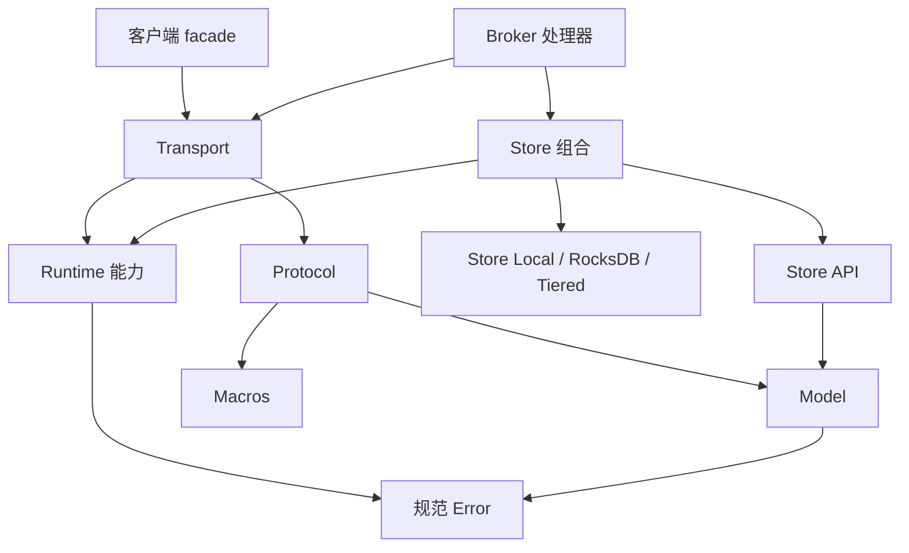

修改行为前，可以通过本地图找到对应所有者。Cargo 包、操作系统进程和产品是不同单位：一个 Broker 进程会组合多个库，而一个 Dashboard 产品可能包含独立的 Rust 和 Node 工程。

## workspace 成员与发行范围

当前根 `Cargo.toml` 列出 **28 个 workspace 成员**，`scripts/core-release-scope.json` 列出 **27 个核心包**。两者相差 `rocketmq-dashboard-common`：它属于根 workspace，但不在该核心发行包清单中。

workspace 成员关系决定 Cargo 构建图。核心发行分类表示 registry 发布、仅二进制或内部使用等打包意图。任何一个数量，都不能证明全部包已经以源码版本发布。

目录名与包名可能不同。`rocketmq-client` 目录中的包名是 `rocketmq-client-rust`，`cargo -p` 命令使用包名。`rocketmq-dashboard` 目录自身不是 Cargo workspace。

## 按职责查看根成员

| 相对仓库路径 | 职责 | 应保留的边界 |
| --- | --- | --- |
| `rocketmq-model`、`rocketmq-error` | 领域值与规范操作错误 | 消息身份、序列化和错误身份 |
| `rocketmq-security-api` | 共享安全契约 | 安全类型不隐式选择策略实现 |
| `rocketmq-protocol`、`rocketmq-macros` | 协议命令/codec 和类型化头部生成支持 | 请求码、头部与序列化 |
| `rocketmq-transport` | 客户端/服务端连接、分派、准入和文件传输 | 有界网络工作与完成语义 |
| `rocketmq-runtime` | 运行时所有权、任务作用域、阻塞和资源预算 | 取消、准入与关闭证据 |
| `rocketmq-observability` | 日志、指标、追踪及 exporter 所有权 | 有界诊断与脱敏 |
| `rocketmq-auth`、`rocketmq-filter` | 认证/授权实现与过滤 | 运行时权限和支持的表达式 |
| `rocketmq-client` | 生产者、消费者与可选 Admin facade | 应用持有的 ClientRuntime 与 API 兼容性 |
| `rocketmq-namesrv` | Broker 注册与路由查询 | 发现状态与公布地址 |
| `rocketmq-broker` | 消息处理器与服务组合 | Broker/Store 生命周期和请求结果 |
| `rocketmq-store-api` | 与后端无关的存储契约 | 回执、持久性、进度和 HA 决策 |
| `rocketmq-store` | 面向 Broker 的 StoreFactory/StorePorts 组合 | 独占生命周期所有权与窄能力接口 |
| `rocketmq-store-local`、`rocketmq-store-rocksdb`、`rocketmq-tieredstore` | 本地存储原语、可选 RocksDB 元数据与分层存储集成 | 主日志权威性与派生/次级进度 |
| `rocketmq-controller` | Controller 元数据、OpenRaft 与 Broker 角色协调 | 写入权、epoch 和副本成员 |
| `rocketmq-proxy`、`rocketmq-proxy-core`、`rocketmq-proxy-cluster`、`rocketmq-proxy-local` | Proxy 入口、共同契约以及远端/嵌入式适配器 | 不同模式的后端与运行时所有权 |
| `rocketmq-tools/rocketmq-admin/rocketmq-admin-core` | 可复用的类型化管理服务 | 只读/变更适配器选择 |
| `rocketmq-tools/rocketmq-admin/rocketmq-admin-cli` 及同父目录下的 `rocketmq-admin-tui` | 命令行与终端管理 | 工具调用和面向操作者的错误 |
| `rocketmq-tools/rocketmq-store-inspect` | 显式存储检查操作 | 离线访问与数据格式范围 |
| `rocketmq-dashboard/rocketmq-dashboard-common` | Dashboard 共享领域模型与逻辑 | 共享库，不是 UI 或后端可执行程序 |

表格将相关成员归组，不代表同组 crate 使用相同 feature 或发行分类。

## 库之间如何组合



这是选取关键关系的依赖图，不是完整 Cargo 图。安全和可观测性属于跨层依赖。关键区别是：协议类型不持有套接字，存储契约不选择运行时或具体数据库。

需要准确的当前依赖时，在根目录执行：

```bash
cargo metadata --no-deps --format-version 1
cargo tree -p rocketmq-client-rust -e features
```

feature 树描述本次命令的依赖图。可选依赖、默认值和 feature 合并可能使另一个消费者的依赖图不同。例如，根 workspace 的 Transport 依赖关闭默认 feature，而直接构建包可能启用包默认值。

## 独立工程

| 工程根目录 | 结构 | 起点 |
| --- | --- | --- |
| `rocketmq-example` | 独立 Cargo 示例工程 | manifest 和 example 目标 |
| `rocketmq-website` | Docusaurus Node 工程 | `package.json` 和网站写作指南 |
| `rocketmq-website/examples/first-message` | 小型独立 Cargo 教程 | 使用相对源码路径依赖的 manifest |
| `rocketmq-dashboard/rocketmq-dashboard-gpui` | 原生 Rust 桌面应用 | 本地 manifest 与平台前置条件 |
| `rocketmq-dashboard/rocketmq-dashboard-tauri` | Node 前端及 `src-tauri` Rust 后端 | 在前端工程根目录执行 Tauri 命令 |
| `rocketmq-dashboard/rocketmq-dashboard-web` | 独立 `frontend` Node 与 `backend` Cargo 工程 | Web Dashboard 搭建指南 |
| `rocketmq-ai/rocketmq-mcp` | 独立只读 MCP 包 | 传输 feature 与配置 |
| `rocketmq-ai/rocketmq-mcp-control` | 独立受控变更包 | 独立策略与编译启用条件 |
| `rocketmq-ai/rocketmq-sre` | 独立 Rust 2024 workspace，另有 UI 和 SDK 工程 | SRE workspace 与部署指南 |
| `fuzz` 和宏测试 fixture | 专用独立测试工程 | 各自说明与目标 |

不能将根目录 `cargo check` 解释为已检查每个独立产品。同样，前端 `npm run build` 不能证明 Tauri 安装包或 Web 后端已经构建。

## 定位改动

- 请求码或编码头部错误，应从 Protocol 及其契约测试入手。
- 连接超时、准入或 writer 生命周期问题，应从 Transport 及其消费者入手。
- 任务泄漏或关闭截止时间问题，应定位实际运行时所有者，通常涉及 Runtime 和集成服务。
- 消息已存储但查询可见性延迟，应追踪 Store 追加/分派/读取路径，不能直接归因于 NameServer。
- UI 操作可能跨越前端、产品后端、Admin Core 和核心服务，需要检查这些具体消费者。

公开导出经过明确设计。应优先使用模块文档指定的 crate 根、`api` 或 `prelude` 入口，不能仅因某个实现文件存在，就导入私有模块。

继续阅读[消息生命周期](message-lifecycle.md)，了解请求路径；阅读[开发指南](../contributing/development-guide.md)，了解工作目录和针对性检查。

来源：[workspace 成员](https://github.com/mxsm/rocketmq-rust/blob/main/Cargo.toml)、[核心发行范围](https://github.com/mxsm/rocketmq-rust/blob/main/scripts/core-release-scope.json)、[Protocol](https://github.com/mxsm/rocketmq-rust/blob/main/rocketmq-protocol/README.md)、[Transport](https://github.com/mxsm/rocketmq-rust/blob/main/rocketmq-transport/README.md)、[Store API](https://github.com/mxsm/rocketmq-rust/blob/main/rocketmq-store-api/README.md)。
