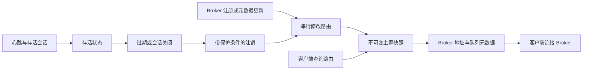

NameServer 回答某个主题可以在哪里读写。Broker 注册身份和主题元数据，客户端查询路由后直接与 Broker 通信。消息体和消费者的业务确认不经过 NameServer。

## 状态与发布

`RouteInfoManager` 维护主题队列、Broker 地址、集群成员、存活 Broker、过滤服务器和队列映射元数据等源表。影响路由的修改先取得统一协调器，更新相关表，再为受影响主题发布不可变快照。路由查询加载一个完整主题快照，不会临时拼接正在并发变化的多张表。

这是有意选择的并发取舍：用串行修改及重建视图的成本，换取一致、低开销的主题读取。但不同主题的快照并不构成全局事务。管理查询在组织源表视图时也会取得修改协调器。

`KVConfigManager` 独立管理命名空间/键配置及其持久化。KV 配置持久化不等于把存活 Broker 路由变成持久化集群注册中心；NameServer 重启后，实时路由通过 Broker 重新注册恢复。

## 注册、查询与过期

注册将 Broker 集群、名称、ID、地址与当前主题和存活会话信息关联。元数据版本帮助判断哪些信息需要更新。心跳刷新存活状态，不表示任何消息已经存储。

维护任务检测不活跃 Broker；传输会话销毁也可以提前触发移除。注销携带会话及 generation 信息，用于区分旧连接的延迟清理和新的注册。批量注销服务清理相关地址与队列元数据，然后重新发布路由。

最终可见性延迟包含注册/心跳周期、过期检测、排队清理、网络延迟和客户端路由刷新。一个过期参数不能保证故障切换时间。客户端可能继续缓存不可达 Broker 的路由，直到刷新或操作失败触发恢复。

路由响应包含队列权限和 Broker 端点。主题路由存在，并不证明客户端能访问该地址、Broker 可写或调用方已获授权。NameServer 查询成功但发送失败时，应检查对外通告的 IP 和端口。

## 多个 NameServer

Broker 使用配置的 NameServer 端点集合向可用节点注册；可用列表为空时，注册路径回退到配置列表。不同 NameServer 上的注册调用可能得到不同结果。

客户端也维护 NameServer 端点集合，通过传输客户端获取路由。普通 NameServer 服务不使用 Raft 在节点间复制路由表，因此两个 NameServer 可以暂时返回不同路由。多节点部署提高发现服务的可用性；应统一 Broker 与客户端的端点配置，在注册不对称时逐节点检查。

普通路由查询不要求 NameServer 法定多数。反过来，路由查询成功也不是 Controller 已形成法定多数的证据。[Controller 协调](ha-controller.md) 属于独立服务，即便它嵌入 NameServer 进程运行也是如此。

## 启动与生命周期

二进制为 `rocketmq-namesrv-rust`。启动装配解析配置、home/KV 路径，组装由运行时管理的处理器、准入控制、路由维护、持久化和传输监听器。空 NameServer 可以成功启动；在 Broker 注册前没有业务主题路由属于正常现象。

默认构建不包含嵌入式 Controller 依赖图。嵌入模式同时要求 `embedded-controller` Cargo feature 与 `enableControllerInNamesrv = true`；只开启配置而未编译 feature 会被拒绝。Controller 的 Remoting 和 Raft 端点仍需使用不同且有效的地址。

关闭时停止入口及其拥有的维护、注销任务，并关闭服务持久化和运行时资源。进程退出或某个路由句柄被释放，不应被视为已完成所有排队管理持久化的证明。

## 故障解释

| 现象 | 解释及下一步证据 |
| --- | --- |
| 所有节点都没有主题 | 检查主题创建和 Broker 注册是否成功 |
| 仅一个节点缺少主题 | 比较 Broker 端点列表、连通性和注册失败 |
| 路由存在但 Broker 不可达 | 从客户端网络检查通告的 Broker 地址 |
| Broker 故障后路由仍存在 | 分开检查存活过期及客户端缓存刷新 |
| Controller 不可用 | 独立诊断 Controller 领导权，不混同路由可用性 |

[首次诊断](../operations/first-diagnosis.md) 提供从路由到消息的具体排查路径。

## 源码地图

- [路由管理器](https://github.com/mxsm/rocketmq-rust/blob/main/rocketmq-namesrv/src/route/route_info_manager.rs)与[快照发布](https://github.com/mxsm/rocketmq-rust/blob/main/rocketmq-namesrv/src/route/topic_route_snapshot.rs)。
- [启动装配](https://github.com/mxsm/rocketmq-rust/blob/main/rocketmq-namesrv/src/bootstrap.rs)、[KV 配置](https://github.com/mxsm/rocketmq-rust/tree/main/rocketmq-namesrv/src/kvconfig)。
- [Broker 注册调用](https://github.com/mxsm/rocketmq-rust/blob/main/rocketmq-broker/src/out_api/broker_outer_api.rs)。
