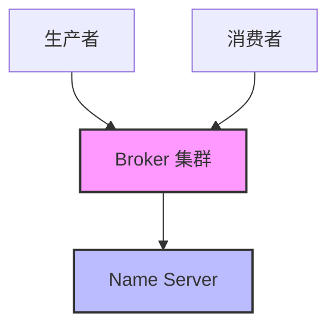

# RocketMQ-Rust 架构概览

## 核心组件

### Name Server
负责路由信息管理、 Broker 注册与发现

### Broker
消息存储与转发核心组件

### Producer
消息生产者客户端

### Consumer
消息消费者客户端

## 架构图

## 相关文档

- [消息模型](./message-model)
- [存储架构](./storage)
