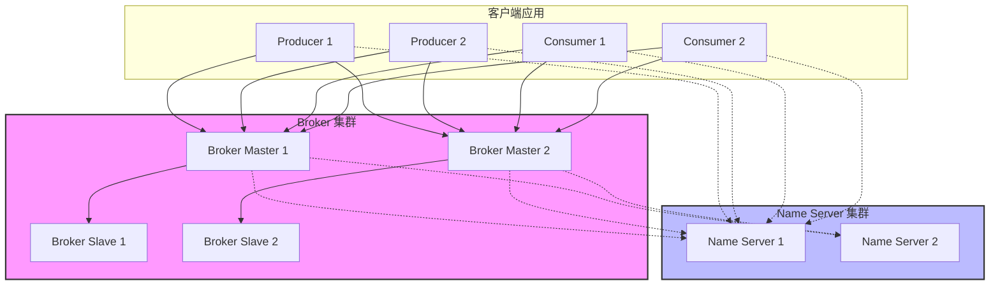
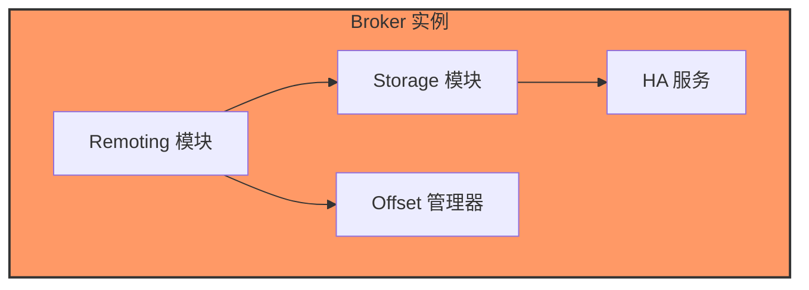
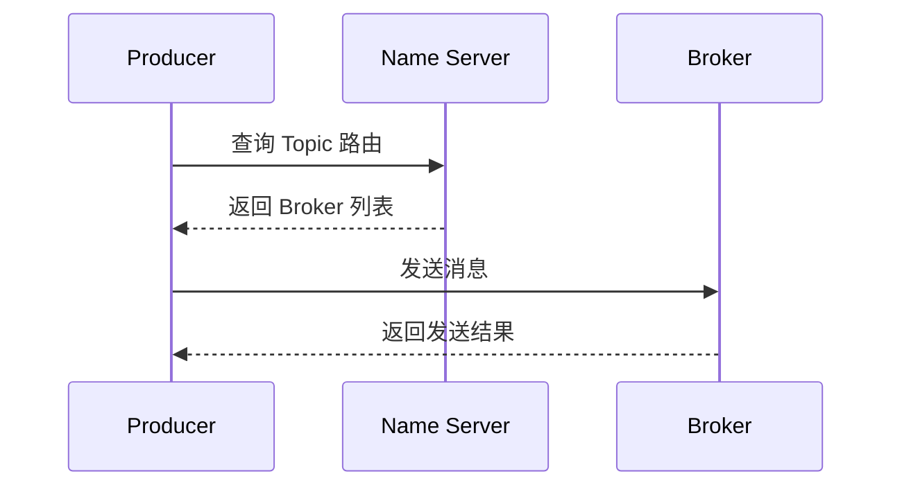
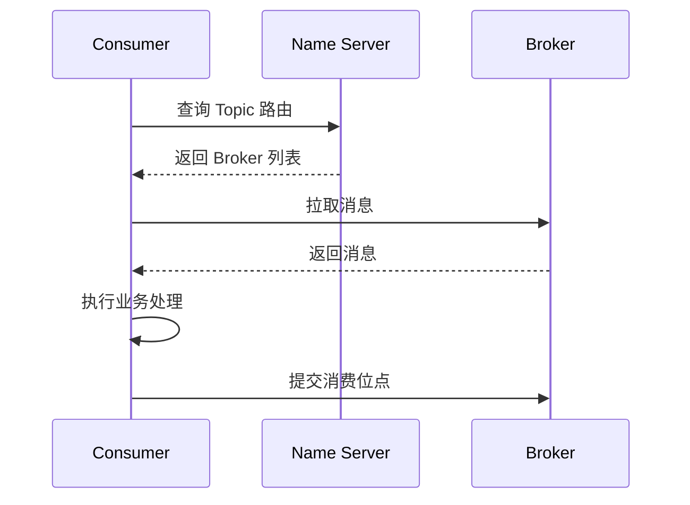
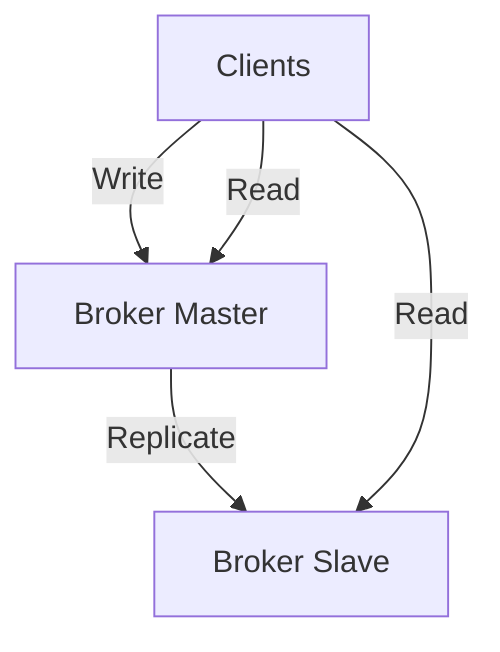

# 架构概览

RocketMQ-Rust 继承了 Apache RocketMQ 经验证的架构设计，同时结合了 Rust 在性能与安全性方面的优势。

## 系统架构


```mermaid
graph TB
    subgraph Clients["客户端应用"]
        P1[Producer 1]
        P2[Producer 2]
        C1[Consumer 1]
        C2[Consumer 2]
    end

    subgraph Namesrv["Name Server 集群"]
        NS1[Name Server 1]
        NS2[Name Server 2]
    end

    subgraph Brokers["Broker 集群"]
        B1[Broker Master 1]
        B2[Broker Master 2]
        BS1[Broker Slave 1]
        BS2[Broker Slave 2]
    end

    P1 --> B1
    P1 --> B2
    P2 --> B1
    P2 --> B2

    C1 --> B1
    C1 --> B2
    C2 --> B1
    C2 --> B2

    B1 -.-> NS1
    B1 -.-> NS2
    B2 -.-> NS1
    B2 -.-> NS2

    P1 -.-> NS1
    P2 -.-> NS1
    C1 -.-> NS1
    C2 -.-> NS1

    B1 --> BS1
    B2 --> BS2

    style Brokers fill:#f9f,stroke:#333,stroke-width:2px
    style Namesrv fill:#bbf,stroke:#333,stroke-width:2px
```

## 组件说明

### 1. Name Server

Name Server 是轻量级注册中心，主要提供：

**功能：**

- Broker 注册与发现
- 路由信息维护
- 心跳检测

**特点：**

- 无状态设计
- 集群部署提升可用性
- 节点之间无需数据同步

**典型操作：**

```text
// 伪代码流程：
// 客户端向 NameServer 查询 TopicTest 路由
// NameServer 返回 Broker/Queue 路由信息
```

### 2. Broker

Broker 是消息系统的核心处理节点：

**职责：**

- 消息接收与存储
- 消息查询与投递
- 消费位点（offset）管理
- 高可用复制（HA）

**Broker 内部组件：**


```mermaid
graph TB
    subgraph Broker["Broker 实例"]
        Remoting[Remoting 模块]
        Store[Storage 模块]
        Offset[Offset 管理器]
        HA[HA 服务]
    end

    Remoting --> Store
    Remoting --> Offset
    Store --> HA

    style Broker fill:#f96,stroke:#333,stroke-width:2px
```

**消息存储结构：**

- CommitLog：所有消息的顺序存储
- ConsumeQueue：面向消费的索引结构
- IndexFile：用于 Key 查询的哈希索引

### 3. Producer

Producer 负责向 Broker 发送消息：

**特性：**

- 异步发送
- 发送失败自动重试
- 跨 Broker 负载均衡
- 支持事务消息

**发送流程：**


```mermaid
sequenceDiagram
    participant P as Producer
    participant NS as Name Server
    participant B as Broker

    P->>NS: 查询 Topic 路由
    NS-->>P: 返回 Broker 列表
    P->>B: 发送消息
    B-->>P: 返回发送结果
```

### 4. Consumer

Consumer 负责接收并处理消息：

**类型：**

- **Push Consumer**：事件驱动，Broker 推送消息
- **Pull Consumer**：轮询拉取，由消费者主动拉消息

**消费模式：**

- **Clustering（集群）**：组内负载均衡
- **Broadcasting（广播）**：每个消费者接收全部消息

**消费流程：**


```mermaid
sequenceDiagram
    participant C as Consumer
    participant NS as Name Server
    participant B as Broker

    C->>NS: 查询 Topic 路由
    NS-->>C: 返回 Broker 列表
    C->>B: 拉取消息
    B-->>C: 返回消息
    C->>C: 执行业务处理
    C->>B: 提交消费位点
```

## 消息流转

### 消息发送路径

```text
1. Producer 向 Name Server 查询 Topic 路由
2. Name Server 返回 Broker 列表及队列信息
3. Producer 选择队列（负载均衡）
4. Producer 向 Broker 发送消息
5. Broker 将消息写入 CommitLog
6. Broker 更新 ConsumeQueue 索引
7. Broker 返回发送结果
```

### 消息消费路径

```text
1. Consumer 向 Name Server 查询 Topic 路由
2. Name Server 返回 Broker 列表及队列信息
3. Consumer 执行 Rebalance 分配队列
4. Consumer 从分配队列拉取消息
5. Consumer 处理消息
6. Consumer 提交消费位点
7. Consumer 继续拉取下一批消息
```

## 高可用设计

### Broker 高可用

Broker 支持主从复制：

- **Master**：处理读写请求
- **Slave**：复制主节点数据，通常承担读请求
- **同步模式**：支持同步复制与异步复制


```mermaid
graph TB
    Master[Broker Master]
    Slave[Broker Slave]

    Master -->|Replicate| Slave

    Clients[Clients]
    Clients -->|Write| Master
    Clients -->|Read| Master
    Clients -->|Read| Slave
```

### Name Server 高可用

Name Server 以集群方式部署：

- 每个 Broker 向所有 Name Server 注册
- 客户端可查询任意 Name Server
- 避免单点故障

## Rust 设计优势

### 内存安全

RocketMQ-Rust 基于 Rust 所有权模型：

- 无需手动内存管理
- 避免空指针解引用
- 编译期消除数据竞争

### 异步架构

基于 Tokio 运行时：

- 非阻塞 I/O
- 资源利用率高
- 低开销支持高并发

### 零成本抽象

- 通过泛型保证类型安全
- 编译期优化
- 抽象层不引入额外运行时开销

## 下一步

- [消息模型](../architecture/message-model) - 深入理解消息组织与投递语义
- [存储](../architecture/storage) - 了解持久化与索引机制
- [Broker 配置](../configuration/broker-config) - 学习部署与运行参数配置
