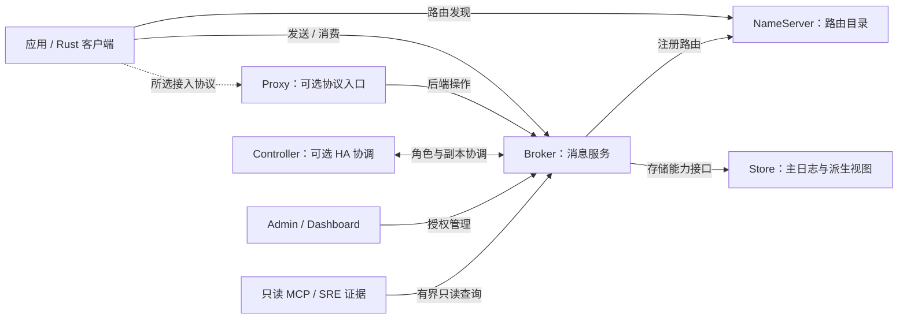
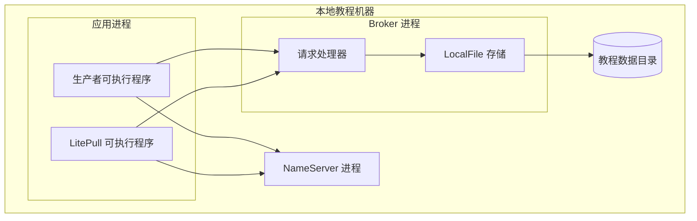

RocketMQ-Rust 将消息发现、消息所有权、应用处理和运维产品分开。基础部署由一个或多个 NameServer、Broker 和客户端应用组成。Proxy、Controller、Dashboard 和 AI 服务分别增加特定职责，不是每条消息链路都必须经过的节点。

本页说明逻辑边界。[模块地图](module-map.md)将职责对应到 crate，[部署总览](../deployment/overview.md)将其对应到进程。

## 逻辑系统

```mermaid
flowchart LR
    App["应用 / Rust 客户端"]
    N["NameServer：路由目录"]
    B["Broker：消息服务"]
    S["Store：主日志与派生视图"]
    P["Proxy：可选协议入口"]
    H["Controller：可选 HA 协调"]
    O["Admin / Dashboard"]
    R["只读 MCP / SRE 证据"]
    App -->|"路由发现"| N
    App -->|"发送 / 消费"| B
    App -.->|"所选接入协议"| P
    P -->|"后端操作"| B
    B -->|"注册路由"| N
    B -->|"存储能力接口"| S
    H <-->|"角色与副本协调"| B
    O -->|"授权管理"| B
    R -->|"有界只读查询"| B
```

实线表示图中组合的职责关系，不要求部署全部可选组件。Proxy 也可以嵌入本地 Broker；只读产品还会使用发现能力和各自的适配器。图中将运维查询与普通消息数据路径分别表达。

## 发现与数据所有权

NameServer 接收 Broker 注册、跟踪存活状态并返回主题路由快照，不存储应用消息体，也不转发生产者流量。路由提供 Broker 地址和队列元数据，不能证明 Broker 可写，或对特定客户端可达。

Broker 持有主题/消费者组元数据、请求处理、消息放置、读取、消费者协调和存储生命周期。Store 实现位于该职责边界内部。Model、Protocol 和 Store API crate 是库，不是额外网络服务。

客户端持有面向应用的发送或消费模型，维护路由与连接，并在注入的客户端运行时下执行工作。应用处理和业务存储位于 Broker 事务边界之外。

## 协议与运行时边界

| 边界 | 职责 | 不持有的内容 |
| --- | --- | --- |
| Model | 消息、队列和结果等领域值 | 套接字或服务启动 |
| Protocol | 命令、协议码、类型化头部和编码 | 网络连接生命周期 |
| Transport | TCP/TLS、帧大小限制、连接/请求准入、分派与响应完成 | 业务存储或应用成功语义 |
| Runtime | 任务所有权、取消、阻塞通道、资源预留与关闭报告 | 任意业务工作的自动正确性 |
| Store API | 类型化能力、追加回执、进度和复制决策 | 具体引擎或执行器 |

“Remoting”表示 RocketMQ 命令传输及围绕它构建的客户端/服务端 API。当前根 workspace 由 `rocketmq-protocol` 持有协议契约，`rocketmq-transport` 持有网络职责，不应将历史 Remoting 模块路径当作当前独立 workspace 服务。

传输完成、Broker 接纳、持久化、消费者投递和业务完成是不同观察结果。[消息生命周期](message-lifecycle.md)串联这些变化，[存储](storage.md)解释持久化边界。

## 可选接入与 HA

Proxy 提供 v2 gRPC MessagingService 和可选 remoting 入口。Cluster 模式将操作适配到远端服务，Local 模式持有嵌入式 Broker 后端组合。两者共享处理器契约，但部署、故障和关闭边界不同。

Controller 使用 Rust Controller 的 OpenRaft 实现管理 Broker 元数据、主节点选举和副本协调，不承载每条消息体。选择 HA 拓扑时，需要共同考虑 Controller 可用性、Broker 写入权、副本进度和发送确认策略。

Broker 侧响应兼容，不代表 Rust Controller 可以加入 Java JRaft/DLedger 共识组。应使用本实现的节点与存储契约，组合模式前先阅读[能力矩阵](../overview/capability-matrix.md)。

## 管理与 AI 产品

Admin CLI、Admin Core 和 Dashboard 按所选 API 范围及运行时权限提供管理能力。编译时 mutation feature 只决定代码是否存在，不授予主体修改集群的权限。

只读 MCP 服务提供有界诊断访问。MCP Control 是独立的变更产品，需要显式启用并使用类型化操作。SRE 将证据采集、模型辅助诊断、计划、协调和已注册执行驱动分开。建议不等于执行授权。

这些产品可能依赖核心库，或与核心服务通信，但保留独立配置、身份和生命周期。[生态总览](../ecosystem/overview.md)说明搭建顺序与边界。

## 单机即可学习消息链路

```mermaid
flowchart TB
    subgraph Host["本地教程机器"]
      subgraph Clients["应用进程"]
        Producer["生产者可执行程序"]
        Consumer["LitePull 可执行程序"]
      end
      NS["NameServer 进程"]
      subgraph BrokerProcess["Broker 进程"]
        Processor["请求处理器"]
        Store["LocalFile 存储"]
        Processor --> Store
      end
      Files[("教程数据目录")]
      Producer --> NS
      Consumer --> NS
      Producer --> Processor
      Consumer --> Processor
      Store --> Files
    end
```

每个应用和服务持有各自的运行时。Store 与 Broker 位于同一进程，由组合根传入运行时能力。该拓扑用于学习注册与消息流动，不具备冗余含义。

从[本地源码搭建](../getting-started/local-source.md)和[快速开始](../getting-started/quick-start.md)入手。参与实现时，继续阅读[模块地图](module-map.md)、[运行时设计](runtime.md)和[开发指南](../contributing/development-guide.md)。

来源：[workspace 清单](https://github.com/mxsm/rocketmq-rust/blob/main/Cargo.toml)、[Broker](https://github.com/mxsm/rocketmq-rust/blob/main/rocketmq-broker/README.md)、[Proxy](https://github.com/mxsm/rocketmq-rust/blob/main/rocketmq-proxy/README.md)、[Controller](https://github.com/mxsm/rocketmq-rust/blob/main/rocketmq-controller/README.md)。
