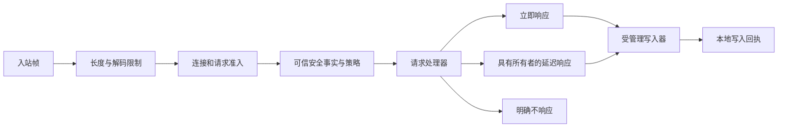

`rocketmq-protocol` 定义 RocketMQ Remoting 命令在线路上的含义。`rocketmq-transport` 负责在有界连接上传输帧，并在运行时所有者之下分发请求。职责分离使编解码器和类型化请求头能够在不打开套接字的情况下使用。

## Remoting 分帧

Remoting 帧包含总长度字段、序列化类型/请求头长度组合字段、编码后的请求头，以及可选消息体。组合字段的高 8 位表示序列化类型，低 24 位表示请求头长度。这个编码边界不意味着允许任意大小的消息体；传输限制会约束实际帧大小。

请求头包含请求/响应码、语言/版本、opaque 关联标识、标志、备注和扩展字段。类型化自定义请求头将应用字段转换为协议表示。关联标识用于匹配一次请求/响应，不是业务去重键。

JSON 与 RocketMQ 二进制请求头序列化是两种格式。`RemotingCommandFactory` 使用不可变默认配置，使应用能够明确指定版本/序列化设置构造命令。兼容的应用默认路径由应用所有者初始化；不应把工厂创建后进程设置的变化，理解为该工厂契约也已变化。

协议契约错误包括无效编码或请求头约束不满足。连接运行错误保留共享错误身份。Rust 重构之外，还需分别保持线协议字段名、数字码、标志及持久化/消息编码布局兼容。

## 网络请求生命周期

图中表示职责边界，不是声称每项检查都具有统一的调度顺序。`TransportClientBuilder` / `RemotingClientBuilder` 构造受管理客户端，`TransportServer` 拥有服务端工作。配置通过整理后的 `api` 或 `prelude` 表面提供帧限制、套接字/TLS 行为、准入约束和处理器。

`RequestDeadline` 约束沿其路径进行的请求等待和工作。背压限制活跃工作；配置的保留字节限制覆盖排队或延迟响应持有的内存。这些限制与连接数、每秒速率限制解决不同问题。

`HandlerOutcome` 区分立即响应、延迟响应和明确不响应。延迟工作必须保留所需响应及资源所有权，直到完成、取消或过期。把所有未立即响应都当作处理器失败，会破坏长轮询和单向请求语义。

## 结果解释

| 结果 | 含义 |
| --- | --- |
| 有效响应 | 对端返回关联协议响应；仍需检查应用响应码 |
| 准入拒绝 | 该边界无法在限制内接纳更多工作 |
| 截止时间到达 | 等待/工作超出预算；远端完成情况可能仍不确定 |
| 解码/协议错误 | 帧或请求头不满足受支持契约 |
| 连接丢失 | 通道不可用；此前本地写入进度影响重试安全性 |
| 本地写入器完成 | 本地传输完成写入，不代表远端持久化或消费 |

重试属于了解幂等性和执行进度的操作所有者。传输层不能安全地把每次断连都转换成一次变更请求重放。

## 文件区域、TLS 与复制

`FileRegion` 将不可变存储租约保留到写入器完成，防止响应仍引用文件时清理任务回收它。可移植路径通过运行时拥有的阻塞 I/O 通道，使用可复用的 64 KiB 缓冲区读取。

可选 `linux-sendfile` 路径仅在能力检查后用于符合条件的明文传输。不满足预检条件时，在任何帧字节写出前回退。TLS 必须走可移植路径，使数据经过 TLS 记录层。共享 `Bytes` 和分散写入可以减少用户态复制，但不能证明所有请求都具有内核零拷贝、网卡卸载或远端确认。

传输包默认 features 包含 `tls` 和 `socks`，但根工作区依赖关闭默认 features。应检查消费方包的 feature 图。Rust 客户端没有名为 `tls` 的 feature；需要实际编译并配置传输 TLS。

## Remoting 与 gRPC

NameServer/Broker Remoting 命令与 Proxy v2 gRPC 方法属于不同协议。Proxy 适配器将生成的 protobuf 请求转换为服务契约，再把结果映射为消息体状态/传输状态。启用生成绑定不会启动监听器；开放 Proxy gRPC 也不会自动开放所有 Broker 管理请求。

Controller Raft gRPC 又是控制平面共识的独立端点。它不是 Proxy 消息服务，也不替代 Broker HA 数据传输。

## 源码地图

- [协议契约](https://github.com/mxsm/rocketmq-rust/blob/main/rocketmq-protocol/README.md)、[帧字段](https://github.com/mxsm/rocketmq-rust/blob/main/rocketmq-protocol/src/protocol/remoting_command.rs)。
- [传输公开表面](https://github.com/mxsm/rocketmq-rust/blob/main/rocketmq-transport/src/public_api.rs)、[传输设计](https://github.com/mxsm/rocketmq-rust/blob/main/rocketmq-transport/README.md)。
- [Proxy 协议](https://github.com/mxsm/rocketmq-rust/blob/main/rocketmq-proxy-core/proto/service.proto)、[Proxy 架构](proxy.md)、[错误映射](errors-observability.md)。
