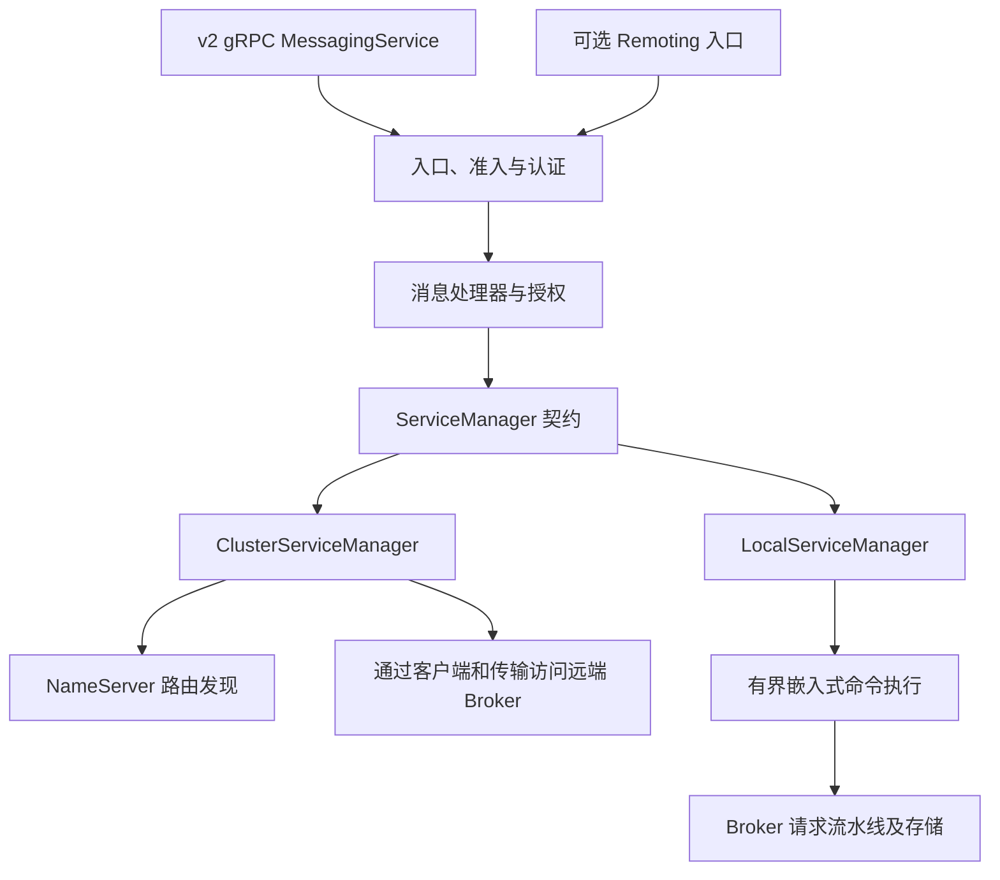

Proxy 提供 RocketMQ v2 gRPC `MessagingService` 及可选的面向客户端 Remoting 入口。它将请求转换成与后端无关的服务调用，再访问现有集群或嵌入式 Broker。在集群模式下，Proxy 不是第二套独立消息存储。

## 装配与两种模式

`rocketmq-proxy-core` 负责契约、生成的协议模型、入口/会话状态、receipt 和排空协调。它使用 Tokio/运行时能力，不是无运行时模型 crate。`rocketmq-proxy-cluster` 负责远端客户端桥接；`rocketmq-proxy-local` 负责嵌入式 Broker 适配。`rocketmq-proxy` 装配监听器、认证、处理器和生命周期。

集群模式使用 NameServer 发现和路由/元数据缓存，再执行有界客户端/传输调用。下游签名是明确提供的安全能力。入站请求已认证，并不会自动认证 Proxy 另行建立的 Broker 连接。

本地模式通过有界命令队列调用嵌入式 Broker 门面。队列条数、保留字节、等待时长、I/O 并发、控制预留和长轮询跟踪分别受限。嵌入式分发仍经过 Broker 请求流水线。其组件构造器不是完整的独立 `BrokerBootstrap` 路径；应配置自身 Broker 身份及唯一存储根目录。

## 协议表面

gRPC 服务包括路由/分配查询、心跳、发送、接收、拉取、ACK、不可见时长修改、偏移量操作、事务、撤回、遥测、客户端终止及 Lite 订阅。流式 Receive/Pull 响应具有独立生命周期和结果保留预算。

Remoting 默认关闭。启用后，将选定客户端请求码适配到处理器/后端模型。它不是通用 Broker 管理隧道：该入口拒绝认证管理请求码，这类请求应发送至 Broker 管理端点。本地模式的加锁/解锁透传是单独支持的路径。

gRPC 默认端口为 8081，可选 Remoting 为 8080；它们是 Proxy 入站端口，与嵌入式或远端 Broker 端点不同。生成 protobuf 绑定需要构建时提供 `protoc`，但 core crate 本身不会启动服务器。

## 会话与 receipt

`ClientSessionRegistry` 跟踪客户端存活/设置、遥测连接、预备事务、Lite 订阅及 receipt 所有权。心跳刷新会话状态，不会提交业务事务，也不会确认全部投递。

receipt 续期使用单调截止时间和识别 generation 的调度。替换/删除 receipt 会使旧调度条目失效。续期结果区分成功推进、暂时性重试、无效 receipt 和续期前过期。自动续期可配置，但不能保证进程丢失或后端长时间不可用期间仍维持投递不可见。

会话 TTL、receipt 跟踪 TTL 与 Broker 实际不可见截止时间不同。仍在内存中跟踪的 receipt，也可能已经在 Broker 过期。ACK 和不可见时长操作必须使用当前投递上下文，详见 [POP](../consumer/pop.md)。

## 准入与排空

路由、生产、消费和客户端管理工作分别具有在途许可及可选速率限制。Receive/Pull 流还保留结果许可和字节预算。后端完成后，慢速读取方仍可能使响应保持存活，因此仅限制后端调用数并不足够。

受监督排空模型区分 `Accepting`、`Draining`、`Drained`。快照包含准入/路由/就绪状态，以及连接、会话、receipt、预备事务、遥测连接/命令、Remoting 通道、在途 RPC 的未完成计数。只有 RPC 数为零不足以证明已经排空。

排空操作具有标识，并拒绝冲突操作。完成排空与关闭运行时服务是不同步骤。应用仍需通过各所有者停止监听器、会话维护、后端工作、认证、遥测及运行时。截止时间耗尽必须报告，不能描述成排空完成。

## 故障行为与构建选择

| 故障 | 应检查的边界 |
| --- | --- |
| 无路由或元数据过期 | 集群发现/缓存及 Broker 元数据调用 |
| 入站认证成功、下游拒绝 | Proxy 下游凭据和 Broker 策略 |
| 接收流停滞 | 客户端读取方、响应许可/字节及后端截止时间 |
| receipt 过期 | 会话所有权、续期调度及后端可用性 |
| 本地队列拒绝工作 | 嵌入式队列条数/字节/等待时长及控制预留 |
| 配置模式不可用 | 编译的模式 features |

Proxy 默认 features 同时包含 `cluster-mode` 和 `local-mode`。纯集群构建使用 `--no-default-features --features cluster-mode`，排除嵌入式 Broker 后端。选择未编译模式会产生配置错误。可选 TLS、可观测性 features 仍需要监听器/导出器配置。

## 源码地图

- [Proxy 入口](https://github.com/mxsm/rocketmq-rust/blob/main/rocketmq-proxy/README.md)、[核心契约](https://github.com/mxsm/rocketmq-rust/blob/main/rocketmq-proxy-core/README.md)。
- [集群适配](https://github.com/mxsm/rocketmq-rust/blob/main/rocketmq-proxy-cluster/README.md)、[本地适配](https://github.com/mxsm/rocketmq-rust/blob/main/rocketmq-proxy-local/README.md)。
- [receipt 调度器](https://github.com/mxsm/rocketmq-rust/blob/main/rocketmq-proxy-core/src/receipt_renewal.rs)、[排空模型](https://github.com/mxsm/rocketmq-rust/blob/main/rocketmq-proxy-core/src/drain.rs)。
- [安全](security.md)、[协议与传输](protocol-transport.md)。
