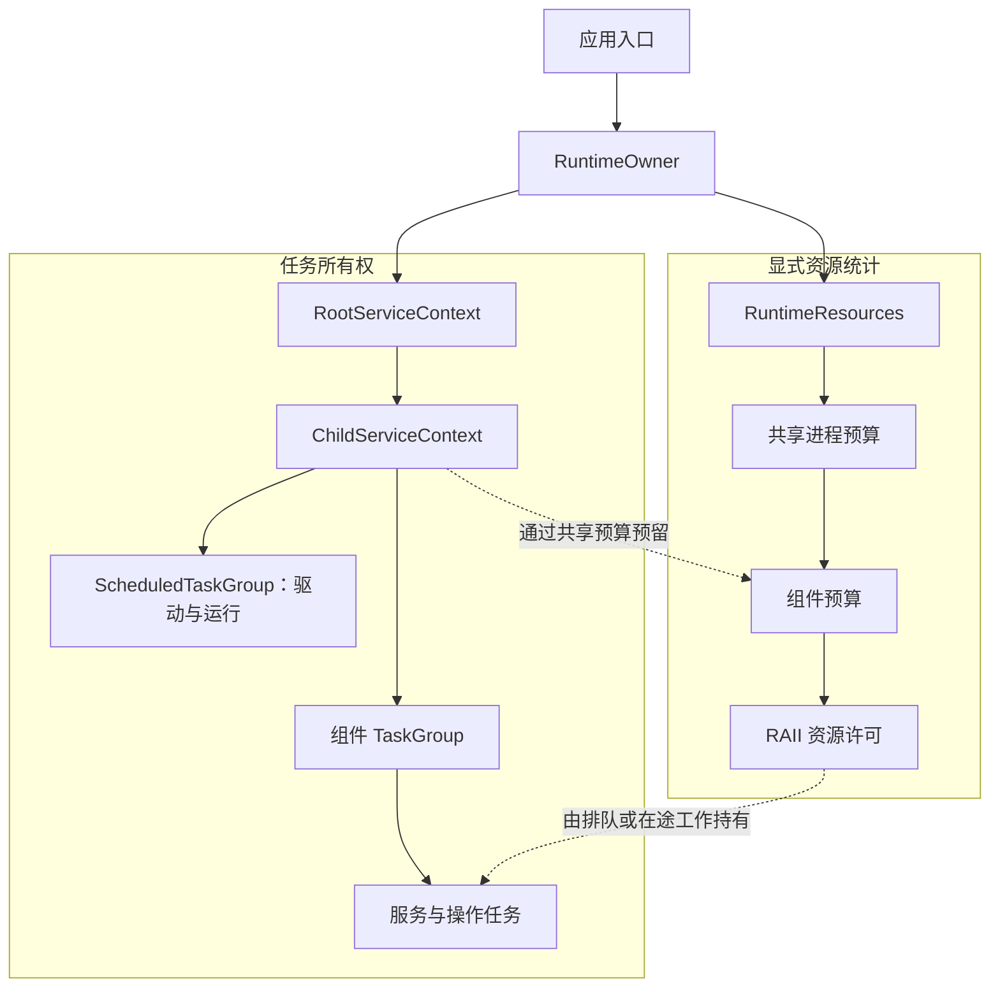
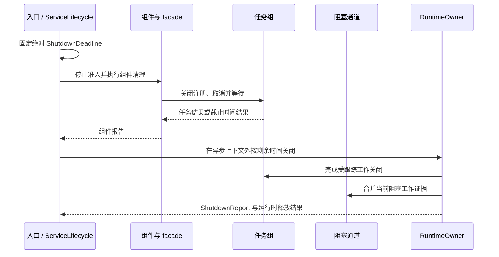

`rocketmq-runtime` 为异步工作提供明确的服务所有者，并为阻塞工作提供有界路径。它构建在 Tokio 之上，但集成边界是服务能力，而不是任意访问全局运行时。

该设计分别回答三个问题：谁负责停止任务，哪些容量承担任务的资源，以及关闭时间耗尽后还保留哪些证据。

## 应用持有运行时

生产入口创建 `RuntimeOwner`。`RuntimeOwner::plan(config)` 验证配置，`build` 执行资源发现并构造运行时。所有者公开不可克隆的 `RootServiceContext`，由应用派生 `ChildServiceContext`。

库接收子上下文或更窄的 `TaskSpawner`，不会发现隐式运行时，也不会在缺少运行时时创建后备实例。[收发示例](https://github.com/mxsm/rocketmq-rust/blob/main/rocketmq-website/examples/first-message/src/main.rs)通过向 `ClientRuntime::try_new` 注入子上下文展示了该模式。

两棵树通过显式预留关联，不会将每个任务自动换算为其全部进程内存。创建任务作用域不会自动统计任意分配。一个稳定任务所有者下可以包含多个操作上下文。

## 任务作用域与操作作用域

克隆上下文或任务组会共享同一所有者和取消令牌。创建子作用域，则在父生命周期内建立独立取消边界：父取消向下传播，取消子作用域不会取消兄弟或父作用域。

长期服务使用组件作用域，有界请求或可重启工作使用 `OperationContext`。操作提供自己的取消/截止时间，不创建新的任务组，避免将请求数量带入所有权树。

| 提交方式 | 生命周期行为 |
| --- | --- |
| `spawn` / `spawn_service` | 跟踪 Future，由服务观察取消并执行有序清理 |
| `spawn_cancellable_service` | 所有者取消时丢弃 Future，仅在此时丢弃安全的情况下使用 |
| `spawn_operation` | 同时观察所有者取消和操作取消/截止时间 |
| `spawn_draining_operation` | 所有者取消后，已接纳工作可以继续，但仍受操作和任务组关闭约束 |
| `spawn_with_handle` | 提供特定任务的 join 句柄，同时保留组所有权 |

丢弃上下文句柄不等于优雅关闭，活动工作可能使任务组继续存活。`cancel` 只请求取消，不等待完成；需要通过对应关闭或操作等待取得完成证据。

任务组准入经历 open、closing 和 closed 状态。关闭会停止新注册、取消工作并缓存报告。创建请求与关闭发生竞态时，必须尊重准入结果，不能通过新建子作用域逃避父截止时间。

## 阻塞工作实际退出前一直占用容量

子上下文提供受管理的 `storage_io`、`metadata_io` 和 `cpu_crypto` 执行器。通道具有各自的并发/排队策略，并共享所有者的全局阻塞准入预算。克隆通道不会创建新池。

排队超时限制准入等待，任务超时限制接纳后调用者等待，绝对截止时间方法用同一截止时间约束两阶段。已经运行的阻塞闭包，不会因 Future 被丢弃或调用者超时而停止。

闭包在实际退出前一直持有许可，因此调用者返回后，诊断仍可能显示 `TimedOutStillRunning`。提前释放许可会让实际接纳工作超过配置限制。

短工作边界拒绝 `BlockingKind::LongRunning`。长期阻塞循环需要具有停止和 join 行为的显式线程或领域服务所有者。独立兼容构造器也不会自动将其独立预算纳入根受管理通道。

## 资源预留与过载

生产所有者从显式环境配置、Linux cgroup 或宿主机内存发现进程内存限制，也可以接受指定的 `ProcessMemoryLimit`。预算 API 沿祖先链统计已接纳数量、保留字节和可选速率，不是限制所有分配或常驻内存的操作系统机制。

`ResourcePermit` 通过 RAII 所有权携带数量/字节预留。控制类工作可以使用预留控制容量，数据工作不能占用该保留部分。应从共享进程预算派生更窄的组件预算，使兄弟组件仍受预期全局限制约束。

队列策略属于数据契约：

| 策略 | 适用含义 |
| --- | --- |
| `Reject` | 返回过载，不再接纳工作 |
| `WaitUntilDeadline` | 仅在调用者有界准入窗口内等待 |
| `CoalesceLatest` | 新条目可以替代旧的排队状态 |
| `DropStale` | 按选定规则丢弃过期工作 |
| `CloseSlowConsumer` | 应关闭过慢的下游消费者 |

需要逐个处理的事件不能选择合并策略。出队 API 也需要明确选择：`recv`/`try_pop` 在出队时释放许可，而 `recv_budgeted`/`try_pop_budgeted` 在处理期间通过 `BudgetedItem` 保留许可。统计生命周期应匹配实际数据保留时间。

## 调度任务与元数据 I/O

`ScheduledTaskGroup` 同时持有驱动和每次运行。固定延迟在一次运行结束后等待；固定频率不重叠模式在前次仍活动时跳过；允许重叠模式可以接纳并发运行，不另设单任务并发上限。当前固定频率驱动在提交尝试之间休眠并测量漂移，不是基于绝对时钟的补偿调度器。

`MetadataIoActor` 为元数据快照持有有界协调器，并使用共享元数据阻塞通道。提交接纳与持久完成是不同结果。排队中的代次可以合并，同一逻辑资源较晚的持久代次可以满足较早等待者。等待超时不能证明文件系统写入已停止。

这些机制复用基础设施，同时保留“已排队”“正在执行”和“已持久化”的明确区别。

## 使用同一截止时间协调关闭

`ServiceLifecycle` 区分 Starting、Ready、Draining、Stopped 和 Failed。依赖就绪与进程存活分开表示。第一次关闭请求固定截止时间，重复信号不能延长可用时间。

先关闭客户端 facade 和可变服务组合根，再关闭共享运行时。`shutdown_runtime_blocking_until` 消费所有者，必须在 Tokio 异步上下文之外调用。该操作已包含受跟踪任务关闭，不需要仅为完成清单再增加一轮任务关闭。

截止时间到达后，未完成的受跟踪任务可能被中止，阻塞闭包仍可能继续运行。立即/后台关闭及 `Drop` 是不同清理路径，不能证明每个 Future 都完成了有序清理。

## 准确解释报告

`ShutdownReport::is_healthy` 检查失败、panic、超时、泄漏、仍运行的阻塞/脱离任务以及子报告。单独的 `aborted` 计数不会使该谓词为假。因此，健康谓词是其契约范围内的有效证据，不能证明所有任务自然结束或所有外部效果均已提交。

还需要检查组件专用报告：Store 可以报告刷盘、租约和文件退役状态，通用任务报告无法推断这些信息。运维 API 应使用有界、脱敏的 `RuntimeDiagnosticsViewV1`，避免暴露原始任务名、参数或配置；API 调用方仍负责认证。

配置契约违反与操作性 `RuntimeError` 是不同错误通道。适配启动错误时应保留区别，而不是将全部失败转为 panic。

## 兼容路径与后续阅读

`RuntimeContext` 用于现有 Tokio 运行时内的迁移或测试，不持有也不关闭宿主运行时，并采用宽松测试预算。保留的执行器/线程适配器具有各自边界，不能描述为与生产 `RuntimeOwner` 组合完全相同。

[存储设计](storage.md)展示另一种所有权超出调用者等待期的情形，[开发指南](../contributing/development-guide.md)介绍针对性运行时测试。

来源：[运行时指南](https://github.com/mxsm/rocketmq-rust/blob/main/rocketmq-runtime/README.md)、[公开导出](https://github.com/mxsm/rocketmq-rust/blob/main/rocketmq-runtime/src/public_api.rs)、[任务组](https://github.com/mxsm/rocketmq-rust/blob/main/rocketmq-runtime/src/task_group.rs)、[阻塞执行器](https://github.com/mxsm/rocketmq-rust/blob/main/rocketmq-runtime/src/blocking/executor.rs)、[关闭报告](https://github.com/mxsm/rocketmq-rust/blob/main/rocketmq-runtime/src/shutdown_report.rs)。
