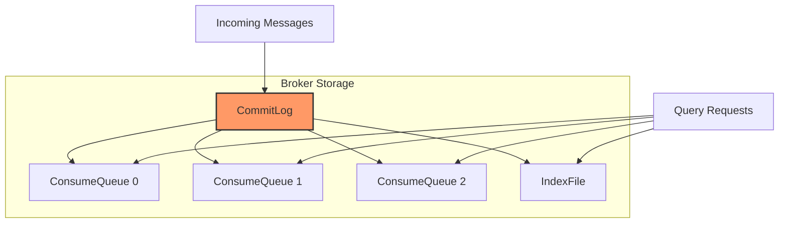
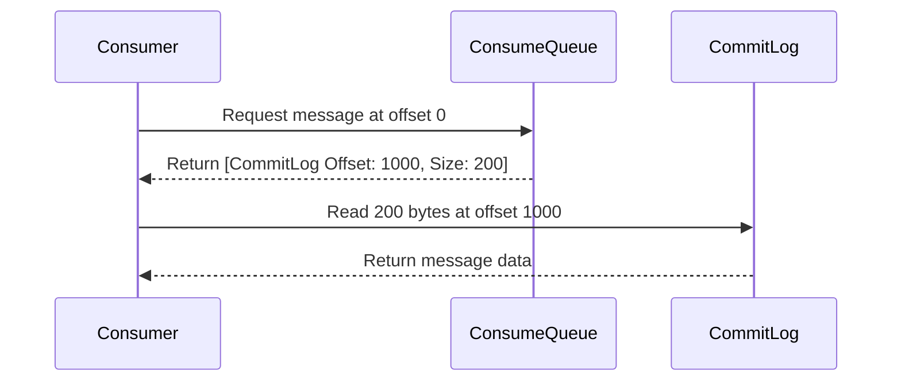

# 存储

RocketMQ-Rust 采用高性能存储机制，实现可靠消息持久化与快速检索。

## 存储架构



## CommitLog

CommitLog 是核心存储文件，所有消息都按顺序追加写入。

### 特性

- **顺序写**：消息以 append-only 方式写入
- **固定文件大小**：每个 CommitLog 文件大小固定（默认 1GB）
- **滚动创建**：写满后创建新文件
- **延迟删除**：仅在过期后进行清理

### CommitLog 结构

```text
CommitLog 文件（每个 1GB）

┌────────────────────────────────────────────────────┐
│ [Message 1][Message 2][Message 3]...[Message N]    │
│  ↑                                                 │
│  顺序追加写入                                        │
└────────────────────────────────────────────────────┘

文件命名：00000000000000000000, 00000000000000001000, ...
```

### CommitLog 中的消息格式

```rust
pub struct CommitLogMessage {
    // Total message size (4 bytes)
    total_size: u32,

    // Magic code (4 bytes) - for file integrity check
    magic_code: u32,

    // Message body CRC32 (4 bytes)
    body_crc: u32,

    // Queue ID (4 bytes)
    queue_id: u32,

    // Message flag (4 bytes)
    flag: u32,

    // Message properties
    properties: ByteBuffer,

    // Message body
    body: ByteBuffer,
}
```

### 顺序写性能

CommitLog 的顺序写可显著提升性能：

```text
Traditional random I/O:  ~10,000   ops/sec
Sequential I/O (SSD):    ~100,000+ ops/sec
Sequential I/O (HDD):    ~50,000+  ops/sec
```

## ConsumeQueue

ConsumeQueue 是用于快速消费读取的索引结构。

### ConsumeQueue 结构

每个 Topic 的每个 Queue 都有独立 ConsumeQueue：

```text
ConsumeQueue（Topic: OrderEvents, Queue: 0）

┌─────────────────────────────────────────────┐
│ 单条索引大小：20 字节                          │
├─────────────────────────────────────────────┤
│ [CommitLog Offset][Size][Tags Hash]         │
│ [8 bytes         ][4B  ][8 bytes  ]         │
│                                             │
│ 示例：                                       │
│ [0x00000000][0x0064][0x12345678]            │
│ [0x00000064][0x0080][0x87654321]            │
│ [0x000000E4][0x0050][0xABCDEF12]            │
└─────────────────────────────────────────────┘
```

### 作用

1. **快速定位**：按 offset 快速定位消息
2. **内存映射友好**：可通过 mmap 高效访问
3. **体积小**：单条索引仅 20 字节
4. **支持过滤**：可配合 Tag 过滤

### 读取流程



## IndexFile

IndexFile 提供基于 Key 的快速查询能力。

### IndexFile 结构

```text
IndexFile

┌─────────────────────────────────────────────┐
│ Hash 槽位（500 万个 slots）                   │
│ ↓                                           │
│ [Slot 0] → [Head Index] → ...               │
│ [Slot 1] → [Head Index] → ...               │
│ [Slot 2] → [Head Index] → ...               │
│ ...                                         │
│                                             │
│ 每条索引（20 字节）：                           │
│ - Key Hash（4 字节）                         │
│ - CommitLog Offset（8 字节）                 │
│ - Time Diff（4 字节）                        │
│ - Next Index Offset（4 字节）                │
└─────────────────────────────────────────────┘
```

### 使用方式

```rust
// 按 key 查询消息
let messages = broker.query_message_by_key("OrderEvents", "order_12345")?;

// 返回 key 为 "order_12345" 的消息列表
```

## 刷盘策略

RocketMQ 支持多种刷盘策略，用于平衡性能与可靠性。

### ASYNC_FLUSH（默认）

- 消息先写入 OS Page Cache
- 立即返回发送结果
- 后台线程异步刷盘
- **性能**：最高
- **可靠性**：系统异常时可能丢失少量消息

### SYNC_FLUSH

- 消息写入 OS Page Cache 后强制刷盘再返回
- **性能**：低于异步刷盘
- **可靠性**：更高，可避免刷盘前丢失

```rust
// 配置刷盘模式
let mut broker_config = BrokerConfig::default();
broker_config.set_flush_disk_type(FlushDiskType::SYNC_FLUSH);
```

## 文件删除

RocketMQ 会自动清理过期文件以释放磁盘空间。

### 删除策略

满足任一条件时会触发删除：

1. **磁盘空间不足**：磁盘使用超过阈值（默认 85%）
2. **时间过期**：超过保留时间（默认 72 小时）
3. **手动触发**：通过管理命令清理

```rust
// 配置保留策略
let mut broker_config = BrokerConfig::default();
broker_config.set_delete_when(DeleteWhen::DiskFull);
broker_config.set_file_reserved_time(72); // hours
```

## 内存映射

ConsumeQueue 与 IndexFile 使用 mmap 提升读取效率：

```rust
// Memory-mapped file I/O
let mmap = unsafe { MmapOptions::new().map(&file)? };

// 直接访问内存
let offset = mmap.read_u64(offset_position)?;
let size = mmap.read_u32(size_position)?;
```

### 优势

- 零拷贝 I/O
- 热数据访问速度快
- 由操作系统统一管理分页

## 存储性能

### 写性能

```text
Type                | Throughput    | Latency
--------------------|---------------|--------------
Single Thread       | 100K+ msg/s   | < 1ms
Multi Thread        | 500K+ msg/s   | < 5ms
Batch Send          | 1M+   msg/s   | < 10ms
```

### 读性能

```text
Operation           | Latency
--------------------|--------------
Sequential Read     | < 1ms
Random Read (mmap)  | < 1ms
Index Lookup        | < 1ms
```

## 存储配置示例

```toml
[broker]
# CommitLog file size (1GB default)
commit_log_file_size = 1073741824

# ConsumeQueue file size (30MB default)
consume_queue_file_size = 31457280

# Flush disk type: ASYNC_FLUSH or SYNC_FLUSH
flush_disk_type = "ASYNC_FLUSH"

# Delete policy
delete_when = "DiskFull"
file_reserved_time = 72  # hours

# Maximum disk usage ratio
disk_max_used_space_ratio = 85

# Minimum free disk space (GB)
disk_space_warning_level_ratio = 90
```

## 最佳实践

1. **优先使用 SSD**：可显著提升随机读能力
2. **监控磁盘使用率**：为磁盘阈值设置告警
3. **按业务选择刷盘策略**：平衡性能与可靠性
4. **CommitLog 与 ConsumeQueue 分盘**：条件允许时可优化 I/O
5. **建立备份策略**：保护关键数据
6. **合理设置保留时间**：控制存储成本

## 下一步

- [生产者](../category/producer) - 了解消息发送
- [消费者](../category/consumer) - 了解消息消费
- [配置](../category/configuration) - 配置存储参数
