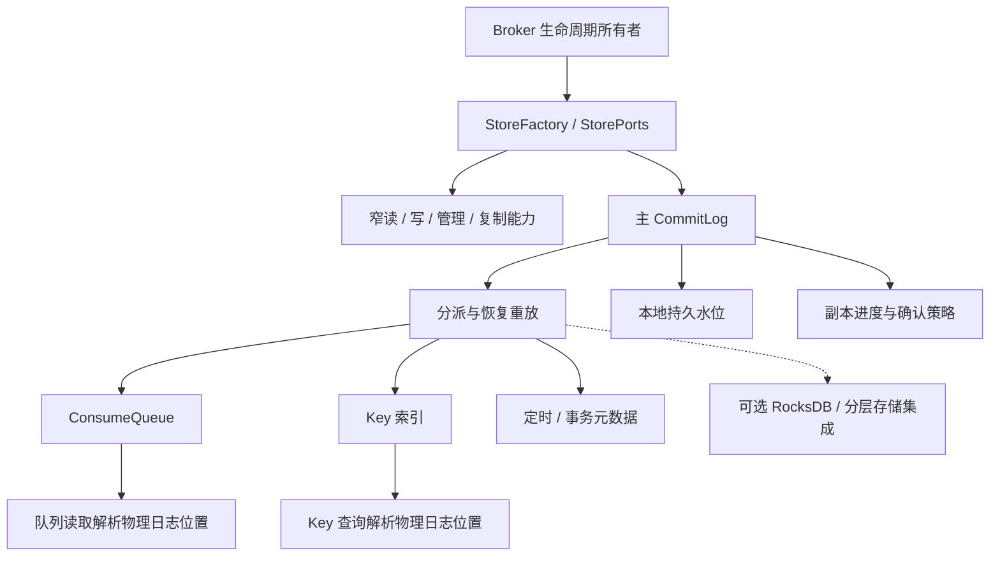
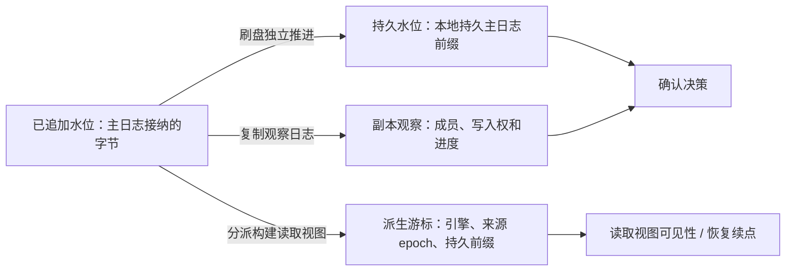

Store 将 Broker 读写请求转换为主日志操作，以及服务这些请求所需的派生结构。其核心设计区别是：接纳字节、满足持久性策略，以及通过特定读取视图使字节可见。

## 组合与所有权

`rocketmq-store-api` 定义与执行器无关的能力和值。`rocketmq-store-local` 提供本地 CommitLog、映射文件、恢复、派生视图、定时和 HA 原语。`rocketmq-store` 通过 `StoreFactory` 与 `StorePorts` 组合面向 Broker 的实现，可选 RocksDB 和分层存储组件参与该组合。

```mermaid
flowchart TB
    Broker["Broker 生命周期所有者"] --> Factory["StoreFactory / StorePorts"]
    Factory --> Ports["窄读 / 写 / 管理 / 复制能力"]
    Factory --> Log["主 CommitLog"]
    Log --> Dispatch["分派与恢复重放"]
    Dispatch --> CQ["ConsumeQueue"]
    Dispatch --> Index["Key 索引"]
    Dispatch --> Timer["定时 / 事务元数据"]
    Dispatch -.-> Secondary["可选 RocksDB / 分层存储集成"]
    CQ --> Reads["队列读取解析物理日志位置"]
    Index --> Queries["Key 查询解析物理日志位置"]
    Log --> Flush["本地持久水位"]
    Log --> Replication["副本进度与确认策略"]
```

组合根持有生命周期，请求处理器接收所需的窄能力，而不是整个后端的可变句柄。Store 是 Broker 组件，不是用户需要额外启动的服务。

正常集成顺序为配置验证、`StoreFactory::open`、初始化、加载/恢复、启动，最后优雅关闭。仅打开组合，不能证明恢复成功或后台服务已启动。

## 主日志与派生结构

CommitLog 在物理字节范围内保存编码消息记录。ConsumeQueue 将主题/队列的逻辑偏移量映射到物理记录，key 索引支持按消息 key 查询。定时、事务及可选次级组件维护各自操作所需的状态。

这种组织方式避免在每个读取索引中保存完整独立消息体，同时也产生进度差异：追加已接纳时，某个派生视图仍可能落后。队列读取与 key 查询不一定在每个时刻观察到相同进度。

当前 RocksDB 模式保留本地文件 CommitLog，将消费队列、索引以及所选定时/事务元数据交给 RocksDB 服务，不代表全部主消息字节进入 RocksDB。分层存储集成属于可选次级分派，不增强主日志确认。

## 将追加回执作为契约理解

`AppendReceipt` 组合追加状态、可选追加范围、已追加水位、持久水位和已达到的 `Durability`，并验证各字段不互相矛盾。

对于已接纳的半开字节范围 `[start, end)`：

- 已追加水位必须覆盖 `end`。
- 持久水位不能超过已追加水位。
- 本地持久性要求持久水位覆盖完整范围。
- 副本持久性需要覆盖该范围的已验证复制决策，不能仅在普通回执中填写更强枚举值来声明。

| 持久性 | 契约 |
| --- | --- |
| `Memory` | 主日志接受了字节，但不保证完整范围已持久写入 |
| `Local` | 本地持久水位覆盖完整追加范围 |
| `Replicated` | 还满足配置的副本确认条件 |

`AppendStatus::is_accepted` 包含 `PutOk`、`FlushDiskTimeout`、`FlushReplicaTimeout` 和 `ReplicaUnavailable`。这些已接纳结果达到的保证仍然不同。无效输入、存储不可用等被拒绝结果，不能表示为成功追加范围。

Broker 将存储结果映射为发送响应。因此，生产者超时或非成功刷盘/副本状态可能对应不确定写入结果，重试要求业务处理能够容忍重复。

## 水位不能互换

```mermaid
flowchart LR
    A["已追加水位：主日志接纳的字节"]
    D["持久水位：本地持久主日志前缀"]
    R["副本观察：成员、写入权和进度"]
    C["派生游标：引擎、来源 epoch、持久前缀"]
    A -->|"刷盘独立推进"| D
    A -->|"复制观察日志"| R
    A -->|"分派构建读取视图"| C
    D --> Decision["确认决策"]
    R --> Decision
    C --> Visibility["读取视图可见性 / 恢复续点"]
```

只能比较同一坐标系和来源代次中的位置。消费者组的逻辑队列偏移量不是 CommitLog 字节偏移量。派生游标的 `next_offset` 表示某个引擎已持久完成的主日志排他性结束位置，并由 source epoch 限定。

派生重放将记录分类为已提交或连续推进。来源 epoch 不匹配、物理间隙或部分重叠均违反游标契约。类型化游标/检查点防止将任意数字静默当作另一代日志的有效进度。

派生进度不会将 `Memory` 升级为 `Local` 或 `Replicated`，也不存在“全部派生结构追到同一位置后所有读取才可工作”的通用规则，应检查对应操作使用的视图。

## 复制与写入权

`AckPolicy` 区分本地持久、配置副本数量和当前同步集合全部成员。副本数量包含本地主节点，按唯一且符合条件的成员计算。Controller 感知契约还携带 master/sync-set epoch 与写入权。

决策必须符合当前写入权和确认条件。副本已连接、过时观察或过期角色，都不足以证明更强回执。Controller 发出的租约时长由 Broker 转为进程内单调时钟截止时间，不能与远端墙上时钟时间戳互换。

这些契约让 HA 推理更加明确，但用户可依赖的结果由实际部署拓扑和故障场景决定。单 Broker LocalFile 教程没有验证副本确认或故障转移。

## 文件租约与异步传输

读取结果可以暴露带租约的消息缓冲区或文件区域。Transport writer 仍引用数据时，租约使底层文件保持可用。清理必须尊重未释放租约；请求超时不代表所有引用已经释放。

Transport 的可移植文件路径使用有界阻塞 I/O。可选 Linux sendfile 需要满足明文区域与能力检查条件；TLS 经其记录层使用可移植读取。这些实现选择改变传输成本，不改变 Store 确认策略。

## 恢复、关闭与故障限制

加载/恢复确定可用主日志记录，执行所选正常/异常恢复路径，并协调兼容的派生状态与检查点。脏尾部或中断的派生更新，需要按对应格式与引擎契约解释。

优雅关闭按顺序停止准入和后台活动，按组件路径执行刷盘，并报告最终进度、未释放租约和待重放的文件退役状态。应同时检查 `MessageStoreShutdownReport` 和运行时报告，通用任务报告不能推断全部存储责任已完成。

| 故障窗口 | 检查内容 |
| --- | --- |
| 已接纳但所需本地刷盘尚未完成 | 已确认策略与恢复后的持久前缀 |
| 已本地持久但所需副本进度尚未达到 | 副本策略、写入权和远端观察 |
| 主记录可用但派生视图落后 | 对应引擎的游标、重放与可见性 |
| writer 仍持有文件区域 | 租约所有权与退役进度 |
| 业务效果完成但消费进度尚未持久化 | 应用重放/幂等，与 Store 追加恢复分开 |

不要将删除存储目录作为常规恢复。后端/布局修改、恢复导入和保留策略修改，需要各自的流程与数据后果说明。已有数据是调查故障的证据。

## feature 与取舍

Store 默认 feature 选择 LocalFile 和快速加载。仅在缺少 `fast-load` 时，启用 `safe-load` 才选择顺序加载；两者都未启用时，本地原语的策略仍允许并行加载。`ROCKETMQ_SAFE_LOAD=true` 可以强制安全路径。

`rocksdb_store`、分层存储、扩展定时轴、可观测性和 Linux `io_uring` 分别增加不同条件。编译平台 feature 不能证明宿主机支持。比较吞吐量时，应固定后端、持久性、消息大小、硬件和工作负载；该组合不存在通用性能数值。

继续阅读[消息生命周期](message-lifecycle.md)、[投递与重试](../guides/delivery-and-retry.md)或[部署总览](../deployment/overview.md)。

来源：[Store 组合](https://github.com/mxsm/rocketmq-rust/blob/main/rocketmq-store/README.md)、[追加契约](https://github.com/mxsm/rocketmq-rust/blob/main/rocketmq-store-api/src/lib.rs)、[派生进度](https://github.com/mxsm/rocketmq-rust/blob/main/rocketmq-store-api/src/progress.rs)、[HA 契约](https://github.com/mxsm/rocketmq-rust/blob/main/rocketmq-store-api/src/ha_contract.rs)、[本地原语](https://github.com/mxsm/rocketmq-rust/blob/main/rocketmq-store-local/README.md)。
