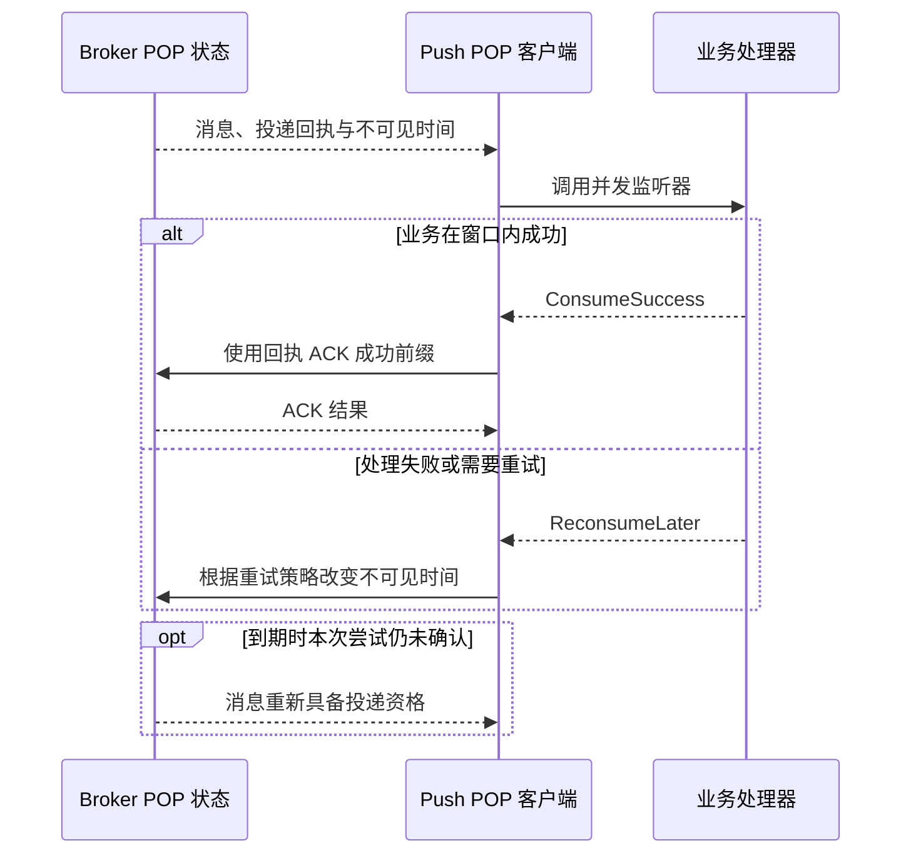

# POP、回执与确认

POP 在投递后暂时使消息不可见，并使用回执确认本次投递尝试。它不同于推进 LitePull 消费者组的队列偏移量。未成功确认的尝试，在不可见窗口结束后可能重新具备投递资格。

当前示例通过 `DefaultMQPushConsumer`、并发监听器和 Broker 侧请求模式配置使用 POP，不存在独立的公开 `DefaultPopConsumer` 构造流程。

## 启用目标路径

1. 在目标集群创建主题和消费者组，确认普通路由可用。
2. 使用有权限的 Admin 操作，将该主题和组的请求模式设为 POP。
3. 用应用持有的 `ClientRuntime` 构建 Push 消费者，并设置 `client_rebalance(false)`。
4. 注册并发监听器和订阅，再启动消费者。
5. 完成业务后返回成功；关闭共享运行时前先关闭 facade。

仅设置 `client_rebalance(false)` 不会写入 Broker 请求模式。示例通过 Admin Core 使用 `SetConsumerRequestModeRequest::try_new(topic, group, ConsumerRequestMode::Pop, 8, 3_000)`。其中 8 是请求中的 POP 共享队列设置，不是八秒不可见时间。

在 `rocketmq-example/` 中，先阅读 `examples/consumer/pop_consumer.rs`，再运行：

```bash
cargo check --example pop-consumer
cargo run --example pop-consumer
```

当前示例会在回环 NameServer 对应集群中修改 `TopicTest` / `please_rename_unique_group_name_4` 的请求模式。隔离试验应重命名这些常量并创建资源。该示例执行真实管理变更，不要用它改变无关现有消费者组的流量。

示例展示设置方法，但在信号处理后没有显式关闭消费者 facade。集成时应采用 [Push 消费者](./push-consumer.md)的清理结构：完成或限制当前工作，调用 `consumer.shutdown().await`，再关闭共享客户端和进程运行时。示例打印完整消息的调试日志也不适合生产数据。

## 理解一份回执的生命周期



回执属于投递尝试元数据，不是业务事件 ID。它携带定位对应 Broker、队列和 POP 检查点所需的信息。不要用消息键或逻辑偏移量替代、伪造回执字段，也不要把某次回执用作其他尝试的操作依据。

消费者回调接收消息，POP 服务使用关联元数据执行 ACK。跨尝试去重应另行保留稳定业务标识。

## 不可见时间是有界处理机会

当前 Push 默认请求 `pop_invisible_time = 60_000` 毫秒、`pop_batch_nums = 32`。它们不同于监听器批次大小和普通拉取超时；Broker 校验及所选模式也会约束请求。

不可见计时包含处理器开始前的排队时间。增加回调并发可能缓解排队瓶颈，但不会使缓慢下游变得安全。处理器可能在原窗口结束后才完成，并与另一次尝试同时存在。

当前并发 POP 服务在调用前、应用结果前检查到期状态，不承诺在长回调执行期间持续自动续期。应为有界工作设置合适窗口，或使用已说明其契约的底层或 Proxy 续期路径，明确持有更新后的回执状态并处理失败。

改变不可见时间是带结果的远程操作。改变成功影响本次尝试的时限，不会提交业务。续期超时应视为结果不确定；所选 API 在续期后替换回执时，应使用它返回的新回执。

## 监听器成功不等于 ACK 回执

并发服务规范化成功前缀，再调用批量 ACK 路径。逐项 ACK 错误会记录日志并依赖重新投递；应用监听器返回 `ConsumeSuccess`，不能证明每个 Broker ACK 都成功。

失败消息由服务选择重试延迟并修改不可见时间。达到配置的最大重消费次数后，当前实现还会考虑消息年龄，可能 ACK 较老消息，也可能再次延迟。不能宣称该客户端分支中每条失败 POP 消息都会进入死信队列。

业务副作用提交后 ACK 失败，下一次尝试必须识别已完成的业务事件。业务提交前返回成功，则 ACK 可能使该尝试退出普通重投，而业务仍未完成。这与[投递与重试](../guides/delivery-and-retry.md)中的应用边界相同，只是使用回执而非 LitePull 提交实现。

## 诊断与模式切换

| 现象 | 优先检查 |
| --- | --- |
| 未选中 POP 路径 | Broker 主题和组请求模式、客户端再平衡设置、分配响应 |
| 处理器执行期间重复投递 | 排队加处理时长与不可见时间的关系、续期结果 |
| 回调成功但消息再次出现 | ACK 响应和日志、回执有效性、Broker 连通性 |
| 持续失败的消息不再出现 | 次数与年龄策略、应用恢复存储；没有证据不能假定已进入死信队列 |
| 关闭遗留业务工作 | 处理任务所有权、facade 清理、剩余尝试时间 |

从 Pull 切换 POP 会改变进度语义。应停止旧消费者，明确处理已有偏移量和在途尝试的方式，有意修改组模式，再观察新的分配与确认路径。不能把在线模式切换当作无影响的调优选项。

本页描述当前并发 Push POP 实现及示例接入，不证明崩溃恢复、故障转移、有序 POP，或 Proxy 与 Java 客户端的语义完全相同。

源码依据：[POP 示例](https://github.com/mxsm/rocketmq-rust/blob/main/rocketmq-example/examples/consumer/pop_consumer.rs)、[并发 POP 处理](https://github.com/mxsm/rocketmq-rust/blob/main/rocketmq-client/src/consumer/consumer_impl/consume_message_pop_concurrently_service.rs)、[ACK 与不可见时间适配](https://github.com/mxsm/rocketmq-rust/blob/main/rocketmq-client/src/consumer/consumer_impl/default_mq_push_consumer_impl.rs)、[Broker POP 处理器](https://github.com/mxsm/rocketmq-rust/blob/main/rocketmq-broker/src/processor/pop_message_processor.rs)。
