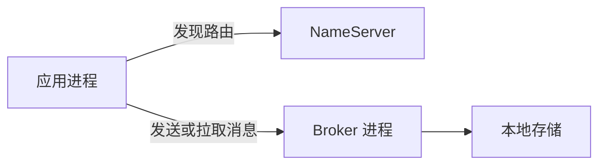

# 文档贡献指南

围绕读者的任务或问题组织页面，并同时交付英文和简体中文版本。网站承担面向读者的文档体系；各 crate 的 README 和源码契约提供实现依据。

## 选择文章结构

| 文章类型 | 读者目标 | 必需内容 |
| --- | --- | --- |
| 教程 | 获得第一个可运行结果 | 前置条件、完整操作流程、预期输出、诊断、清理、下一步 |
| 操作指南 | 执行某项具体操作 | 适用拓扑、权限与输入、步骤、观察结果、恢复方式 |
| 设计说明 | 理解系统如何工作及其原因 | 职责、所有权、流程、不变量、故障行为、取舍、源码依据 |
| 参考文档 | 查询准确的接口或配置 | 名称、类型、默认值、单位、启用条件、约束、兼容性、示例 |

开篇说明结果或设计问题，先确定范围，再讨论替代方案。图示和 crate 列表不能代替对边界存在原因，以及依赖故障时行为的解释。

对于命令，应说明工作目录、Shell、输入和需要运行的服务。完整示例应包含生命周期初始化与清理，片段和伪代码必须明确标注。两种语言中的代码与命令实际语义应一致。

## 放置配对页面并保留文档标识

以下两个文件描述同一篇逻辑页面：

```text
rocketmq-website/docs/architecture/runtime.md
rocketmq-website/i18n/zh-CN/docusaurus-plugin-content-docs/current/architecture/runtime.md
```

对应文档 ID 是 `architecture/runtime`。新页面以内容根目录下的路径作为 ID。重写已有页面之前，应检查 front matter，保留显式 `id`、`slug` 和既有 URL。

使用常规 Docusaurus front matter：

```yaml
---
title: 运行时架构
sidebar_label: 运行时
description: 任务所有权、资源预算、取消与关闭。
---
```

中文文件应翻译这些展示字段。正文必须完整翻译，包括前置条件、故障处理、图注、图中标签和替代文本。API 符号、配置键、CLI 选项和值保持原样。中文术语应前后一致；摘要或英文回退都不能算作完成配对。

相关文章使用指向 Markdown 页面的相对链接。将已完成的 ID 加入 `sidebars.ts`；当前侧栏手工维护，单独新增文件或 `_category_.json` 不会加入导航。分类翻译放在 `i18n/zh-CN/docusaurus-plugin-content-docs/current.json`。中文链接应相对于当前语言解析，避免再嵌入一个 `zh-CN` 前缀。

## 在正确边界上提供依据

核对相关实现、配置解析器、清单和可执行示例。README 提供方向；默认值和注册路径通常还需要阅读构造函数或入口。

| 问题 | 应查找的依据 |
| --- | --- |
| 是否已有实现？ | 具体实现与公开契约 |
| 在当前场景是否启用？ | feature、默认值、注册、运行配置、选中的适配器 |
| 是否观察到该行为？ | 实际运行的场景及其输出或状态 |
| 是否已经发布？ | 对应发布产物与发布说明 |

当前文档标记为 **Next**，描述开发中的源码。包的版本字段或可用类型，并不能证明功能已发布、已启用，或完成端到端验证。当前源码操作说明应与特定发行版的依赖版本分开。

分别说明受理、本地持久性、副本确认、索引可见性、消费和业务成功。超时可能留下结果不确定的状态。配置参考应采用解析器接受的外部名称、单位和默认值；存在配置字段不意味着支持热更新。

准确说明未验证条件。不要添加虚构的吞吐数字、输出、恢复保证或生产结论。读者需要知道观察结果在什么条件下成立。

## 绘制可维护的技术图

拓扑、时序、状态和所有权图可以使用 Mermaid，网站已启用：



上图箭头表示发现与消息访问，而非 Rust 依赖列表。英文配对页面应具有同样含义。正文应解释箭头方向和边界，不能仅靠颜色传达含义。

矢量或位图资源放在 `static/img/docs/<topic>/`。无文字资源可以两种语言共用；本地化插图可使用 `.en.svg` 和 `.zh-CN.svg`。保证窄屏以及浅色、深色主题下的文字可读性。

需要时可以使用图片模型生成概念插图或背景。应检查生成图片中的关系，并适当标注概念图。协议、所有权和可靠性契约应使用准确、可编辑的图示；不要把生成插图当作界面截图或实测结果。

## 预览并检查相关内容

在 `rocketmq-website/` 中使用 `.nvmrc` 指定的 Node 版本，当前为 24.13.0。复用已安装依赖；依赖缺失或锁文件变化时运行 `npm ci`。

```bash
npm run start
```

如需预览中文，先停止第一个开发服务器，再运行：

```bash
npm run start:zh
```

阅读两种语言的渲染页面，点击受影响链接，检查代码块和图示。然后使用现有命令构建已配置的语言：

```bash
npm run build
```

`npm run serve` 用于预览静态结果。不要将 `build/`、`.docusaurus/` 和 `node_modules/` 纳入贡献。记录实际检查及尚未解决的相关警告。正文修改不需要构建 Rust workspace；可执行 Rust 示例需要相应的聚焦检查或运行。

文档编写不要求指纹、哈希、固定 checkout、评分、审批阶段或新增 CI 门禁。产品认证、授权和审计要求影响实际操作时，仍应准确写入技术文档。

## 演进信息架构

既有页面的主题仍然有用时，优先在原位置重写。整合页面时，在旧入口保留简短且有用的说明和目标链接。静态 GitHub Pages 托管不会自动把 Markdown 文件迁移转换为 HTTP 301 重定向。

配置查询与运维步骤应分开编写、相互链接。发布公告放入已配置的 `releases` 区域。不要再创建一套文档目录，也不要把同一操作流程复制到多篇指南。

仓库内的编写说明与环境细节，参见[文档编写指南](https://github.com/mxsm/rocketmq-rust/blob/main/rocketmq-website/DOCUMENTATION-zh-CN.md)、[网站 README](https://github.com/mxsm/rocketmq-rust/blob/main/rocketmq-website/README-zh_cn.md)和[站点配置](https://github.com/mxsm/rocketmq-rust/blob/main/rocketmq-website/docusaurus.config.ts)。
