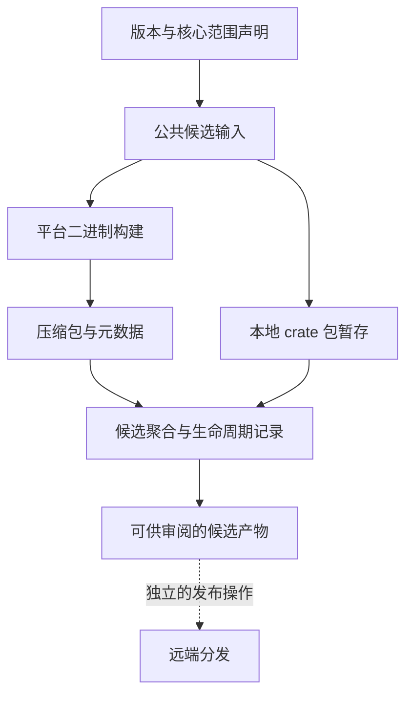

仓库定义了社区分发、候选准备、包暂存及部署资产。本页解释这些部分如何协作，以及文档应如何描述它们；不宣布已发布版本，也不执行发布。产品身份和排除范围参见[发行范围](../overview/release-scope.md)。

## 遵循声明的范围

根工作区包含 28 个成员。`scripts/core-release-scope.json` 分类了 27 个核心包：24 个注册表发布包和三个仅二进制包。Dashboard common 成员不属于这份核心包清单。注册表分类、压缩包内容及服务可执行文件数量是不同概念。

压缩包布局选择六个可执行文件：NameServer、Broker、Controller、Proxy、Admin CLI 和离线存储检查器。Admin TUI 被归类为仅二进制包，不代表它包含在这份六可执行文件压缩包中。Dashboard、MCP 和 SRE 是独立产品，被排除在核心压缩包能力清单之外，应使用各自的源码和部署文档。

发行身份为 `RocketMQ Rust Community Distribution`，身份类别是 `unofficial-community`，且 `official_apache_release: false`。发行说明和下载内容应一致使用该身份。采用 Apache 2.0 许可证，不代表产物是 Apache 项目的官方发行版。

## 候选准备与产物流转



图中概括的是职责；crate 暂存是相关分发工具，不表示每个工作流作业都按此精确顺序调用它。`.github/workflows/release-candidate.yml` 包含公共准备、平台构建、聚合、完整矩阵阶段及生命周期收尾。它接受精确的未发布候选版本和发行系列输入。现有系列状态使候选准备成为有状态流程；不要手工编造父代际，也不要把部分结果视为完整候选。

该工作流使用仓库只读权限上传候选产物。上传到 Actions 的产物不等于注册表发布或公开发行公告。独立的 `core-service-image-publish.yml` 路径当前校验本地候选准备，并明确拒绝 `publish: true`；不能根据文件名推断已向远端推送镜像。

## 理解文档对应的压缩包

| 项目 | 声明的内容或行为 |
| --- | --- |
| 平台布局 | `x86_64-unknown-linux-gnu` 和 `x86_64-apple-darwin` 使用 `tar.gz`；`x86_64-pc-windows-msvc` 使用 `zip` 和 `.exe` |
| 目录 | `bin`、`conf`、`data`、`logs`、`run`、`sbom` 和 `scripts` |
| 公共文件 | `LICENSE-APACHE`、`NOTICE`、`README.md` 和 `RELEASE_NOTES.md` |
| 服务配置 | `distribution/config/` 下选定的 NameServer、Broker、Controller 和 Proxy 文件 |
| 构建 feature | `distribution/release-layout.json` 按可执行文件记录请求与实际生效的 feature；压缩包 feature 可能不同于开发者默认构建 |
| 离线检查器名称 | 源码二进制 `rocketmq-cli-rust` 在压缩包中命名为 `rocketmq-store-inspect`，需要时带平台后缀 |
| 元数据 | Manifest、来源信息和 SBOM 工具描述候选的内容与构建输入 |

这些是声明的准备目标，不表示所有产物当前均可下载，也不表示每个平台均已通过部署试验。编写候选安装说明时，使用实际生成的 manifest 和选定配置。不要将默认 `cargo build` 的 feature 假设直接复制到压缩包指南。

## crate 打包属于独立操作

`distribution/release-package-policy.json` 定义 `plan-only` 与 `package-only` 模式、`local-temp` 暂存注册表及 `remote_publication: not-executed`。规划器为 `distribution/package_publish_workspace.py`，暂存器为 `distribution/stage_publishable_crate.py`。打包结果检查的是候选包边界，不是成功执行 `cargo publish`。

如需只读查看可用参数，在仓库根目录运行：

```bash
python distribution/package_publish_workspace.py --help
python distribution/build_release_archive.py --help
python distribution/verify_release_archive.py --help
```

实际暂存需要规划器的候选 manifest 和输出报告输入，以及 `--all-core` 或选定的 `--project`。应使用现有已准备候选及其文档所述生命周期，不要用无关文件填充这些输入。版本传播和构建/暂存工具可能修改工作区或生成文件；其输出应与网站源码分开。

## 同步维护发行与网站文档

1. **选择文档对象。** 确认是源码搭建、特定候选压缩包、注册表包还是独立产品，明确版本和 feature 假设。
2. **描述实际变化。** 覆盖行为、配置默认值、公共 API、协议/存储兼容性及迁移影响。对应边界复用 [Java 迁移](../migration/java-to-rust.md)、[Rust API 迁移](../migration/rust-api.md)和[升级回滚](../operations/upgrade-rollback.md)。
3. **区分能力与观察。** 已注册命令、声明目标或矩阵场景属于实现/准备事实。运行或恢复成功需要实际观察及其范围。
4. **更新两种语言。** 保持页面 ID、命令、配置键、单位和图示语义一致。Next 表示当前开发文档，不应静默改称已发行版本。
5. **产物存在后更新安装链接。** 指向实际产物与说明，再检查相关网站路由和示例。避免推测下载 URL 或笼统声明生产就绪。

现有发行工具具有自身的来源信息、状态和产物检查，它们描述发行处理流程，不是写页面的前提。文档工作不需要指纹流程、固定工作副本、新审批阶段或额外 CI 门禁。本次文档任务不触发发行工作流，也不修改产品授权行为。

## 源码参考

- [核心包范围](https://github.com/mxsm/rocketmq-rust/blob/main/scripts/core-release-scope.json)、[发行身份](https://github.com/mxsm/rocketmq-rust/blob/main/distribution/release-identity.json)和[压缩包布局](https://github.com/mxsm/rocketmq-rust/blob/main/distribution/release-layout.json)。
- [候选工作流](https://github.com/mxsm/rocketmq-rust/blob/main/.github/workflows/release-candidate.yml)和[核心镜像候选路径](https://github.com/mxsm/rocketmq-rust/blob/main/.github/workflows/core-service-image-publish.yml)。
- [包策略](https://github.com/mxsm/rocketmq-rust/blob/main/distribution/release-package-policy.json)、[包规划器](https://github.com/mxsm/rocketmq-rust/blob/main/distribution/package_publish_workspace.py)和[压缩包构建器](https://github.com/mxsm/rocketmq-rust/blob/main/distribution/build_release_archive.py)。
