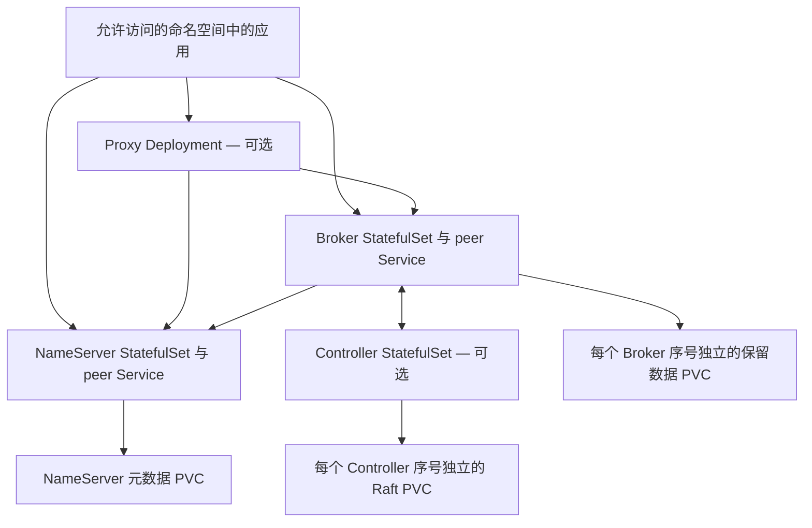

本文使用 `distribution/helm/rocketmq-rust-core` 部署 NameServer、Broker、Controller 和 Proxy。先选择一种 profile，再按目标集群覆盖镜像、存储、调度、资源和凭据配置。Chart 提供基础设施配置；Release 安装成功后，仍需验证应用的实际消息链路。

## 选择拓扑

| Profile 文件 | NameServer / Broker / Controller / Proxy 副本数 | 对应拓扑 |
| --- | --- | --- |
| `values-dev-single.yaml` | 1 / 1 / 0 / 0 | 开发环境；显式关闭认证 |
| `values-production-default-ha.yaml` | 2 / 2 / 0 / 0 | 默认主副本模式，要求两个副本参与 |
| `values-production-controller-ha.yaml` | 2 / 3 / 3 / 0 | Controller 管理的 Broker 组，至少两个同步副本 |
| `values-production-proxy-tls.yaml` | 2 / 2 / 0 / 2 | 默认 HA，加上 Proxy gRPC 入口 TLS |

生产 profile 要求副本分布在不同主机。先确认可调度节点数量、StorageClass 和资源余量，再判断 Pending Pod 是否属于服务故障。选择写入可用性与复制要求前，阅读 [HA 部署](high-availability.md)。



每个 StatefulSet 序号都有完整的独立 TOML 和稳定的 peer DNS 名称。PVC 保存该身份的数据，不供多个副本共享写入目录。内部域名格式为 `<release>-<service>-<ordinal>.<release>-<service>-peer.<namespace>.svc.<clusterDomain>`。外部 remoting 客户端必须能够访问路由返回的地址，仅转发 NameServer 端口并不足够。

## 准备镜像与本地 values

安装 Helm 和适合目标集群的 `kubectl`，选择正确的 Kubernetes context，并从仓库根目录执行命令。下文使用 Release `core` 和命名空间 `rocketmq`。

镜像路径为 `<global.imageRegistry>/<service>:<global.candidateVersion>`。Values 中的默认仓库和版本不能证明该位置已发布可用镜像。请提供自行构建或已确认可用的镜像，参考[容器封装](containers.md)。启用 Proxy TLS 的镜像必须编译 `tls` feature。

在仓库外建立私有部署目录，将以下起始配置保存为 `core-site-values.yaml`，替换示例镜像仓库、标签和 StorageClass：

```yaml
global:
  imageRegistry: registry.example.com/team/rocketmq-rust
  candidateVersion: site-tested-version
  storageClassName: site-block-storage
  clusterName: SiteCluster
services:
  broker:
    storage: 100Gi
```

`100Gi` 只是申请容量的示例，并非容量建议。按[容量规划](../operations/capacity-performance.md)计算存储与资源限制。凭据不要放入 values、生成的 ConfigMap 或版本控制。NetworkPolicy 默认启用，需要检查命名空间选择器以及客户端、采集器实际需要的流量。

## 提供已有 Secret

生产 profile 同时启用认证和授权。安装前，为实际启用的服务创建 Secret：

| 默认 Secret 名称 | 必需的键 |
| --- | --- |
| `rocketmq-namesrv-auth` | `plain_acl.yml` |
| `rocketmq-broker-auth` | `plain_acl.yml`、`inner-client.json` |
| `rocketmq-controller-auth`，启用 Controller 时 | `plain_acl.yml` |
| `rocketmq-proxy-auth`，启用 Proxy 时 | `plain_acl.yml`、`inner-client.json` |
| `rocketmq-proxy-tls`，TLS profile 使用 | `tls.crt`、`tls.key`；配置客户端证书认证时还需要 `ca.crt` |

Broker 和 Proxy 的 JSON 凭据字段为 `accessKey`、`secretKey`，以及可选的 `securityToken`。接收请求的服务必须授予相应内部客户端身份所需权限。提供 Secret 文件本身不会自动授予权限。

例如，在权限受限的 `private` 目录准备好实际 ACL 和凭据文件后：

```bash
kubectl create namespace rocketmq
kubectl -n rocketmq create secret generic rocketmq-namesrv-auth --from-file=plain_acl.yml=private/namesrv-acl.yml
kubectl -n rocketmq create secret generic rocketmq-broker-auth --from-file=plain_acl.yml=private/broker-acl.yml --from-file=inner-client.json=private/broker-inner-client.json
```

命名空间已存在时跳过创建操作。只为所选 profile 添加 Controller、Proxy 的 Secret。TLS profile 还需要：

```bash
kubectl -n rocketmq create secret generic rocketmq-proxy-auth --from-file=plain_acl.yml=private/proxy-acl.yml --from-file=inner-client.json=private/proxy-inner-client.json
kubectl -n rocketmq create secret tls rocketmq-proxy-tls --cert=private/proxy.crt --key=private/proxy.key
```

使用 `clientAuth: require` 或 `optional` 时，Secret 应同时包含服务端证书、私钥及配置要求的 CA 键，并设置 `services.proxy.tls.clientAuth`。服务端证书必须匹配客户端使用的 DNS 名称。详见[安全配置与轮换](security.md)。

Chart 的 `securityProfile: production` 设置服务认证默认值，与进程级 `ROCKETMQ_SECURITY_PROFILE=secure-enforced` 及其必需的引导材料不同。任何一个选项都不会自动加密集群全部连接。TLS profile 具体配置的是 Proxy gRPC 入口。

## 渲染、安装与观察

以下示例选择 Controller HA。渲染与安装使用同一份 profile 和 values：

```bash
helm template core distribution/helm/rocketmq-rust-core -n rocketmq -f distribution/helm/rocketmq-rust-core/values-production-controller-ha.yaml -f core-site-values.yaml > core-rendered.yaml
helm upgrade --install core distribution/helm/rocketmq-rust-core -n rocketmq -f distribution/helm/rocketmq-rust-core/values-production-controller-ha.yaml -f core-site-values.yaml
kubectl -n rocketmq get pods,pvc,svc,pdb
kubectl -n rocketmq describe pod core-broker-0
kubectl -n rocketmq logs core-broker-0 --tail=100
```

安装前检查渲染结果中的镜像名、服务 DNS、挂载路径、Secret 引用、副本身份和存储申请。渲染文件留在本地。上述命令会创建或更新指定 Release，不会创建业务主题与消费者组。

Pod 处于 Pending 时，查看调度事件和 PVC 绑定情况。启动失败时，查看对应容器当前及上一次运行的日志、挂载配置和 Secret 键名。进程以 UID/GID `10001` 运行，根文件系统只读；可写状态应落在指定卷中。

Chart 在内部健康端口（默认 `8088`）使用 HTTP `/livez` 做启动与存活探针，`/readyz` 做就绪探针，`/drainz` 做停止前排空。默认关闭预算为 45 秒，Pod 终止宽限期为 60 秒。探针成功说明服务生命周期状态，并不能证明主题可写、消费者已提交进度或副本已经追平。

从允许访问的位置执行[管理查询](../operations/admin.md)，创建隔离的测试资源，并使用可达的集群地址和凭据完成[第一条消息链路](../getting-started/quick-start.md)。Proxy 使用带 TLS/认证的 [gRPC 探测](proxy.md)。记录实际响应结果与消费完成情况。

## 每次更新一个工作负载

NameServer、Broker、Controller 使用 `OnDelete`。Helm 会更新期望的 Pod 模板和配置校验注解，但已有 Pod 会持续运行，直到显式替换。Proxy 使用 Deployment，`maxUnavailable: 0`、`maxSurge: 1`，应预留额外一个 Pod 的资源。

保留 PVC 与序号身份。修改 Controller 配置中的 peer 列表并不等于执行 Raft 成员变更。副本数、节点 ID、peer 地址与持久化成员关系不能视为可互换的扩缩容控制项。

计划重启 Controller 时使用 chart 随附的工具。它需要 Python 3.11+、`kubectl`、PATH 中匹配版本的 `rocketmq-admin-cli`，以及读取工作负载和申请 Pod 驱逐的 Kubernetes 权限。若序号零是**当前 Leader**，在另一终端持续运行：

```bash
kubectl -n rocketmq port-forward pod/core-controller-0 19878:9878
```

在运维终端环境中提供 `ROCKETMQ_ACL_ACCESS_KEY`、`ROCKETMQ_ACL_SECRET_KEY`，以及可选的 `ROCKETMQ_ACL_SECURITY_TOKEN`，随后重启另一个序号：

```bash
python distribution/helm/rocketmq-rust-core/files/rollout.py --namespace rocketmq --statefulset core-controller --ordinal 1 --controller-address localhost:19878
```

工具获取新鲜的成员与复制观察结果，核对 peer 身份和移除目标后是否仍有多数派，提交绑定 Pod UID 且受 PDB 约束的驱逐请求，再等待替换 Pod 以新 UID 进入 Ready。观察能力不支持、证据过期、连接到 Follower 或驱逐被拒绝时，操作停止。它不会自动重试被拒绝的驱逐，也不会改用直接删除。处理下一个序号前，重新确认当前 Leader。

该工具不处理 Broker 角色切换或数据追平。两个副本且 `minInSyncReplicas: 2` 的 Broker 组没有主动中断余量。维护前应明确写入可用性的影响；直接删除 Pod 会绕过 PDB 保护。详见[日常维护](../operations/maintenance.md)。

Chart 指南规定凭据、证书轮换后受控重启。不能假定 Secret 更新会使 ACL 与内部客户端凭据自动重载。当前 Proxy TLS 监听器另行支持文件重载，应按[安全指南](security.md)确认活跃代次与新连接。轮换后分别验证允许和拒绝的请求。

## 清理教程 Release

停止相关应用后，`helm uninstall core -n rocketmq` 删除指定 Release。删除与缩容时的 PVC 保留策略默认都是 `Retain`。检查保留的声明和备份后，再单独决定是否删除数据；不要把删除整个命名空间作为常规清理捷径。

## 范围与限制

另一个 `distribution/helm/rocketmq-rust` chart 以及 `distribution/kubernetes` 资产用于不同的五服务 MCP/发布集成。其测试镜像与示例地址不能直接替代本文的 core chart。

本文步骤依据 chart 模板和源码配置编写，未声明已完成 Kubernetes 安装、Pod/PVC 恢复或故障切换演练。渲染与配置检查不能建立生产 RPO、RTO 结论。

## 源码索引

[Core chart 指南](https://github.com/mxsm/rocketmq-rust/blob/main/distribution/helm/rocketmq-rust-core/README.md)、[values 与 profile](https://github.com/mxsm/rocketmq-rust/tree/main/distribution/helm/rocketmq-rust-core)、[生成配置](https://github.com/mxsm/rocketmq-rust/blob/main/distribution/helm/rocketmq-rust-core/templates/_config.tpl)、[Controller 重启工具](https://github.com/mxsm/rocketmq-rust/blob/main/distribution/helm/rocketmq-rust-core/files/rollout.py)。
