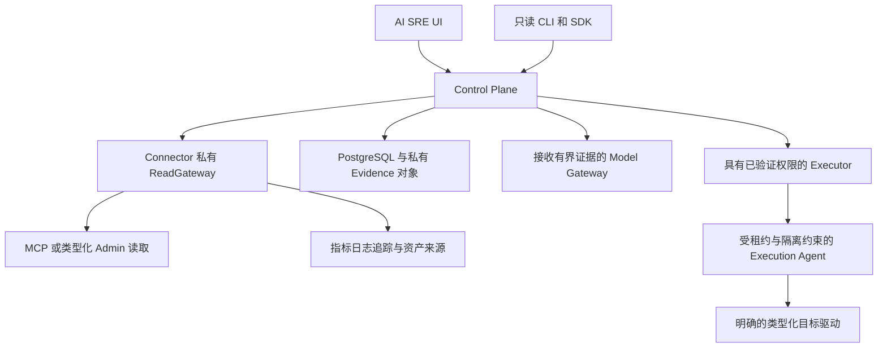

AI SRE 是用于基于证据诊断和受监督运维的独立 Rust 2024 工作区，拥有自己的 Control Plane、Connector、模型网关、PostgreSQL 状态、UI、客户端和隔离执行服务。它不复用 Dashboard 会话，也不向模型开放 Dashboard 变更 API。[部署指南](./ai-sre-deployment.md)解释开发栈与生产边界。

## 组件职责

| 工作区成员 | 职责与依赖边界 |
| --- | --- |
| `rocketmq-sre-contracts` | 版本化领域、协议、Evidence、Incident、方案和执行契约；不依赖网络、异步运行时、数据库、模型 SDK 或 RocketMQ 实现 |
| `rocketmq-sre-core` | 确定性协调与描述符注册表；正常依赖仅为 Contracts |
| `rocketmq-sre-control-plane` | 公共 API 与组装入口；接入、持久化、诊断、对话、治理、审批和执行协调 |
| `rocketmq-sre-connector` | 私有读取网关、MCP 协议客户端、能力握手、数据源采集及证据转换 |
| `rocketmq-sre-model-gateway` | 提供方中立的模型表示、协议适配器、能力路由、流式输出、预算、回退与 Critic 来源链 |
| `rocketmq-sre-executor` | 持久化受监督执行状态机、租约/隔离协调、验证与恢复；不持有目标凭据，也不直接访问目标网络 |
| `rocketmq-sre-execution-agent` | 单独启用的类型化目标驱动；拥有目标凭据、效果台账及受隔离约束的分发 |
| `rocketmq-sre-probe` | 在专用合成主题/组上执行有界生产/消费流量；无 Admin 或变更 feature |
| `rocketmq-sre-eval` | 显式模式导出与确定性评估/验收工具 |
| `rocketmq-sre-client` / `rocketmq-sre-cli` | 固定只读 HTTP 客户端及运维命令；本地草稿不授予执行权限 |

UI 和 TypeScript SDK 是独立 Node 工程。UI 可以调用版本化 Control Plane 工作流路由；公开 Rust/TypeScript SDK 和 CLI 保持更小的固定只读接口。两者都不允许原始目标请求。

## 观察与执行路径

Connector 通过公共协议使用 MCP，不依赖 MCP 服务器 crate 或 Rust DTO。MCP 与只读 Admin 适配器共用一个私有 ReadGateway，统一处理租户/集群授权、速率/并发准入、截止时间、取消、有界输出、脱敏和审计。回退到 Admin 仍然读取同一个获准查询，不扩展范围。

Connector 注册和命令使用独立认证反向通道。公共 Control Plane 端口不暴露 Connector 专属内部路由。服务端声明变更能力、未知 schema 主版本或能力漂移时会被拒绝，不会静默接受。因此，MCP Control 不能替代 Connector 配置中的查询 MCP 端点。

## Evidence 是带来源信息的观察

PostgreSQL 是持久化事实存储。Evidence 包含版本化模式、租户/集群范围、观察时间、新鲜度、来源和部分结果语义。较大的脱敏 JSON 载荷进入私有对象存储，默认内联上限为 64 KiB。内存仓库/对象适配器用于测试，不是生产回退。

拓扑边来自已观察标识。`Topic -> Queue -> Broker -> Store` 遵循 RocketMQ 路由/运行时观察。Kubernetes 元数据仅在存在明确映射时添加 Pod/Node/PVC 关系；Broker Pod 需要 `rocketmqrust.com/broker-name` 标签才能关联逻辑 Broker。缺失来源保持 partial 或 `not_production_verified`，系统不会为补全图示而编造生产者连接或拓扑边。

典型诊断经过限定范围的采集、规范化 Evidence、确定性 Diagnostic Pack、假设和反证，再形成持久化诊断修订。模型可以解释有界证据并引用它。答案必须保留缺失或过旧观察，合理的模型解释不能替代测量。

## 模型辅助职责受限

Model Gateway 使用规范请求/响应契约和协议适配器，不将领域逻辑绑定到某个厂商 SDK。Profile 声明工具、结构化输出、流式输出、上下文、数据分类及区域等能力。路由拒绝不兼容提供方，不静默改变请求契约。提供方凭据通过引用解析，不进入 Connector、目标适配器或模型提示词。

Control Plane 配置默认禁用网络模型调用，部署可以显式启用。仓库开发 Compose 栈启用本地模型 fixture，不证明真实外部提供方集成。提供方系列 profile 描述支持的集成路径，不表示每个厂商/模型组合均已成功验证。

规则与类型化契约保持权威。不安全、被拒绝或不可用的模型路径可以生成 `RulesOnlyDiagnosisNotExecutable`。无效结构化输出最多允许向同一提供方发起一次有界、无工具的修复调用，并作为独立调用关联记录；修复失败不触发基于 schema 的提供方回退。有限可用性回退仅适用于暂时性超时、429、5xx 或传输失败。对话工具选择限定在固定只读目录中，并返回带引用的持久化答案修订。

## 受监督执行已实现，但逐项启用

当前 Control Plane 代码持久化方案、策略/Critic 评估、人工审批和执行协调。Execution Agent 启动注册表按条件注册已审阅处理器。本地指南较早的“P3-05 前禁用”边界描述了隔离阶段前提，不能解释为当前源码没有执行实现。实际可用性由当前启动配置及注册处理器决定。

所有 Agent 动作开关默认 false。支持配置的处理器类别为：

| 动作 | `ROCKETMQ_SRE_AGENT_` 后的启用后缀 |
| --- | --- |
| 允许列表内 Broker 配置 | `ENABLE_BROKER_CONFIG` |
| 允许列表内主题配置 | `ENABLE_TOPIC_CONFIG` |
| 允许列表内订阅组配置 | `ENABLE_SUBSCRIPTION_GROUP_CONFIG` |
| 带 TTL 的日志级别 | `ENABLE_LOGGER_TTL` |
| 单单位 Proxy 扩容 | `ENABLE_PROXY_SCALE_OUT` |
| Proxy 镜像金丝雀 | `ENABLE_PROXY_IMAGE_CANARY` |
| 带重叠期的凭据轮换 | `ENABLE_CREDENTIAL_ROTATION` |
| 重启一个 Proxy | `ENABLE_PROXY_RESTART` |
| 重启一个遥测采集器 | `ENABLE_TELEMETRY_COLLECTOR_RESTART` |

单独开关不够，目标允许列表、独立凭据、验证端点及驱动配置都必须有效。Executor 运行不代表 Agent 动作启用。Agent 没有通用 Shell、原始 Admin 请求码或任意 Kubernetes 补丁接口。

执行序列验证短期请求，恢复持久状态，建立租约/隔离条件，检查描述符与实时前提，获取资源所有权，记录意图，再分发类型化 Agent 操作。Agent 在调用驱动前持久化 `Prepared` 和 `Dispatched`；只有有界、已验证结果进入 `Confirmed`。非终态重复效果保持未解决，不盲目再次分发。新隔离代际等待在途工作，并拒绝未解决的旧效果。

验证结合 Agent 资源观察与独立的 Control Plane 技术 SLI 观察。不确定结果通过只读状态检查协调；补偿是明确操作，也需要验证。这不是跨资源原子事务，也不保证每种失败都可撤销。PostgreSQL 或 Lease Authority 不可用会阻止目标写入。

## 选择工作流前读取能力状态

- 接入可能处于 pending、只读就绪、降级、拒绝或已下线。必需来源不可用时，集群保持降级；下线撤销身份并保留历史。
- 查询客户端可以读取状态、集群、Incident、巡检、方案和 OpenAPI。本地 Plan/Runbook 草稿不是服务端审批或执行授权。
- 普通 Dashboard 仍是直接资源管理产品。SRE 拥有跨信号调查和受治理工作流，不共享凭据与会话。
- 编译、描述符注册、配置启用和真实场景成功是不同证据。使用观察到的能力/覆盖状态，不声明全部已定义动作都通过生产验证。

本文架构依据当前清单、服务注册和组件文档，未为此页面执行真实 SRE 诊断、模型调用或目标执行。文档写作没有指纹或审批门禁；产品自身策略、权限及审计契约仍属于技术设计。

来源：[工作区](https://github.com/mxsm/rocketmq-rust/blob/main/rocketmq-ai/rocketmq-sre/Cargo.toml)、[Control Plane](https://github.com/mxsm/rocketmq-rust/blob/main/rocketmq-ai/rocketmq-sre/crates/rocketmq-sre-control-plane/README.md)、[Connector](https://github.com/mxsm/rocketmq-rust/blob/main/rocketmq-ai/rocketmq-sre/crates/rocketmq-sre-connector/README.md)、[Executor](https://github.com/mxsm/rocketmq-rust/blob/main/rocketmq-ai/rocketmq-sre/crates/rocketmq-sre-executor/README.md)和 [Agent 注册](https://github.com/mxsm/rocketmq-rust/blob/main/rocketmq-ai/rocketmq-sre/crates/rocketmq-sre-execution-agent/src/api.rs)。
