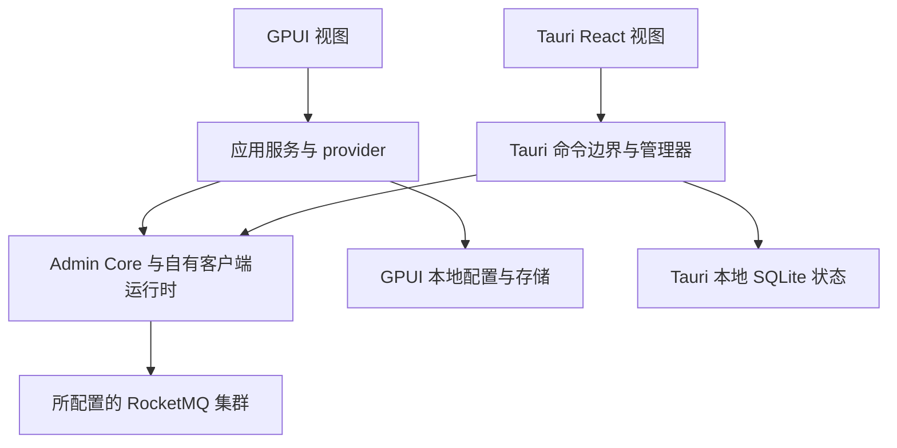

GPUI 与 Tauri 是独立的桌面应用，具有不同的渲染器、配置存储和认证生命周期。两者都需要在自身工程构建，根 Cargo 工作区不构建它们。应用连接现有 RocketMQ 部署，不代为启动 Broker 或 Proxy 服务。参见 [Dashboard 选择](./dashboards.md)和[本地集群搭建](../getting-started/local-source.md)。

## 选择应用与原生依赖

| 领域 | GPUI | Tauri |
| --- | --- | --- |
| 工程根目录 | `rocketmq-dashboard/rocketmq-dashboard-gpui/` | `rocketmq-dashboard/rocketmq-dashboard-tauri/`；Rust 根目录为 `src-tauri/` |
| 渲染 | GPUI 与 `gpui-component` 原生窗口 | Tauri webview 中的 React/TypeScript 与 Rust 命令 |
| 工具 | 仓库 Rust 1.95.0；Rust 2024 | 仓库 Rust 工具链及 Node/npm；Rust 后端采用 edition 2024 |
| Windows | MSVC C++ 工具链和 Windows SDK；图形桌面 | MSVC/Windows SDK 和 Tauri webview 运行环境/工具 |
| macOS | Xcode 命令行工具和图形会话 | Xcode 工具及平台 webview/打包环境 |
| Linux | Clang、CMake、Make、Ninja、pkg-config、protobuf 编译器、Fontconfig、FreeType、X11/XCB 和 xkbcommon 开发包 | 构建工具及 Tauri CI 使用的 WebKitGTK 4.1、OpenSSL、xdo、Ayatana AppIndicator 和 librsvg 开发包 |

使用各工程本地指南与 CI 中对应目标的平台包集合。所选 RocketMQ 依赖图还可能引入其他原生依赖。无图形环境编译成功不能验证图形、焦点、键盘交互或另一操作系统上的打包行为，也不意味着固定构建耗时或内存占用。

## GPUI：构建与运行

从仓库根目录进入 GPUI 目录，并留在该目录：

```bash
cd rocketmq-dashboard/rocketmq-dashboard-gpui
cargo run
```

在同一目录构建优化后的可执行文件：

```bash
cargo build --release
```

使用默认 Cargo 目标目录时，二进制为 `target/release/rocketmq-dashboard-gpui`，Windows 带 `.exe` 后缀。运行需要图形桌面。编译不会生成 Tauri 安装程序或 Web Dashboard 包。

进程入口初始化遥测、组件库和应用根。视图将工作委派给应用服务与 `GpuiAdminProvider`；Admin Core 和应用拥有的客户端运行时执行远端操作。渲染与网络、持久化工作分开。事件循环退出时，应用关闭其运行时和遥测所有权。



图中比较的是应用边界，不表示功能完全相同或共享同一个桌面进程。

### GPUI 配置与身份

配置默认为操作系统用户配置目录下的 `rocketmq-dashboard/gpui/config.json`。`ROCKETMQ_DASHBOARD_GPUI_CONFIG_PATH` 覆盖完整文件路径。通过应用连接设置选择 NameServer 和传输选项；配置持久化在本地，查询结果来自所选集群。

本地登录与出站认证相互独立：

- 配置启用本地登录时，为进程提供 `ROCKETMQ_DASHBOARD_USERNAME` 和 `ROCKETMQ_DASHBOARD_PASSWORD`。认证后应用保留本地会话标记。
- Admin 凭据来源为 `environment` 时，提供 `ROCKETMQ_ADMIN_ACCESS_KEY` 和 `ROCKETMQ_ADMIN_SECRET_KEY`；`ROCKETMQ_ADMIN_SECURITY_TOKEN` 可选。这些凭据用于签名出站 RocketMQ 请求。
- 配置保存凭据来源选择，不保存凭据值。默认认证设置禁用本地登录且不选择 Admin 凭据来源；共享工作站应明确选择预期策略。

环境变量必须在启动应用前存在，桌面启动器启动时也适用。诊断时将 `RUST_LOG` 设为有界的应用级日志范围，避免收集凭据或消息正文。备份或有意修改本地状态前，先关闭应用。

## Tauri：开发、构建与打包

在独立 Shell 中，从仓库根目录开始：

```bash
cd rocketmq-dashboard/rocketmq-dashboard-tauri
npm ci
npm run tauri dev
```

已有 Node 依赖时复用安装结果。Tauri 命令同时启动前端开发进程和桌面后端。Vite 与 `tauri.conf.json` 约定端口 8765。Vite 使用 `strictPort: true`，端口占用会失败，不会静默选择其他端口。单独运行 `npm run dev` 只启动前端开发服务器，不提供原生命令桥接。

根据需要的输出，在 Tauri 根目录选择：

```bash
npm run build
npm run tauri build
```

第一条命令在 `build/` 生成前端资产。第二条命令调用配置的前端构建并生成桌面包；单独先运行第一条只在检查前端输出时有用。`tauri.conf.json` 使用 `frontendDist: ../build` 并启用平台打包目标。默认 Cargo 输出下，安装程序/包位于 `src-tauri/target/release/bundle/`，实际格式取决于宿主平台和已安装打包工具。签名/公证属于独立分发事项，本地构建不证明这些工作已完成。

仅检查 Rust 后端编译时，在 `src-tauri/` 运行：

```bash
cargo check
```

这不会验证 React 渲染，也不会生成安装包。反过来，前端构建成功也不会编译全部后端命令。后端拥有客户端/运行时管理器，并在应用关闭时关闭其任务。

### Tauri 认证与持久化状态

首次启动创建本地 `admin` 账户。初始密码优先取自 `ROCKETMQ_DASHBOARD_INIT_PASSWORD`，未提供时实现的引导默认值为 `admin123`。首次启动前应提供私有初始密码。第一次登录成功后，必须修改密码才能进入 Dashboard。密码使用 Argon2 存储；会话位于内存，仅在后端进程仍存活时支持恢复。

认证和已保存的 NameServer/Proxy 配置共用 `dashboard.db`，位于标识 `com.rocketmqrust.dashboard` 对应的 Tauri 应用配置目录：

| 平台 | 默认数据库路径 |
| --- | --- |
| Windows | `%APPDATA%\com.rocketmqrust.dashboard\dashboard.db` |
| macOS | `~/Library/Application Support/com.rocketmqrust.dashboard/dashboard.db` |
| Linux | `$XDG_CONFIG_HOME/com.rocketmqrust.dashboard/dashboard.db`，未设置时为 `~/.config/com.rocketmqrust.dashboard/dashboard.db` |

账户已存在后修改引导环境变量，不会重置密码。删除该数据库会同时重置认证和已保存连接配置。有意重置本地状态时，先停止应用并备份数据库，不将删除操作作为常规排查。应用本地登录不是 RocketMQ ACL 认证。已保存 Proxy 地址也不会启动、停止或重新配置 Proxy 服务进程。

## 验证真实连接并正常关闭

1. 单独启动预期的 NameServer 和 Broker。教程中，仅当桌面应用与服务位于同一宿主机时选择 `127.0.0.1:9876`。
2. 启用本地登录时先完成认证，再检查并保存预期连接设置。从桌面机器检查 Broker 通告地址，不仅检查 NameServer 端口。
3. 刷新集群/Broker 信息，定位已知教程主题和消费者组。视图报错或意外为空时，与[只读 Admin 检查](../operations/admin.md)对照。
4. 将主题修改、偏移量重置和消息动作视为真实集群变更。核对目标，并保留应用的操作确认和授权行为。
5. 正常关闭窗口，等待进程关闭完成。退出前通过应用保存配置，不要仅凭窗口内仍可见的字段推断已经持久化。

## 常见失败

| 现象 | 可能边界与后续检查 |
| --- | --- |
| 根 Cargo 无法选择桌面包 | 进入独立工程；Tauri Rust 使用 `src-tauri/` |
| 原生链接或系统库错误 | 核对该平台 UI/构建依赖及架构与所选工具链是否匹配 |
| Tauri 开发端口不可用 | 确认 8765 的拥有者；不终止无关进程，也不要只改 Vite/Tauri 端口对的一侧 |
| Tauri 页面渲染，但命令失败 | 通过 `npm run tauri dev` 运行；仅浏览器 Vite 会话缺少原生桥接 |
| 登录成功，但远端查询失败 | 本地身份认证成功；分别检查 NameServer、路由、出站凭据和传输 |
| GPUI 未采用环境变化 | 确认启动器进程在启动前继承了预期变量 |
| Tauri 引导密码不再有效 | 已有账户使用持久化密码；修改引导变量不会覆盖它 |

本文记录源码定义的搭建方式和边界，不宣称文档编写期间执行过图形冒烟测试、安装包签名或跨平台桌面构建。

来源：[GPUI README](https://github.com/mxsm/rocketmq-rust/blob/main/rocketmq-dashboard/rocketmq-dashboard-gpui/README.md)、[GPUI 配置](https://github.com/mxsm/rocketmq-rust/blob/main/rocketmq-dashboard/rocketmq-dashboard-gpui/src/infrastructure/config_store.rs)、[Tauri README](https://github.com/mxsm/rocketmq-rust/blob/main/rocketmq-dashboard/rocketmq-dashboard-tauri/README.md)、[Tauri 配置](https://github.com/mxsm/rocketmq-rust/blob/main/rocketmq-dashboard/rocketmq-dashboard-tauri/src-tauri/tauri.conf.json)和 [Tauri 平台工作流](https://github.com/mxsm/rocketmq-rust/blob/main/.github/workflows/dashboard-tauri-ci.yml)。
