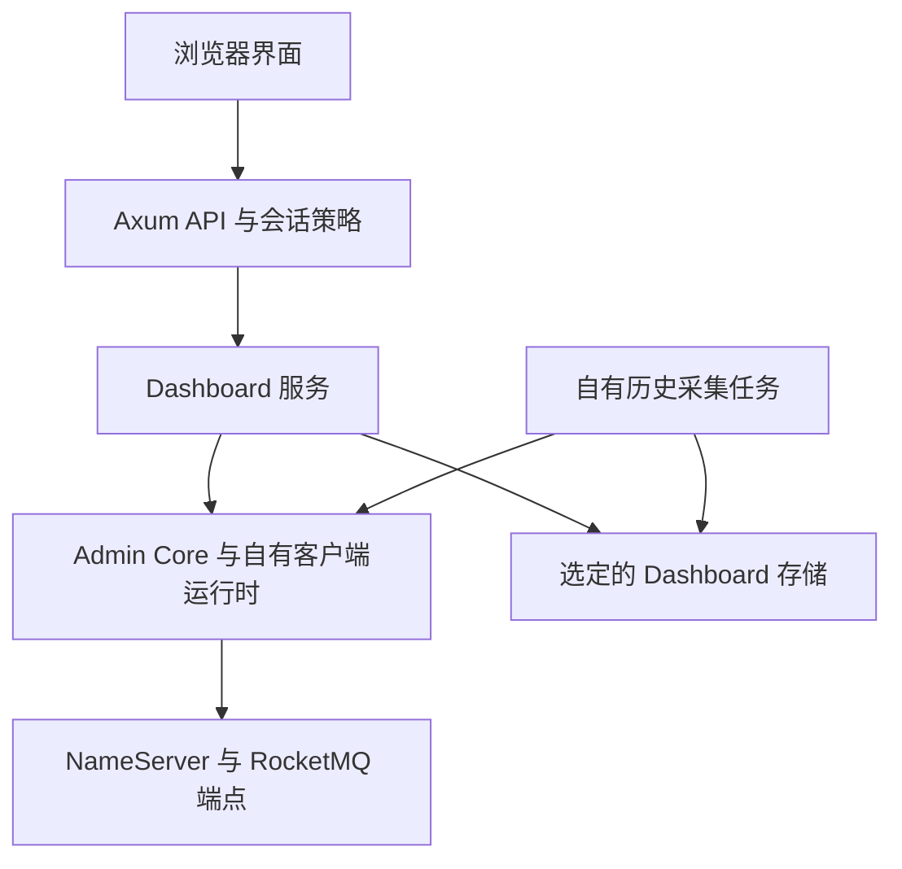

Web Dashboard 由独立的 Axum 后端和 React/TypeScript 前端组成。它查询和管理所配置的 RocketMQ 服务，并存储自身的配置、会话、审计及观察数据。其数据库不是 Broker 消息存储。与桌面产品的对比参见 [Dashboard 选择](./dashboards.md)。

## 请求与持久化路径



前端通过 `src/api/client.ts` 发送携带凭据的请求。后端路由区分公开健康/登录路由与受保护的运维路由。轻量 handler 调用服务，可复用模型和契约来自 `rocketmq-dashboard-common`。管理操作会真实影响集群。刷新视图与重置消费偏移量是不同操作；后者需要明确选择目标，并经过产品的确认/授权路径。

## 启动本地开发实例

准备仓库 Rust 工具链、Node/npm 及后端依赖图要求的原生依赖。按[本地源码搭建](../getting-started/local-source.md)启动 NameServer 和 Broker。以下地址假定教程集群位于同一机器。在 PowerShell 中，从仓库根目录运行：

```powershell
cd rocketmq-dashboard/rocketmq-dashboard-web/backend
$env:DASHBOARD_WEB_HOST = '127.0.0.1'
$env:DASHBOARD_WEB_PORT = '8082'
$env:NAMESRV_ADDR = '127.0.0.1:9876'
$env:DASHBOARD_WEB_STORAGE_BACKEND = 'file'
$env:DASHBOARD_WEB_STORAGE_PATH = 'data/docs-dashboard'
$env:DASHBOARD_WEB_LOGIN_REQUIRED = 'false'
cargo run --bin rocketmq-dashboard-web-backend
```

使用新的专用数据目录，相对路径以后台工作目录解析。此环回开发示例禁用登录，不是共享部署配置。后端还包含存储工具，因此通过 `--bin` 选择服务器，不使用不带目标的 `cargo run`。

在第二个终端中，同样独立从仓库根目录开始：

```powershell
cd rocketmq-dashboard/rocketmq-dashboard-web/frontend
npm ci
npm run dev
```

已有依赖时复用安装结果。Vite 选择端口 3003，默认将 `/api` 代理到 `http://127.0.0.1:8082`。打开 Vite 实际打印的 URL；端口占用时地址可能变化。`VITE_API_TARGET` 修改开发代理目标，不会重新配置 Rust 后端，也不会成为生产反向代理。

在另一个终端检查进程存活与存储就绪：

```powershell
Invoke-RestMethod 'http://127.0.0.1:8082/api/health/live'
Invoke-RestMethod 'http://127.0.0.1:8082/api/health/ready'
```

`/api/health/live` 报告进程存活；`/api/health/ready` 包含存储就绪状态，`/api/health` 是就绪别名。它们都不能证明每个 RocketMQ 端点可达。在界面中确认所选 NameServer，刷新集群/Broker 数据，再定位教程主题和消费者组。将空表解释为空集群前，先检查明确的查询错误。

## 只选择一个存储后端

| 后端 | 配置 | 所有权与部署 |
| --- | --- | --- |
| File | `DASHBOARD_WEB_STORAGE_BACKEND=file`；`DASHBOARD_WEB_STORAGE_PATH` 为目录 | 进程生命周期内独占目录锁；单节点部署 |
| SQLite | 后端为 `sqlite`；存储路径为磁盘数据库文件 | 拒绝内存 URL；单节点部署 |
| MySQL | 后端为 `mysql`；单独提供数据库 URL | 外部数据库；生产使用校验证书的 TLS |
| PostgreSQL | 后端为 `postgres`；单独提供数据库 URL | 外部数据库；生产使用校验证书的 TLS |

选择严格生效：未知后端、无效路径或缺少必需 URL 会阻止启动，不回退到 File。`DASHBOARD_WEB_DATABASE_URL` 与 `DASHBOARD_WEB_DATABASE_URL_FILE` 互斥。文件选项读取包含完整 URL 的挂载秘密文件。这些 SQL 设置不适用于 File 或 SQLite。

连接池默认最小 1 / 最大 10 个连接，连接超时 5000 ms、获取超时 3000 ms、空闲超时 600 s、最大生命周期 1800 s。对应变量为 `DASHBOARD_WEB_DB_MIN_CONNECTIONS`、`DASHBOARD_WEB_DB_MAX_CONNECTIONS`、`DASHBOARD_WEB_DB_CONNECT_TIMEOUT_MS`、`DASHBOARD_WEB_DB_ACQUIRE_TIMEOUT_MS`、`DASHBOARD_WEB_DB_IDLE_TIMEOUT_SECS` 和 `DASHBOARD_WEB_DB_MAX_LIFETIME_SECS`。最小值可以为零，且不能超过最大值；超时值和最大值必须为正。

历史采集默认间隔 60 s、保留 30 天、清理批次 500 行、租约 TTL 30 s。根据部署配置 `DASHBOARD_WEB_HISTORY_INTERVAL_SECS`、`DASHBOARD_WEB_HISTORY_RETENTION_DAYS`、`DASHBOARD_WEB_HISTORY_RETENTION_BATCH_SIZE` 和 `DASHBOARD_WEB_HISTORY_LEASE_TTL_SECS`。历史样本是观察结果，不是事务完整的 Broker 活动记录。

## 区分三类身份

| 边界 | 配置与行为 |
| --- | --- |
| 浏览器到 Dashboard | 启用 `DASHBOARD_WEB_LOGIN_REQUIRED` 并提供 `DASHBOARD_WEB_USERNAME` / `DASHBOARD_WEB_PASSWORD`；不要部署内置示例凭据。受保护请求验证持久化会话。 |
| 浏览器会话 | `dashboard_session` 使用 HttpOnly 和 SameSite=Strict。`DASHBOARD_WEB_SESSION_COOKIE_SECURE` 默认为 true；共享部署使用 HTTPS。明确进行本地纯 HTTP 登录测试时，仅在该本地环境将其设为 false。 |
| 浏览器跨源访问 | `DASHBOARD_WEB_CORS_ORIGIN` 接受一个精确 HTTP(S) Origin。未配置时禁用 CORS，不回退到通配符。SameSite Cookie 规则仍生效，启用 CORS 不代表任意跨站部署自动可用。 |
| Dashboard 到 RocketMQ | 配对设置 `DASHBOARD_WEB_ROCKETMQ_ACCESS_KEY` 和 `DASHBOARD_WEB_ROCKETMQ_SECRET_KEY`；`DASHBOARD_WEB_ROCKETMQ_SECURITY_TOKEN` 可选。`DASHBOARD_WEB_USE_TLS` 和 `DASHBOARD_WEB_USE_VIP_CHANNEL` 选择连接行为。 |
| Dashboard 到 SQL | 使用独立的数据库 URL 秘密及经过验证的服务端证书/CA。数据库与 RocketMQ 秘密都不能放入前端 `VITE_` 变量。 |

会话 TTL 默认为 28800 s，活跃会话上限为 32。会话/审计清理在 [AppConfig](https://github.com/mxsm/rocketmq-rust/blob/main/rocketmq-dashboard/rocketmq-dashboard-web/backend/src/config/app_config.rs) 中具有独立保留设置。Dashboard 登录不授予 Broker ACL 权限，配置 Broker 凭据也不认证浏览器用户。

## 构建并部署两部分

在 `frontend/` 中，`npm run build` 生成 `dist/`。在 `backend/` 中，`cargo build --release --bin rocketmq-dashboard-web-backend` 在对应 Cargo 目标目录生成服务器可执行文件。Axum 路由提供 API，不自动托管前端包。通过部署环境的 HTTPS 反向代理托管静态包，并将 `/api` 转发到后端。为前端路由配置 SPA 回退，同时保留 API 的 JSON 错误。

前端 `VITE_API_BASE_URL` 是构建时 API 前缀；留空支持上述同源方式。单独托管 API 时，需要精确 Origin、携带凭据的请求及兼容的 Cookie/站点配置。修改构建时 API 前缀后需要重新构建前端。

`deploy/docker-compose.storage.yml` 是后端存储部署示例，选择 `file`、`sqlite`、`mysql` 或 `postgres` 中一个 profile；不是完整前端托管栈。SQL profile 使用外部数据库和挂载 URL/CA 秘密，MySQL 使用 `ssl-mode=verify_identity`，PostgreSQL 使用 `sslmode=verify-full`。选择副本数、数据库权限、备份或迁移流程前，参阅[存储部署指南](https://github.com/mxsm/rocketmq-rust/blob/main/rocketmq-dashboard/rocketmq-dashboard-web/docs/storage-deployment.md)。

使用 Ctrl+C 停止前台后端，让其所属服务完成关闭；单独停止 Vite。按所选引擎备份 Dashboard 存储，与 Broker 数据分开处理。不要通过删除数据库解决临时登录或就绪错误，数据库还包含其他 Dashboard 状态。

## 按边界排查

| 现象 | 首先检查 |
| --- | --- |
| 界面加载，但所有 API 失败 | 后端进程、Vite 代理或生产 `/api` 路由、实际 API 前缀 |
| 登录成功，下一请求却未认证 | 浏览器 Cookie 拒收、HTTPS/Secure 设置、SameSite 行为、精确 Origin 和会话有效性 |
| Live 正常，ready 失败 | 所选存储、目录锁、数据库可达性、TLS/CA、连接池耗尽及迁移状态 |
| 存储正常，集群查询失败 | NameServer 选择、后端能否访问 Broker 通告地址、ACL 和 TLS |
| 第二个 File 实例失败 | 其他进程已拥有目录；使用预期的单实例，不删除锁文件 |
| 历史数据稀疏或延迟 | 采集间隔/租约、查询失败和保留策略；比较观察时间 |

本文依据配置和路由源码核对，并进行配对文档与网站检查；不宣称文档编写期间完成了真实 Dashboard 登录、数据库故障切换或浏览器到集群试验。

来源：[Web README](https://github.com/mxsm/rocketmq-rust/blob/main/rocketmq-dashboard/rocketmq-dashboard-web/README.md)、[API 路由](https://github.com/mxsm/rocketmq-rust/blob/main/rocketmq-dashboard/rocketmq-dashboard-web/backend/src/api/router.rs)、[会话中间件](https://github.com/mxsm/rocketmq-rust/blob/main/rocketmq-dashboard/rocketmq-dashboard-web/backend/src/middleware/auth_layer.rs)、[前端 API 客户端](https://github.com/mxsm/rocketmq-rust/blob/main/rocketmq-dashboard/rocketmq-dashboard-web/frontend/src/api/client.ts)和 [Vite 配置](https://github.com/mxsm/rocketmq-rust/blob/main/rocketmq-dashboard/rocketmq-dashboard-web/frontend/vite.config.ts)。
