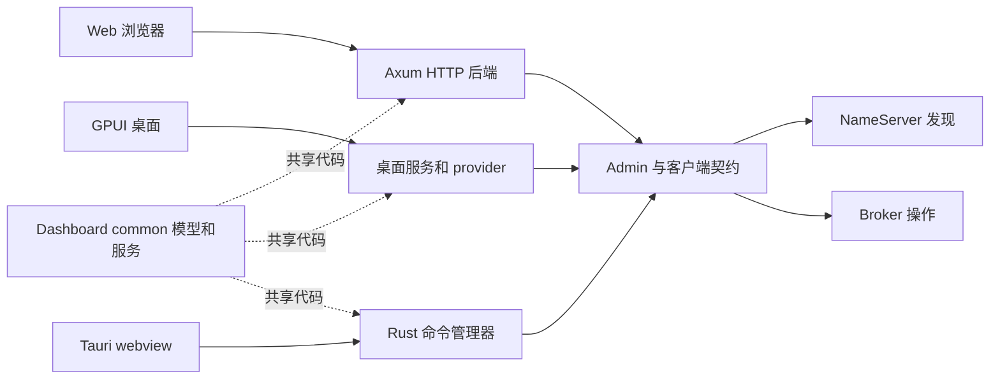

# 选择与运行 Dashboard

仓库包含 Web、GPUI、Tauri 三个 Dashboard 应用。它们共享 RocketMQ 管理概念及部分公共代码，但应用生命周期、持久化和构建根目录独立。先按部署方式选择，再确认所需操作在该实现中的支持情况。

## 产品对比

| 产品 | 界面与执行方式 | 持久化 / 连接所有者 | 适合的起点 |
| --- | --- | --- | --- |
| Web | React/TypeScript 浏览器界面调用独立 Axum HTTP 后端 | 后端选择 File、SQLite、MySQL 或 PostgreSQL，并持有出站 RocketMQ 访问 | 集中运维的浏览器服务 |
| GPUI | 原生 GPUI/gpui-component 桌面应用 | 桌面配置/历史/监控存储及实时管理 provider | 具有图形桌面的原生操作工作站 |
| Tauri | Tauri 桌面外壳中的 React/TypeScript 界面调用 Rust 命令 | Rust 应用管理器及共享配置服务 | 使用 Web 界面组件的桌面安装包 |
| Dashboard common | 库，不是面向用户的可执行文件 | 共享模型、配置及可选管理门面 | 复用独立于 UI 的领域行为 |

共同术语不代表功能完全对等。查询、管理、认证、历史和监控流程应在选定产品中核对。这些应用可以执行变更，Dashboard 不等同于[只读 MCP](./mcp.md) 服务。



各应用独立持有运行时和持久化生命周期。图中表示共享职责，不表示同一进程或公共在线数据库。执行后端或桌面进程的机器必须能够访问 NameServer 发现结果及 Broker 广播地址。

## Web：独立后端与前端

从后端自身 Cargo 根目录运行：

```bash
cd rocketmq-dashboard/rocketmq-dashboard-web/backend
cargo run --bin rocketmq-dashboard-web-backend
```

必须明确二进制，因为该包还包含存储工具。文档中的后端默认地址为 `http://127.0.0.1:8082`。为目标集群设置 `NAMESRV_ADDR`，超出本地开发范围前检查后端认证、存储和连接配置。

在第二个终端中，从仓库根目录执行：

```bash
cd rocketmq-dashboard/rocketmq-dashboard-web/frontend
npm ci
npm run dev
```

后续运行复用已安装依赖。Vite 请求端口 `3003`，默认将 `/api` 代理到 `http://127.0.0.1:8082`；`VITE_API_TARGET` 可修改开发代理目标。端口被占用时，以 Vite 实际打印地址为准。开发代理不等同于生产 HTTP 部署配置。

Web 持久化在启动时严格选择。File 使用进程生命周期独占锁保护的目录，SQLite 使用磁盘文件。MySQL/PostgreSQL 需要数据库 URL 和相应连接/TLS 配置。未知后端或缺少必需配置不能被解释为自动回退到 File 存储。

`GET /api/health/live` 报告进程存活，`GET /api/health/ready` 包含存储就绪状态，`/api/health` 仍为就绪端点。这些接口本身不能证明每个 RocketMQ 操作或下游 Broker 都健康。

在前端目录执行 `npm run build` 生成前端资源。后端部署、持久存储、会话认证和反向代理/API origin 仍是独立工作。详细环境变量及存储操作见 [Web 产品 README](https://github.com/mxsm/rocketmq-rust/blob/main/rocketmq-dashboard/rocketmq-dashboard-web/README.md)。

## GPUI：原生桌面所有权

从仓库根目录执行：

```bash
cd rocketmq-dashboard/rocketmq-dashboard-gpui
cargo run
```

在该目录使用 `cargo build --release` 构建优化后的可执行文件。运行需要图形桌面。Windows 需要 MSVC C++ 工具链和 Windows SDK，macOS 需要 Xcode 命令行工具，Linux 需要 [GPUI 指南](https://github.com/mxsm/rocketmq-rust/blob/main/rocketmq-dashboard/rocketmq-dashboard-gpui/AGENTS.md)中的 GUI 开发库。该工程是独立 Rust 2024 工作区。

配置默认位于操作系统用户配置目录下的 `rocketmq-dashboard/gpui/config.json`。`ROCKETMQ_DASHBOARD_GPUI_CONFIG_PATH` 覆盖完整文件路径，其中保存 NameServer 和连接设置。

本地 Dashboard 登录与出站 RocketMQ 凭据相互独立。启用本地登录时需要 `ROCKETMQ_DASHBOARD_USERNAME`、`ROCKETMQ_DASHBOARD_PASSWORD`。Admin 凭据来源选择 `environment` 时，使用 `ROCKETMQ_ADMIN_ACCESS_KEY`、`ROCKETMQ_ADMIN_SECRET_KEY` 及可选 `ROCKETMQ_ADMIN_SECURITY_TOKEN`。通过工作站受管理环境提供密钥，不把真实值放入共享截图或报告。

GPUI 入口初始化组件并持有应用运行时。Admin 和持久化工作通过注入的子作用域执行，不在渲染路径执行。事件循环退出后触发运行时清理，参见 [GPUI README](https://github.com/mxsm/rocketmq-rust/blob/main/rocketmq-dashboard/rocketmq-dashboard-gpui/README.md)。

## Tauri：前端构建与桌面打包

从仓库根目录执行：

```bash
cd rocketmq-dashboard/rocketmq-dashboard-tauri
npm ci
npm run tauri dev
```

原生构建前安装目标操作系统的 Tauri 前置依赖。React 界面调用 Rust 命令管理器，Rust 应用持有共享客户端运行时，并在关闭时清理管理器。仅在浏览器预览不会执行桌面命令桥接。

| 命令与目录 | 结果 |
| --- | --- |
| Tauri 应用根目录中的 `npm run build` | TypeScript/Vite 前端资源 |
| `src-tauri` 中的 `cargo check` 或 `cargo build` | Rust 后端检查或二进制编译 |
| 应用根目录中的 `npm run tauri build` | 所配置平台的桌面安装包/bundle |

未覆盖 target 目录时，默认 bundle 位于 `src-tauri/target/release/bundle/`。不要把前端构建成功表述为桌面应用已打包或测试。参见 [Dashboard 构建指南](https://github.com/mxsm/rocketmq-rust/blob/main/rocketmq-dashboard/README.md)和 [Tauri 应用所有者](https://github.com/mxsm/rocketmq-rust/blob/main/rocketmq-dashboard/rocketmq-dashboard-tauri/src-tauri/src/lib.rs)。

## 定位正确边界

| 现象 | 首先区分 |
| --- | --- |
| Web UI 加载但请求失败 | 浏览器到后端的 API/代理/会话问题，还是后端到 RocketMQ 的问题 |
| 登录成功但无法访问集群 | 本地/产品认证，还是出站 RocketMQ 认证和授权 |
| 主题或消费者表为空 | 所选集群、实际响应、加载/错误状态和可见权限；不能直接认定集群没有数据 |
| Web 服务启动失败 | 所选存储驱动、路径/URL、独占锁和就绪状态；不要切换后端来掩盖持久化故障 |
| 原生构建失败 | 独立目录是否正确、Rust edition/工具链、Node 依赖及操作系统原生前置条件 |
| 不同产品显示数据不同 | 所选集群、采样时间、产品持久化或实际操作不同；公共模型不会同步应用状态 |

先在隔离开发集群执行查询。变更元数据、偏移量或消息前检查目标和操作影响，保留产品确认及授权行为。编写本概览时没有构建或启动 Web、GPUI、Tauri 应用，不宣称跨平台或操作功能对等已经验证。

来源：[Dashboard common](https://github.com/mxsm/rocketmq-rust/blob/main/rocketmq-dashboard/rocketmq-dashboard-common/Cargo.toml)、[Web 架构](https://github.com/mxsm/rocketmq-rust/blob/main/rocketmq-dashboard/rocketmq-dashboard-web/AGENTS.md)、[Web 开发代理](https://github.com/mxsm/rocketmq-rust/blob/main/rocketmq-dashboard/rocketmq-dashboard-web/frontend/vite.config.ts)、[GPUI 指南](https://github.com/mxsm/rocketmq-rust/blob/main/rocketmq-dashboard/rocketmq-dashboard-gpui/README.md)、[Tauri 脚本](https://github.com/mxsm/rocketmq-rust/blob/main/rocketmq-dashboard/rocketmq-dashboard-tauri/package.json)。

## 详细搭建指南

- [Web Dashboard 搭建与运维](./dashboard-web.md)
- [GPUI 与 Tauri 桌面搭建](./dashboard-desktop.md)
