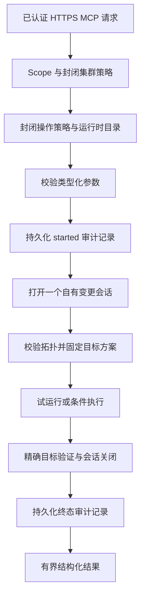

`rocketmq-mcp-control` 是独立的 HTTPS MCP 服务器，提供五个类型化 RocketMQ 变更工具。它与[只读 MCP](./mcp.md)分开；为查询 MCP 添加规划 feature 不会启用这些工具。Control 默认构建不包含 Admin Core 依赖，也没有生产变更工具。实际使用要求编译能力、运行时策略、认证声明、配置集群和持久审计路径相互匹配。

## 支持的操作与边界

| MCP 工具 | 封闭策略操作 | 范围及重要约束 |
| --- | --- | --- |
| `rocketmq_upsert_topic` | `topic_upsert` | 在 1–64 个明确的逻辑 Broker 主节点上完整替换主题；队列数 1–127，权限与消息类型使用支持值 |
| `rocketmq_upsert_consumer_group` | `consumer_group_upsert` | 在 1–64 个明确的逻辑 Broker 主节点上完整替换消费者组；拒绝系统组 |
| `rocketmq_reset_consumer_offset` | `consumer_offset_reset` | 主题/组与带时区 RFC3339 时间戳；固定最多 1000 个 Broker/队列目标，并使用预期偏移量 CAS |
| `rocketmq_patch_broker_config` | `broker_config_patch` | 恰好一个逻辑 Broker，非空补丁仅限六个已知属性 |
| `rocketmq_set_consumer_request_mode` | `consumer_request_mode` | 主题/组、`pull` 或 `pop`、非负共享队列数及 1–24000 ms 超时 |

Broker 补丁只接受 `autoCreateTopicEnable`、`autoCreateSubscriptionGroup`、`brokerPermission`、`defaultTopicQueueNums`、`messageIndexEnable` 和 `traceTopicEnable`。布尔字符串必须小写，拒绝 null/空值及未知键。必需字段与精确限制参见[完整工具模式和示例](https://github.com/mxsm/rocketmq-rust/blob/main/rocketmq-ai/rocketmq-mcp-control/docs/tool-reference.md)。

没有删除、跳过、重发、任意 Admin 命令、Shell、子进程、自由 RPC 或 stdio 传输。可选 `write-tools` feature 只启用 Admin Core 的 mutation-client 适配器，不启用 read/full 适配器。必要的预检/事后读取属于类型化变更会话，不构成通用查询接口。

## 授权、审计与会话顺序



OAuth 与操作/集群授权先于变更参数解析完成。持久化 `started` 记录先于会话创建或 RPC 完成。即使调用方断开、取消或超时，自有监督任务也会保持已获取会话并完成有界关闭。传输响应成功本身不能描述目标效果。

每个操作都在目标状态 RPC 前校验所选集群完整拓扑。条件变更使用已固定的目标/会话，冲突后不会重新解析路由并重试。主题 upsert 将完整 NameServer order-Topic KV 视为禁止写入的保护条件：所选有序条目必须已经匹配请求队列数，所选无序条目必须不存在。定向路径不修复全局 KV。CAS 前变化阻止 Broker 写入；CAS 后变化保留 Broker 已应用事实，并报告部分协调失败。

## 构建独立服务

从仓库根目录进入 Control 工程。第一条命令构建默认无变更接口，第二条选择生产工具能力：

```powershell
cd rocketmq-ai/rocketmq-mcp-control
cargo build --locked --release
cargo build --locked --release --features write-tools
```

按需要选择构建，不把两条都视为部署步骤。未覆盖 Cargo 目标目录时，可执行文件为 `target/release/rocketmq-mcp-control`，Windows 带 `.exe`。根工作区构建不包含此工程。该包选择 Rust 2021 和 MSRV 1.95.0。

## 准备配置与真实身份基础设施

从 [conf/mcp-control.example.toml](https://github.com/mxsm/rocketmq-rust/blob/main/rocketmq-ai/rocketmq-mcp-control/conf/mcp-control.example.toml)开始。它包含示例主机且缺少证书/凭据材料，是模板，不是自包含本地环境。

| 配置节 | 必需准备 |
| --- | --- |
| `server` | 明确的非通配监听地址；示例为 `127.0.0.1:8090` 与 `/mcp`。使用规范公共 HTTPS 基础 URL 和真实证书/私钥对。 |
| `oauth` | 精确 HTTPS issuer、audience 和公共 HTTPS JWKS URL。仅接受 RS256 OAuth JWT，包括有界 `kid`、签名、过期时间、subject 及 `rocketmq:write` scope。 |
| `clusters` | 将封闭逻辑别名映射到私有 NameServer 端点和 TLS 策略；可选 access/secret/security-token 凭据使用环境变量引用。拒绝内联秘密。 |
| `mutations` | 初始为 `mutations_enabled=false`、`dry_run=true`，操作/集群允许列表为空。前提就绪后仅启用预期操作和逻辑集群。 |
| `audit` | 可写的持久 JSONL 目标；示例容量 4096、最大记录 4096 字节。保留并恢复现有审计轨迹，不在重启时替换。 |

配置拒绝未知字段，仅在启动时加载。TLS/审计路径按配置原值使用，加载器不会将其改为相对 TOML 目录解析。使用绝对路径，或明确控制进程工作目录。`ROCKETMQ_MCP_CONTROL_CONFIG` 选择文件；该二进制没有 `--config` CLI 路径。

JWKS 获取拒绝私有、环回、链路本地或保留 DNS 地址，并在连接时复查。因此，本地伪造 issuer 不能替代生产认证路径。密钥代际生命周期上限为五分钟，并具有刷新/负缓存控制。不提供静态令牌、HS 算法或开发认证。HTTPS 监听器限制请求为 1 MiB 和 30 s；示例变更操作超时为 24 s。

身份提供方必须签发匹配的 `rocketmq_operations`、`rocketmq_clusters` 声明及 `rocketmq:write`。`conf/permissions.example.toml` 描述该词汇，不是绕过 OAuth 的本地权限文件。subject 必须满足工具/运行手册中记录的安全有界操作者语法。

配置文件准备好后，在 Control 目录运行：

```powershell
$env:ROCKETMQ_MCP_CONTROL_CONFIG = (Resolve-Path 'conf/mcp-control.local.toml').Path
cargo run --locked --release --features write-tools
```

首次发现时保持变更禁用。要发现某个工具，设置 `mutations_enabled=true`，添加其封闭操作和集群允许列表，确保注册表条目及 OAuth 声明匹配，然后重启。即使试运行也需要满足这些工具启用条件。固定资源 `rocketmq-control://capabilities` 报告编译/运行时/注册状态；仅编译 feature 不会使 `mutation_supported` 为 true。提示词和资源模板为空。

## 有意变更前先试运行

使用已认证、完成初始化的 HTTPS MCP 会话。以下完整调用为示例逻辑集群和 Broker 请求方案，请替换为已配置且已授权目标。它可以读取目标状态并写审计记录，但 `dry_run=true` 不应用 Broker 补丁：

```json
{
  "jsonrpc": "2.0",
  "id": 2,
  "method": "tools/call",
  "params": {
    "name": "rocketmq_patch_broker_config",
    "arguments": {
      "schema_version": "rocketmq-mcp-control.arguments.v1",
      "cluster": "production-a",
      "broker_name": "broker-a",
      "properties": { "traceTopicEnable": "true" },
      "dry_run": true,
      "confirm": false
    }
  }
}
```

检查聚合 `before`、`requested` 和按 Broker 排序的目标证据。有意执行时保留已审阅目标/载荷，显式设置 `dry_run=false`、`confirm=true`，并提供如 `CHG-10016 enable tracing` 的安全原因。原因是去除首尾空白后 5–256 字节的 ASCII，字符限于字母、数字、空格及 `._,#-`；拒绝令牌、地址和端点形状内容。试运行可以省略原因，`confirm` 默认为 false。

可选 `request_key` 提供进程内 10 分钟 singleflight/结果复用，上限 4096 项，按主体、操作、集群、排序后的目标和规范载荷限定范围。同一键配不同载荷会被拒绝。缓存命中/跟随调用不打开新 Admin 会话，但每次调用仍持久化自己的审计记录对。这不是跨重启精确一次执行，调用方超时也不保证回滚。

## 解释结果与恢复

结果使用 `rocketmq-mcp-mutation.v1`，包含聚合 `before`、`requested`、`after` 及逐目标持久化和验证证据。

| 状态 | 含义 |
| --- | --- |
| `planned` | 试运行方案，没有应用变更 |
| `applied` | 已应用或无变化成功；`changed=false` 表示没有变化 |
| `conflict` | `precondition_conflict`；预期状态变化，不自动重试冲突 |
| `partial` | `partial_apply`；逐目标检查，不将操作视为原子事务 |
| `failed` | 仍可能包含已应用但持久化/事后读取验证失败的目标；检查 `error_code` 与目标证据 |

冲突、部分及失败结果设置 MCP `isError=true`，同时保留结构化数据。失败不普遍等于无效果。`order_reconciliation_failed` 保留 Broker 已应用状态，不重写全局 order KV。

可靠审计失败统一为 `audit_unavailable`。`started` 持久化失败阻止会话和 RPC；终态审计失败可能发生在效果已产生且会话有界关闭之后。磁盘尾部不完整或运行中审计轨迹被标记为不可用，需要明确的修复/恢复处理。终态失败含义不明时，不盲目重试写入。

仅审计 v2 可以保留已校验 OAuth subject 与安全原因作为操作者证据。响应、普通日志、tracing 和错误排除它们；所有输出均排除凭据、令牌、端点、消息正文和原始后端错误。审计恢复与部分目标调查参见[运维手册](https://github.com/mxsm/rocketmq-rust/blob/main/rocketmq-ai/rocketmq-mcp-control/docs/operations-runbook.md)。

停止新变更时，禁用 `mutations_enabled` 或移除操作/集群允许列表并重启，配置不热加载。通过单独授权的运维工具核对不确定目标状态，Control 不自行生成补偿写入。这些是产品运行时控制；取消文档审批门禁不会移除它们。

本文核对源码定义的配置、目录与模式。文档编写期间未执行 OAuth 部署、真实 Control 会话或集群变更。

来源：[清单](https://github.com/mxsm/rocketmq-rust/blob/main/rocketmq-ai/rocketmq-mcp-control/Cargo.toml)、[配置加载器](https://github.com/mxsm/rocketmq-rust/blob/main/rocketmq-ai/rocketmq-mcp-control/src/config.rs)、[进程入口](https://github.com/mxsm/rocketmq-rust/blob/main/rocketmq-ai/rocketmq-mcp-control/src/main.rs)、[工具目录](https://github.com/mxsm/rocketmq-rust/blob/main/rocketmq-ai/rocketmq-mcp-control/src/catalog.rs)和[产品边界](https://github.com/mxsm/rocketmq-rust/blob/main/rocketmq-ai/rocketmq-mcp-control/AGENTS.md)。
