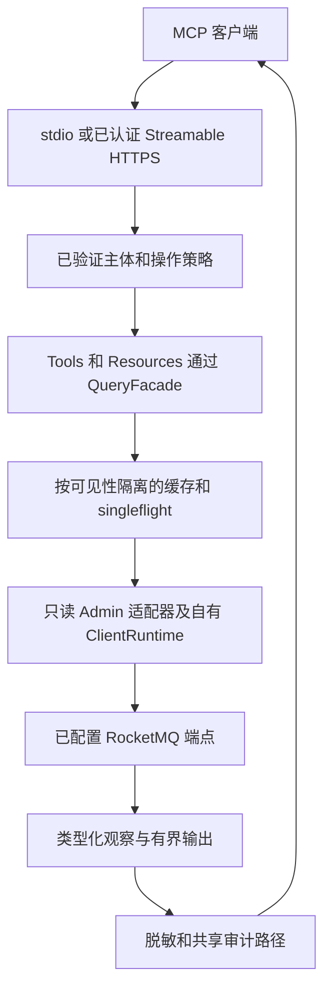

# 只读 MCP 诊断服务

`rocketmq-mcp` 是用于 RocketMQ 查询、诊断和运行手册提示词的独立 Model Context Protocol 服务。它运行在 Broker、NameServer、Dashboard 进程之外，使用 Admin Core 的 `read-client-adapter`。默认工具不打开变更会话；可选规划 feature 生成建议，不执行建议。

## 请求路径与所有权



MCP 进程持有生命周期、查询运行时、缓存和异步审计写入器。关闭时停止准入，排空已接受审计记录、刷出 sink，并在截止时间内关闭所属任务。缓存观察反映数据被观察的时间，不表示新的远程读取，也不保证集群未发生变化。

## 构建所选传输方式

从仓库根目录进入独立工程：

```bash
cd rocketmq-ai/rocketmq-mcp
cargo build --locked --release
```

默认 feature 为 `read-only`、`diagnose`、`stdio`。在同一目录可构建 HTTPS 支持：

```bash
cargo build --locked --release --features streamable-http
```

`streamable-http` 包含认证 feature，不是无认证 HTTP 模式。`observability` 启用进程内信号，`otlp` 选择已实现的 OTLP gRPC 支持。`change-planning` 增加五个受运行时策略约束的规划工具。这些 feature 都不会将 Query MCP 变为 MCP Control。

二进制位于 `target/release/rocketmq-mcp`，Windows 为 `rocketmq-mcp.exe`。根工作区的 `cargo build` 不构建该独立包。原生依赖来自所选依赖图，参见 [features/平台](../reference/features-platforms.md)。

## 准备本地 stdio 配置

将 [conf/mcp.example.toml](https://github.com/mxsm/rocketmq-rust/blob/main/rocketmq-ai/rocketmq-mcp/conf/mcp.example.toml)复制为自己的配置文件。放在同一 `conf` 目录可以保留示例权限文件的相对路径；移动到其他位置时，同时复制策略文件，并明确解析审计/TLS 引用。选择新文件名，不替换已有运维配置。

对第一条消息开发集群，将已有集群条目改为以下值，不要追加另一个默认集群：

```toml
[[clusters]]
name = "local-dev"
rocketmq_cluster_name = "DocsCluster"
namesrv_addr = "127.0.0.1:9876"
default = true
```

这是替换片段，不是完整配置。删除未使用的 Proxy/Controller 示例别名，或将其设置为实际需要查询的服务。MCP 逻辑集群名可以与物理 RocketMQ 集群名不同。工具接受配置中的逻辑别名，不接受任意网络地址。

| 设置 | 仓库示例 / 行为 |
| --- | --- |
| `security.profile` | `diagnose`，用于本地诊断权限范围 |
| `security.allow_change_planning` | `false`，仅编译不能允许规划调用 |
| `security.permissions_file` | `permissions.example.toml`，相对配置文件加载 |
| `security.sanitize_output` | `true` |
| `security.max_concurrent_requests_per_cluster` | 8 |
| `security.rate_limit_per_minute` | 按主体/集群/操作策略每分钟 60 次 |
| `audit.enabled` / `sink` | `true` / `file`，应选择可写审计路径 |
| `cache.enabled` / `max_entries` | `true` / 256，按查询类型的 TTL 决定新鲜度 |
| `server.stdio.log_to_stderr` | `true`，stdout 保留给 MCP 协议帧 |

编辑 `conf/mcp.local.toml` 后，从 MCP 目录启动：

```bash
cargo run --locked -- --config conf/mcp.local.toml --transport stdio
```

配置本地 MCP 客户端，以这些参数和明确的绝对配置路径启动已构建二进制。Stdio 是本地开发进程集成；等待协议输入的终端不是 HTTP 服务。不要在 stdout 前添加 Shell 欢迎信息，也不要将诊断文本重定向到 stdout。

必须通过 `--config` 或 `ROCKETMQ_MCP_CONFIG` 提供配置路径。权限、TLS、JWKS CA 和审计路径相对配置文件解析。CLI 当前在加载文件后赋值 `--transport`，该参数默认 `stdio`。HTTPS 必须显式传入 `--transport streamable-http`；只设置文件中的 `server.transport` 对此 CLI 路径不够。可选 `--bind`、`--endpoint` 覆盖对应文件值。

## Streamable HTTPS 与身份

HTTPS 需要编译传输支持、可读证书/私钥对、允许的 Origin 策略和认证配置。示例监听 `127.0.0.1:8089`，端点 `/mcp`，公开基础 URL 为 `https://127.0.0.1:8089`。这些默认值不会提供真实证书文件或凭据。

| 边界 | 身份与配置 |
| --- | --- |
| 本地开发 HTTP | `development-token` 限于环回开发，通过配置的环境引用读取令牌。 |
| 生产 HTTP | `oauth-jwt` 通过 HTTPS JWKS 验证带 `kid` 的 RS256 令牌签名、issuer、audience、过期时间和必需 scope。 |
| 私有 JWKS CA | 用 `jwks_ca_path` 配置可读 PEM 信任包，相对路径归配置目录所有。 |
| 工具执行 | 已验证角色/scope、配置集群、集群声明、租户绑定、速率限制和操作策略在各自定义阶段生效。 |
| 出站 RocketMQ | 通过配置的文件/环境引用提供独立签名凭据；不转发入站 Bearer 令牌。 |

生产 OAuth 没有静态 `jwt_key_env` 回退。密钥刷新失败时，在配置的陈旧窗口内保留已验证代际。受保护资源元数据端点有意允许无 Bearer 令牌访问以支持发现，MCP 端点本身仍要求认证。

配置材料后，从 MCP 目录启动：

```bash
cargo run --locked --features streamable-http -- --config conf/mcp.local.toml --transport streamable-http --bind 127.0.0.1:8089 --endpoint /mcp
```

支持 HTTP 的 MCP 客户端连接 HTTPS 端点，发送认证头及 `Accept: application/json, text/event-stream`。证书验证、协议初始化和会话/流生命周期由 MCP 客户端处理。单次无认证 GET 不是完整工具调用。

RocketMQ 签名凭据必须与 HTTP 身份分离。配置的 YAML 凭据文件包含 `access_key`、`secret_key` 和可选 `security_token`，大小限制为 64 KiB；也可配置环境变量引用。内联密钥值和混合文件/环境来源会被拒绝。启动及新建读取会话时解析凭据，以支持挂载密钥轮换。Broker 身份只授予所需读取权限。

## 发现并调用工具

仓库协议版本为 `2025-11-25`，初始化拒绝其他版本。初始化后使用 `tools/list` 获取调用方可见目录。源码默认目录包含 24 个工具，但策略可以缩小发现结果。

| 查询类型 | 默认工具名称 |
| --- | --- |
| 集群 / 清单 | `rocketmq_get_cluster_overview`、`rocketmq_list_topics`、`rocketmq_list_consumer_groups` |
| 主题 | `rocketmq_describe_topic`、`rocketmq_get_topic_route`、`rocketmq_get_topic_config_state`、`rocketmq_get_topic_stats`、`rocketmq_get_topic_config` |
| 消费者 / 连接 | `rocketmq_get_consumer_lag`、`rocketmq_list_consumer_connections`、`rocketmq_list_producer_connections`、`rocketmq_get_consumer_group_config_state`、`rocketmq_get_consumer_group_details`、`rocketmq_get_consumer_progress` |
| Broker | `rocketmq_describe_broker`、`rocketmq_get_broker_diagnostics`、`rocketmq_get_broker_config_summary`、`rocketmq_get_broker_log_filter_state` |
| 基础设施 | `rocketmq_get_proxy_drain_state`、`rocketmq_get_ha_status`、`rocketmq_get_controller_metadata`、`rocketmq_get_nameserver_config_summary` |
| 消息 / 诊断 | `rocketmq_get_message_metadata`、`rocketmq_diagnose_consumer_lag` |

先使用明确指定集群的简单查询。下列 `tools/call` 请求用于已初始化 MCP 会话，不是独立 HTTP 命令：

```json
{
  "jsonrpc": "2.0",
  "id": 2,
  "method": "tools/call",
  "params": {
    "name": "rocketmq_list_topics",
    "arguments": {"cluster": "local-dev", "limit": 25}
  }
}
```

`limit` 范围 1–200，默认 50。`has_more` 为 true 时使用不透明的 `data.next_cursor` 继续，不自行构造游标，也不将其当作队列偏移量。提供相同逻辑目标和对应查询参数。精确模式和逐工具输出见[完整工具参考](https://github.com/mxsm/rocketmq-rust/blob/main/rocketmq-ai/rocketmq-mcp/docs/tool-reference.md)。

发现阶段检查 scope 和工具允许/拒绝策略，不代表某个集群/租户调用一定获准。两个清单工具允许省略集群并使用默认/唯一集群回退；当前实现对该省略路径不执行与显式路径相同的逐集群/租户检查。运维客户端应显式提供集群，并在部署策略中考虑此限制，不把省略参数表述为更强隔离保证。

## 理解观察、部分结果和故障

成功调用携带 `rocketmq-mcp.v2` 封装，包括请求 ID、逻辑集群、观察时间、新鲜度、缓存状态、部分结果标志、警告及类型化数据。`hit`、`miss`、`bypass` 区分查询复用，失败不会缓存。查询状态和继续游标按 `standard`、`sensitive` 可见性类别隔离，不跨类别共享。

输出数组限制为 1,000 行，结构化输出限制为 1 MiB。截断和来源失败可能产生部分结果，将观察描述为完整前应检查 warnings 和 `partial`。消息元数据工具不返回消息体，连接身份使用化名；敏感字段缺失不一定是后端故障。

| 现象/错误码 | 后续操作 |
| --- | --- |
| 工具缺失 | 检查编译 feature、主体 scope 和工具策略；规划还需在调用时满足运行时权限。 |
| `unauthorized_scope` / `cluster_not_allowed` / `tenant_mismatch` | 检查已验证身份和配置策略，修改查询别名不能授予权限。 |
| `source_unavailable` | 检查 MCP 进程到配置 NameServer/Broker/Proxy/Controller 的网络路径及出站读取凭据。 |
| `rate_limited` | 降低查询速率并采用有界重试，避免 AI 客户端与 MCP 层叠加重试。 |
| `output_too_large` 或部分结果警告 | 缩小查询，支持时分页，并在诊断中保留警告。 |
| 观察过旧 | 检查观察时间、TTL/缓存状态和所选集群，再推断当前故障。 |
| stdio 解析失败 | 确认协议版本和纯净 stdout，在 stderr 查看脱敏启动/传输诊断。 |

启用规划工具后，可以生成创建主题、更新主题配置、更新主题权限、更新 Broker 配置和重置偏移量方案。工具没有 Apply 模式，也不调用变更 API。执行属于独立设计的运维/控制流程，不属于这个诊断进程。

本文核对了配置、注册和协议源码，并完成 TOML/JSON 及网站渲染检查；不宣称编写文档时测试过真实 MCP 客户端会话、OAuth/JWKS 部署或外部集群诊断。

来源：[配置解析器](https://github.com/mxsm/rocketmq-rust/blob/main/rocketmq-ai/rocketmq-mcp/src/config.rs)、[入口](https://github.com/mxsm/rocketmq-rust/blob/main/rocketmq-ai/rocketmq-mcp/src/main.rs)、[工具目录](https://github.com/mxsm/rocketmq-rust/blob/main/rocketmq-ai/rocketmq-mcp/src/tools/catalog.rs)、[协议服务](https://github.com/mxsm/rocketmq-rust/blob/main/rocketmq-ai/rocketmq-mcp/src/protocol/server.rs)、[权限示例](https://github.com/mxsm/rocketmq-rust/blob/main/rocketmq-ai/rocketmq-mcp/conf/permissions.example.toml)、[只读边界](https://github.com/mxsm/rocketmq-rust/blob/main/rocketmq-ai/rocketmq-mcp/AGENTS.md)。
